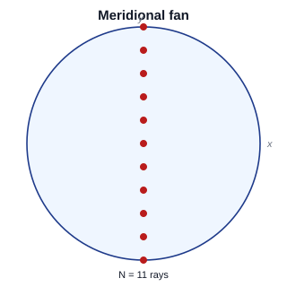
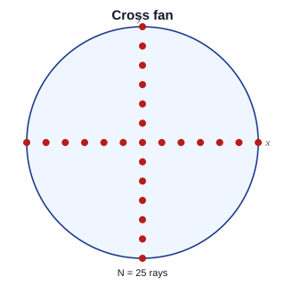
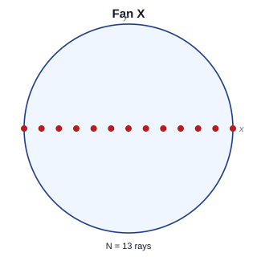
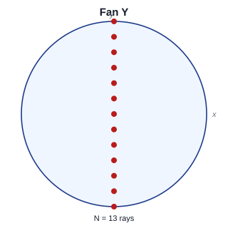
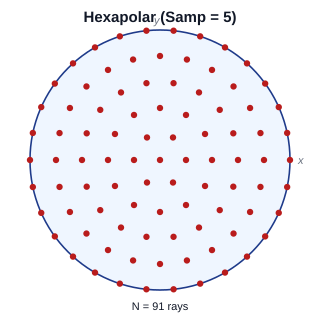
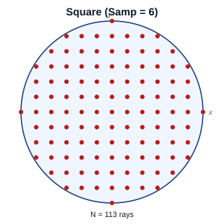
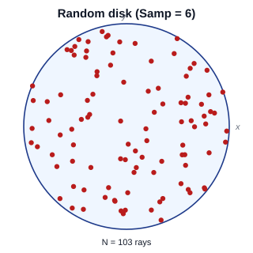
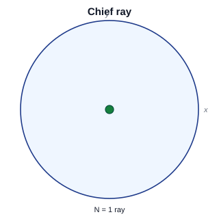
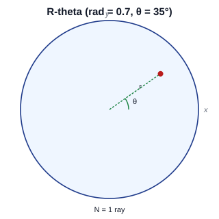

Pupil Patterns (Source Model: Pupil / field)
============================================

When the **Source Model** in the |ui| is set to ``Pupil / field``, rays are
generated by ``KrakenOS.PupilCalc`` (see :doc:`pupilcalc_tool`). Each ray
origin is first laid out on the *unit pupil* — a disk of radius 1 — using one
of the patterns below, then mapped to real-world coordinates and direction
cosines by ``PupilCalc.Pattern2Field``. The set of available patterns and
their parameters are defined in:

* ``KrakenOS/UI/layout_editor.py`` — UI labels and the
  ``PUPIL_PATTERN_TO_KRAKEN`` mapping
* ``KrakenOS/PupilTool.py`` — the underlying point distributions (method
  ``PupilCalc.Pattern``)

The integer sampling parameter ``Pup.Samp`` (default ``5`` in the manual,
``6`` in the library constructor) controls density for every pattern except
the single-ray ``Chief ray`` and ``R-theta`` options. In the illustrations
below the dashed lines mark the +x and +y unit-pupil axes; the blue ring is
the unit pupil; red dots are the generated ray origins.

2D Pattern Versus 3D Scene Launch
---------------------------------

The ``Pupil pattern`` combobox is shared by sequential analysis, 2D previews,
and non-sequential scene previews, but those contexts are not identical.
``Meridional fan``, ``Fan X``, and ``Fan Y`` are section patterns: they are
useful for a 2D plot or a tangential/sagittal aberration slice, but they are
not a physical 3D launch distribution by themselves.

When ``Pupil / field`` is used as a non-sequential source with a nonzero
``Source cone`` in Open 3D, the UI samples the Object/source reference aperture
in 3D and applies the cone angle around each sampled field direction. This
keeps the launch visible as a finite aperture-cone bundle instead of silently
turning it into a hidden infinity/parallel source or a one-point emitter cone.
If one of the section-only fan labels is selected, the 3D scene trace maps it
to the default filled angular cone. This keeps Open 3D as a physical scene
trace instead of flattening the prism or CAD workflow to a 2D section fan.

Use ``Hexapolar``, ``Square``, or ``Random disk`` when you explicitly want to
control the 3D angular-pupil distribution. Use ``Chief ray`` or ``R-theta`` for
single probe rays.

.. _pupil-pattern-meridional-fan:

Meridional fan
--------------

A UI-only convenience pattern used by the 2D layout preview. Ray origins are
evenly spaced along the current display-slice axis (Y by default, X if the
slice axis has been switched). This is what you see in the live editor when
no other pupil pattern has been selected, and it is the default value of the
**Pupil pattern** combobox (``PUPIL_PATTERN_DEFAULT = "Meridional fan"``).
It does not correspond to a ``Pup.Ptype`` value — instead the layout code
falls back to ``_sample_ray_heights`` (see
``_build_meridional_preview_bundles`` in ``layout_editor.py``).

In Open 3D non-sequential source-cone tracing, this label is treated as a
request for the default filled 3D angular-pupil launch, not as a flat fan.

   Equally spaced ray heights along the active slice axis (Y shown).

.. _pupil-pattern-cross-fan:

Cross fan
---------

Two orthogonal linear fans superimposed: one along X and one along Y.
Generated by calling ``__patern_rect`` twice — once with ``kx=1, ky=0`` and
once with ``kx=0, ky=1`` — and concatenating. UI label maps to
``Pup.Ptype = "fan"``.

   Union of the Fan X and Fan Y diameters. Useful for inspecting tangential
   and sagittal aberrations in a single pass.

.. _pupil-pattern-fan-x:

Fan X
-----

A single linear fan along the X (sagittal) diameter of the pupil:
:math:`\{(i/\mathrm{Samp},\, 0)\,:\, i = -\mathrm{Samp},\dots,\mathrm{Samp}\}`.
The points outside the unit disk are dropped, which here collapses to the
diameter only because ``y = 0``. UI label maps to ``Pup.Ptype = "fanx"``.

   Sagittal ray fan; the right choice when only X-axis pupil dependence
   matters (e.g., transverse spherical / sagittal coma traces).

.. _pupil-pattern-fan-y:

Fan Y
-----

A single linear fan along the Y (tangential / meridional) diameter:
:math:`\{(0,\, j/\mathrm{Samp})\,:\, j = -\mathrm{Samp},\dots,\mathrm{Samp}\}`.
UI label maps to ``Pup.Ptype = "fany"``.

   Tangential ray fan; the canonical input for meridional aberration plots.

.. _pupil-pattern-hexapolar:

Hexapolar
---------

The classical hex-polar grid: one chief ray at the centre plus ``Samp``
concentric rings, with ring ``j`` containing ``6·j`` points evenly spaced in
azimuth. Total ray count is :math:`1 + 6\,\frac{\mathrm{Samp}(\mathrm{Samp}+1)}{2}
= 1 + 3\,\mathrm{Samp}(\mathrm{Samp}+1)`. UI label maps to
``Pup.Ptype = "hexapolar"``.

   Roughly uniform area density across the pupil while remaining
   deterministic and reproducible. The default pattern for full-pupil
   analysis and most aberration / spot-diagram work in KrakenOS.

.. _pupil-pattern-square:

Square
------

A Cartesian grid of step :math:`1/\mathrm{Samp}` covering the bounding
square :math:`[-1, 1]^2`, clipped to the unit disk. UI label maps to
``Pup.Ptype = "square"``.

   Easy to align with detector pixels and convenient for FFT-based
   wavefront / OPD reductions where a square footprint is expected.

.. _pupil-pattern-random-disk:

Random disk
-----------

Uniform pseudo-random sampling over the unit disk. The implementation draws
``4·Samp²`` candidate :math:`(x, y)` pairs uniformly in :math:`[-1, 1]^2` and
keeps only those with :math:`x^2 + y^2 < 1`. UI label maps to
``Pup.Ptype = "rand"``.

   Useful for Monte-Carlo style throughput, energy-encircled, and PSF
   estimates where a deterministic grid would alias.

.. _pupil-pattern-chief-ray:

Chief ray
---------

A single ray at the centre of the pupil — the chief ray for the current
field point. Useful as a sanity check, for distortion measurements, or for
locating the centroid before launching a denser pattern. UI label maps to
``Pup.Ptype = "chief"``.

   One ray; pupil radius and field still define its origin and direction
   cosines through ``Pattern2Field``.

.. _pupil-pattern-rtheta:

R-theta
-------

A single ray placed at polar coordinates ``(Pup.rad, Pup.theta)`` on the
unit pupil:

.. math::

   x = \mathrm{Pup.rad}\,\cos(\mathrm{Pup.theta}), \qquad
   y = \mathrm{Pup.rad}\,\sin(\mathrm{Pup.theta})

with ``Pup.rad`` in :math:`[0, 1]` and ``Pup.theta`` in degrees in
:math:`[0, 360)`. When this pattern is selected, the Layout Editor exposes
the ``rad`` and ``theta`` fields (see the conditional in
``layout_editor.py`` near
``self._current_pupil_pattern_label() == "R-theta"``). UI label maps to
``Pup.Ptype = "rtheta"``.

   A targeted probe ray. Sweep ``Pup.theta`` to walk around the pupil at
   fixed radius, or sweep ``Pup.rad`` to walk a single azimuth from chief
   ray to marginal ray.

Summary
-------

.. list-table:: Pupil pattern ↔ ``Pup.Ptype`` mapping (from ``PUPIL_PATTERN_TO_KRAKEN``)
   :header-rows: 1
   :widths: 25 20 55

   * - UI label
     - ``Pup.Ptype``
     - Notes
   * - Meridional fan
     - *(preview only)*
     - Default 2D section pattern; Open 3D source-cone traces map it to a filled 3D angular pupil.
   * - Cross fan
     - ``"fan"``
     - Fan X ∪ Fan Y.
   * - Fan X
     - ``"fanx"``
     - Sagittal diameter; 2D/analysis section pattern.
   * - Fan Y
     - ``"fany"``
     - Meridional / tangential diameter; 2D/analysis section pattern.
   * - Hexapolar
     - ``"hexapolar"``
     - Default for full-pupil analysis; ``1 + 3·Samp·(Samp+1)`` rays.
   * - Square
     - ``"square"``
     - Cartesian grid clipped to unit disk.
   * - Random disk
     - ``"rand"``
     - Pseudo-random uniform on the disk; up to ``4·Samp²`` rays.
   * - Chief ray
     - ``"chief"``
     - Single ray at pupil centre.
   * - R-theta
     - ``"rtheta"``
     - Single ray at polar ``(Pup.rad, Pup.theta)``.
