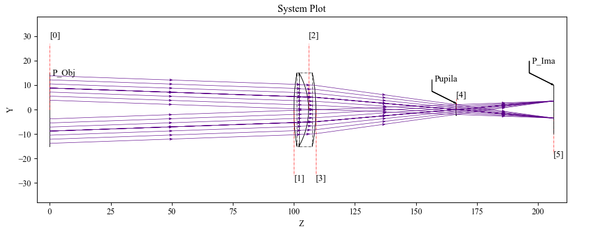
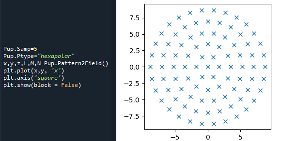
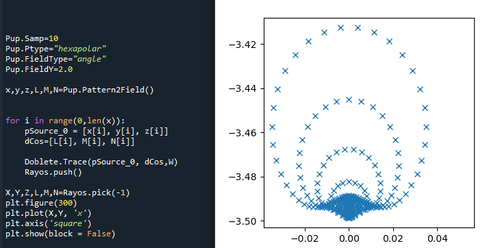
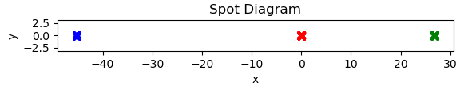

PupilCalc Tool
==============

This page is a faithful conversion of Section 5 of the provisional manual
(``KrakenOS/Docs/USER_MANUAL_KrakenOS_Provisional.pdf``, pages 21–27).

The system aperture — commonly the *aperture stop* (Ref. 5, §6.2) — is the
element that defines how much light passes through the optical system. The
image of the aperture formed by all elements **in front of** it is the
*entrance pupil*; the image of the entrance pupil formed by the whole system
is the *exit pupil*. The entrance pupil is not necessarily defined by the
first element: sometimes it is set by a mechanical element rather than an
optical surface.

.. _figure-4:

   Figure 4. Visualization of two beams that coincide at the position defined
   as the pupil. (See appendix 7.10 — *Examp_Doublet_Lens_Pupil.py*.)

In the example above, the aperture stop sits on surface 4. Two beam fans
arrive at field angles of +2° and −2°; their rays are collimated and pass
together through the stop.

Tracing rays uniformly across the pupil one-by-one is awkward — fields with
different origins on the object plane each need their own ray-direction
calculations. ``PupilCalc`` automates that by sampling the pupil for a given
field and aperture definition.

.. code-block:: python
   :caption: Code 5 — creating a PupilCalc object

   W = 0.4
   Surf = 4
   AperVal = 10
   AperType = "EPD"
   Pup = Kos.PupilCalc(Doublet, Surf, W, AperType, AperVal)

Constructor arguments:

* ``Doublet`` — the optical system built from ``Kos.system``
* ``Surf`` — index of the aperture-stop surface (surface 4 in
  :ref:`Figure 4 <figure-4>`)
* ``W`` — wavelength at which the entrance and exit pupils are evaluated
* ``AperType`` — ``"STOP"`` (``Surf`` is the aperture stop) or ``"EPD"``
  (``AperVal`` is the entrance-pupil diameter)
* ``AperVal`` — aperture-stop diameter or entrance-pupil diameter, depending
  on ``AperType``

Pupil parameters
----------------

After construction, the resulting object exposes the pupil parameters:

.. list-table:: Table 4 — pupil parameters on the PupilCalc object
   :header-rows: 1
   :widths: 30 70

   * - Attribute
     - Meaning
   * - ``Pup.RadPupInp``
     - Entrance-pupil radius.
   * - ``Pup.PosPupInp``
     - Entrance-pupil position.
   * - ``Pup.RadPupOut``
     - Exit-pupil radius.
   * - ``Pup.PosPupOut``
     - Exit-pupil position.
   * - ``Pup.PosPupOutFoc``
     - Exit-pupil position relative to the focal plane.
   * - ``Pup.DirPupSal``
     - Exit-pupil orientation.

The pupil position is computed even when surfaces are decentered or tilted —
in that case the displaced pupil becomes relevant when computing aberrations.

Automatic ray generation
------------------------

``PupilCalc`` also generates rays that uniformly sample the real pupil. The
sampling is configured through the attributes below.

.. list-table:: Table 5 — automatic ray generation from the pupil
   :header-rows: 1
   :widths: 30 70

   * - Attribute
     - Meaning
   * - ``Pup.Samp = #``
     - Integer pupil-sampling parameter. Default ``5``.
   * - ``Pup.Ptype = "<pattern>"``
     - Pupil pattern. Allowed values:

       * ``"rtheta"`` — one ray at radius ``Pup.rad`` (0–1) and angle
         ``Pup.theta`` (0–360°) on the unit pupil.
       * ``"chief"`` — chief ray through the pupil centre.
       * ``"hexapolar"`` — hexapolar pattern.
       * ``"square"`` — rectangular grid.
       * ``"fanx"`` — linear fan on the x-axis only.
       * ``"fany"`` — linear fan on the y-axis only.
       * ``"fan"`` — fans on both x and y.
       * ``"rand"`` — random sampling.
   * - ``Pup.FieldType = "height"`` or ``"angle"``
     - Field type. ``"height"`` is used when the object is at a finite distance
       (object height in millimetres); ``"angle"`` is used when the rays arrive
       from infinity (degrees).
   * - | ``Pup.FieldX = #``
       | ``Pup.FieldY = #``
     - Field value on the X and Y axes, in millimetres or degrees as set by
       ``FieldType``.

To convert the unit-pupil sampling into real-world origins and direction
cosines:

.. code-block:: python

   x, y, z, L, M, N = Pup.Pattern2Field()

``x, y, z`` are the origin coordinates and ``L, M, N`` the direction cosines.
The arrays can be iterated to trace each ray:

.. code-block:: python
   :caption: Code 6 — looped trace from a PupilCalc pattern

   for i in range(0, len(x)):
       pSource_0 = [x[i], y[i], z[i]]
       dCos = [L[i], M[i], N[i]]
       Doublet.Trace(pSource_0, dCos, W)
       Rays.push()

The ray origins themselves can also be plotted. A hexapolar pattern is shown
below.

   Figure 5. Generated code and pattern for the ray origins with a hexapolar
   distribution.

And the corresponding spot diagram at a 2° field:

   Figure 6. Code and spot diagram generated with a hexapolar pattern and a
   field angle of 2°.

When analyzing several fields, build a fresh pattern for each one and store
the traces in separate ``Raykeeper`` containers to keep the results from
mixing.

5.1 Atmospheric refraction in PupilCalc
---------------------------------------

When ``FieldType`` is ``"angle"`` — appropriate for telescopes, where rays
arrive from infinity — ``PupilCalc`` can apply an atmospheric-refraction
correction by deferring to the open-source AstroAtmosphere library (Ref. 3).

AstroAtmosphere computes the ray deviation from the observatory's physical
parameters: geographic latitude (deg), site altitude (m), humidity, CO₂
content (ppm), reference wavelength and zenith distance (deg). The settings
below configure ``PupilCalc`` to apply that correction.

.. code-block:: python
   :caption: Code 7 — enabling atmospheric refraction

   Pup.AtmosRef = 1       # 0 to disable, 1 to enable
   Pup.T  = 283.15        # Temperature (K)
   Pup.P  = 101300        # Atmospheric pressure (Pa)
   Pup.H  = 0.5           # Humidity (0 to 1)
   Pup.xc = 400           # CO2 (ppm)
   Pup.lat = 31           # Latitude (degrees)
   Pup.h  = 2800          # Observatory altitude (m)
   Pup.l1 = 0.60169       # Reference wavelength (µm)
   Pup.l2 = 0.50169       # Wavelength of interest (µm)
   Pup.z0 = 55.0          # Zenith distance (degrees)

The example below generates three groups of rays for the same telescope at
three different wavelengths:

.. code-block:: python
   :caption: Code 8 — building three wavelength groups

   W1 = 0.50169
   Pup.l2 = W1
   xa, ya, za, La, Ma, Na = Pup.Pattern2Field()

   W2 = 0.60169
   Pup.l2 = W2
   xb, yb, zb, Lb, Mb, Nb = Pup.Pattern2Field()

   W3 = 0.70169
   Pup.l2 = W3
   xc, yc, zc, Lc, Mc, Nc = Pup.Pattern2Field()

Each group is traced and pushed into its own ``Raykeeper``:

.. code-block:: python
   :caption: Code 9 — tracing each wavelength group

   for i in range(0, len(xa)):
       Telescope.Trace([xa[i], ya[i], za[i]], [La[i], Ma[i], Na[i]], W1)
       Rays1.push()

   for i in range(0, len(xb)):
       Telescope.Trace([xb[i], yb[i], zb[i]], [Lb[i], Mb[i], Nb[i]], W2)
       Rays2.push()

   for i in range(0, len(xc)):
       Telescope.Trace([xc[i], yc[i], zc[i]], [Lc[i], Mc[i], Nc[i]], W3)
       Rays3.push()

Plotting the per-wavelength spot diagrams shows a separation of roughly 72 µm
between the extreme wavelengths (blue and green crosses in
:ref:`Figure 7 <figure-7>`):

.. code-block:: python
   :caption: Code 10 — plotting the per-wavelength spot diagrams

   X, Y, Z, L, M, N = Rays1.pick(-1)
   plt.plot(X * 1000.0, Y * 1000.0, 'x', c="b")

   X, Y, Z, L, M, N = Rays2.pick(-1)
   plt.plot(X * 1000.0, Y * 1000.0, 'x', c="r")

   X, Y, Z, L, M, N = Rays3.pick(-1)
   plt.plot(X * 1000.0, Y * 1000.0, 'x', c="g")

.. _figure-7:

   Figure 7. Images formed by a telescope that are spectrally displaced by
   the action of atmospheric refraction.
