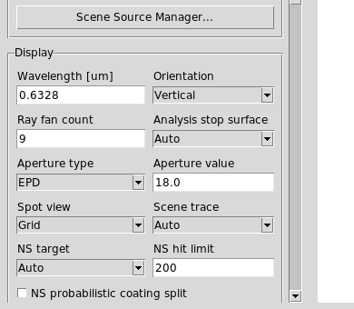

Tracing And Ray Data
====================

Scene-first UI model
--------------------

The UI is moving toward a non-sequential scene-first architecture. The editable
table is treated as a KrakenOS scene/object list. Exact sequential tracing is
still first-class, but it is the axial ordered-surface special case of that
scene model rather than the UI's long-term organizing principle.

The ``Scene trace`` control therefore behaves as follows:

* ``Auto`` uses KrakenOS ``NsTraceLoop`` when the layout contains a physical
  source, a beam splitter, an STL optical solid, off-axis/tilted scene geometry,
  a non-sequential target surface, or probabilistic non-sequential coating.
* ``Non-Sequential Preview`` explicitly forces the scene trace path.
* ``Sequential`` explicitly forces the ordered-surface axial compatibility
  path.
* ``Folded Preview`` remains a legacy display compatibility mode for simple
  mirror-folded layouts.

The separate ``Folded reach`` control decides whether folded 2D display paths
are allowed to define detector hits:

* ``Trace events`` keeps KrakenOS ray events authoritative. Folded display
  detector status, residuals, and detector surface are still written to Ray
  Events CSV and ray-analysis records, but they do not replace the physical
  terminal surface or detector-hit flag.
* ``Display compatibility`` preserves the old folded-preview behavior for
  layouts that intentionally use a display path as the detector reach model.
  This mode is explicit because it is a compatibility display workflow, not a
  physical non-sequential trace.

   ``Scene trace`` lives in the left Display controls beside the ray count,
   aperture, non-sequential target, and hit-limit fields.

2D slices, 3D scenes, and CAD envelopes
---------------------------------------

The UI keeps ray generation 3D-first for scene/CAD workflows:

* The 2D layout is a display slice/projection. ``YZ`` and ``XZ`` are physical
  section views through the traced 3D bundle; ``XY`` is the top-view footprint.
  In a section view a finite-object cone appears as a triangular slice rather
  than a filled cone.
* Sequential ``Pupil / field`` 2D previews use one shared 3D section trace and
  filter it into the selected projection. If the active field span is zero,
  the UI disables ``Field Samples`` as ``NA`` and traces one effective on-axis
  field launch while preserving the requested field count in metadata.
* Ray hover/click diagnostics in the 2D plot and 3D viewers read the canonical
  terminal event. A missed detector/Image reports the detector surface, plane
  distance, radial miss, active half-aperture, local detector-plane X/Y, active
  detector width/height, and the original kernel terminal reason when
  available.
* Active detector footprints and missed-detector crosshairs are scene-target
  overlays, not viewer-only guesses. The 2D projector and both 3D viewers draw
  them from ``SceneTarget3D`` detector metadata and ray terminal events.
* The 3D inspector is not produced by revolving the 2D sketch. It retraces a
  source-driven 3D boundary bundle around the entrance pupil/object cone, then
  adapts inward to the through-going pupil envelope if the outer launch boundary
  is clipped by the optical train. The 3D ``Full Pupil`` toggle still requests a
  dense full-pupil bundle.
* ``Export 3D STEP`` uses the same source-driven 3D boundary bundle and then
  writes only the outer ray envelope as solid STEP tubes for mechanical review.

This separation matters for arbitrary shapes: STL/STEP solids, prisms, beam
splitters, and future non-sequential components must see true world-coordinate
ray directions, while the 2D view remains a readable diagnostic slice.

Sequential tracing special case
-------------------------------

The manual's basic workflow is:

1. Build ``surf`` objects for Object, optical surfaces, stops, mirrors, and
   Image.
2. Create ``config = Kos.Setup()``.
3. Create ``system = Kos.system(surface_list, config)``.
4. Trace rays with ``system.Trace(source_point, direction_cosines, wavelength)``.
5. Push traced rays into ``Kos.raykeeper(system)``.

Minimal example:

.. code-block:: python

   import KrakenOS as Kos

   obj = Kos.surf()
   obj.Thickness = 100.0
   obj.Glass = "AIR"
   obj.Diameter = 30.0

   lens = Kos.surf()
   lens.Rc = 92.847
   lens.Thickness = 6.0
   lens.Glass = "BK7"
   lens.Diameter = 30.0

   image = Kos.surf()
   image.Glass = "AIR"
   image.Diameter = 20.0

   system = Kos.system([obj, lens, image], Kos.Setup())
   rays = Kos.raykeeper(system)
   system.Trace([0.0, 0.0, 0.0], [0.0, 0.0, 1.0], 0.55)
   rays.push()

Non-sequential tracing
----------------------

The manual introduces ``system.NsTrace(source_point, direction_cosines,
wavelength)``. Current UI coverage adds:

* ``Auto`` scene tracing that resolves to ``NsTraceLoop`` for source-driven,
  beam-splitter, off-axis, target-surface, or coating-probability scenes
* explicit Non-Sequential Preview mode
* ``NsLimit``
* target surface selection using ``TargSurf``/``TargSurfRest``
* ``energy_probability`` for probabilistic coating branch splitting
* ``Beam Splitter`` rows that persist splitter settings, spawn deterministic
  reflected/transmitted child paths, and write coating tables as a fallback
* file-backed optical CAD/STL solids through native ``Solid_3d_stl`` rows;
  STEP/IGES vendor CAD is meshed to cached STL first, and closed meshes use the
  row material for non-sequential entry/exit regardless of the tilted mesh side
  selected by the hit chooser
* Non-Sequential Scene Graph inspection and CSV export
* Trace Path inspection and CSV export

Branches are produced by KrakenOS during ``NsTrace``/``NsTraceLoop``. They are
not hand-authored nodes; the UI shows them as trace diagnostics after the ray
trace. Deterministic beam-splitter mode records branch identity, parent
identity, power, phase metadata, and branch labels in ``raykeeper``.

Scene source records
--------------------

The UI maps the current Source panel to a first-class ``SceneSource3D`` record
when no explicit scene sources are defined. For multi-source work, use
``Actions -> Scene Source Manager...`` or the ``Scene Source Manager...`` button
in the Source panel. The manager edits the saved ``SETTINGS["scene_sources"]``
records, controls whether source rows appear after Object or before Object, and
keeps those source rows separate from KrakenOS ``surf`` indices. Saved layouts
can also declare the same records directly, for example:

.. code-block:: python

   SETTINGS = {
       "scene_sources": [
           {
               "source_id": "source:left",
               "name": "Left illuminator",
               "model": "Collimated disk source",
               "origin": [0.0, -10.0, 0.0],
               "direction": [0.0, 0.124, 0.992],
               "radius": 1.2,
               "ray_count": 5,
               "power": 0.6,
           },
           {
               "source_id": "source:right",
               "name": "Right illuminator",
               "model": "Collimated disk source",
               "origin": [0.0, 10.0, 0.0],
               "direction": [0.0, -0.124, 0.992],
               "radius": 1.2,
               "ray_count": 5,
               "power": 0.4,
           },
       ],
   }

The source record is carried by ``SceneBundle.sources`` and exposed in the
Non-Sequential Scene Graph. Physical source modes such as ``Collimated disk
source`` and ``Gaussian beam`` are marked as illumination sources. The legacy
``Pupil / field source`` mode is marked as a ``pupil_field_reference`` because
it is not a physical emitter independent of the Object row.

Use ``Actions -> Source Illumination Report`` after ``Update`` to audit a
selected Object, aperture, splitter, detector, or Image surface. The report
groups traced hits by ``SOURCE_ID`` and shows launched source rays, target-hit
rays, missed/vignetted rays, hit power, power throughput, hit centroid, RMS
radius, and hit span. For rays that never hit the selected target, the report
also shows missed power, the dominant terminal/loss surface, and a terminal
count breakdown. The report table stays compact; selecting a source row opens
the full loss, power, centroid, RMS, and span details in the details pane below
the table. The exported CSV includes those same loss-diagnostic fields.
The ``Illum`` analysis button uses the same traced records for layouts with
explicit scene sources and plots a target-surface power-density map with
per-source centroids; when target rays are missed, the plot annotation includes
the dominant loss terminal. This source-to-object diagnostic layer uses the same
traced 3D ray data as Ray Inspector and SceneBundle, so it does not rebuild a
separate illumination ray set.

For physical scene sources, ``Illum`` is normally a camera-sensor or Image-plane
relative illumination plot. With target ``Auto``, the UI therefore chooses the
first traced-hit target by optical-design priority: Detector/Image, Object or
Diffuse Object target, Aperture/Stop pupil plane, then any other hit surface.
Use ``Analysis surface`` or the Source Illumination Report ``Target`` dropdown
to override that default when you intentionally want illumination on an entrance
pupil, aperture stop, exit pupil proxy, object target, or intermediate surface.
The table row selection alone is not used as the ``Illum`` target, which avoids
accidentally plotting illumination on a beam splitter or lens row.

Launch sampling metadata
------------------------

Ray exports preserve both what the user requested and what the physical launch
actually contains. This matters most for on-axis sequential layouts: a saved
layout may request three field samples, but if ``Field Half-Angle`` or object
height is zero, all three fields overlap. The live preview traces one effective
field launch; saved rays and CSV exports record both values so the browser view
does not hide either fact.

The launch metadata appears on raykeeper arrays, canonical ``RayEvent3D``
records, Ray Inspector rows, ray-analysis rows, and ray-event CSV exports:

* ``LAUNCH_FIELD_REQUESTED``: authored field sample count.
* ``LAUNCH_FIELD_EFFECTIVE``: distinct physical field launches after overlap
  collapse.
* ``LAUNCH_FIELD_BASIS`` and ``LAUNCH_FIELD_UNIT``: angle/object-height basis.
* ``LAUNCH_FIELD_MIN`` and ``LAUNCH_FIELD_MAX``: sampled field span.
* ``LAUNCH_FIELD_ACTIVE``: false when the span is zero.
* ``LAUNCH_RAY_COUNT`` and ``LAUNCH_PUPIL_PATTERN``: per-launch ray sampling.
* ``LAUNCH_TRACE_INTENT`` and ``LAUNCH_SAMPLING_MODE``: resolved sequential or
  non-sequential path plus UI/saved sampling mode.

Missed detector terminals are also event-owned. ``Image`` rows are detector
terminals in both sequential and non-sequential scene mode. If a
non-sequential ray exits the modeled optical geometry before reaching a
detector/Image surface, the scene event layer projects that terminal marker to
the detector plane. It is classified as
``missed_image``/``missed_detector`` and remains ``reaches_detector=False``.
Ray-event and ray-analysis CSV rows preserve
``terminal_geometry_source=detector_miss_plane`` plus detector surface,
projected distance, radial miss, active half-aperture, plane-normal residual,
and the original kernel terminal reason. The 2D and Open 3D viewers use the
same terminal status: detector hits, missed detectors, absorbed paths, escaped
paths, and diagnostic stops receive distinct endpoint markers, and dense plots
continue to show non-hit terminal markers even when normal detector-hit glyphs
are hidden.

``Actions -> Detector Aperture Report`` summarizes those same ray-analysis
records by detector/Image surface. It reports ray/path count, unique source-ray
count, detector hits, missed-detector projections, stopped/other terminals, hit
and miss power, hit/miss fractions, the worst miss margin, worst local X/Y, and
the dominant terminal reason. Its CSV export keeps the detector surface plus
the worst-miss radial, active half-aperture, projected distance, and plane
normal residual fields, so aperture clipping can be audited without reading the
2D plot by eye. The same aggregate detector hit/miss counts are written into
the normal results panel after each trace, and the status bar reports a compact
detector-miss warning when any detector/Image aperture is clipped. Ray
Inspector top rows and CSV export also include normalized per-ray aperture
status fields so each path can be read as detector hit, detector miss, detector
bypass, or unrelated to a detector.

The editable table still stores KrakenOS optical surfaces. A visible
``Illumination Source`` table entry is a scene row backed by ``SceneSource3D``,
not a KrakenOS ``surf`` row. Double-click a source row to open the Scene Source
Manager. Right-click the source row for direct source-row actions such as
duplicate, delete, and move up/down; those actions update
``SETTINGS["scene_sources"]`` only and do not insert pseudo-surfaces. That
distinction keeps source authoring from shifting detector/path surface indices.

Scene target records
--------------------

The scene bundle also carries ``SceneTarget3D`` records. These records make
Object, Object Target, Diffuse Object, Aperture, Image/detector, and explicitly
selected non-sequential target rows visible as object/detector scene entities
without adding or reordering KrakenOS ``surf`` indices. Object and Image rows
remain reference/detector targets by default; they do not become movable
``ScenePlacement3D`` handle records, and old placement metadata on those
reference rows is ignored by the 3D handle layer.

Each target record stores:

* row index and trace-surface index;
* target role, such as ``object_reference``, ``object_target``, ``aperture``,
  ``detector``, or ``analysis_target``;
* world center, normal, and tangent vectors used by display/analysis tooling;
* detector active area, detector bins, and pixel pitch when detector metadata
  is present;
* whether the record is a detector, an object/reference, or the active
  ``TargSurf`` selection.

``Actions -> Non-Sequential Scene Graph`` exposes these records under
``Scene targets``. Use ``Edit Target`` in that window to update target identity
without creating a UI-only abstraction. The editor stores target role metadata
on the surface row, writes detector active area/bins/pixel pitch through the
same detector metadata used by detector analyses, and can set or clear the
active non-sequential ``TargSurf`` selection.

Choosing ``Detector`` marks the selected non-Object row as a detector target.
Choosing ``Object Target``, ``Diffuse Object``, or ``Aperture`` applies the
same surface-type defaults used by the editable table, so KrakenOS tracing
still receives ordinary prescription rows. Choosing ``Analysis Target`` keeps
the surface type unchanged but persists a scene-target role for diagnostics and
future target-aware analysis.

Possible next scene workflows
-----------------------------

White-light triangular-prism dispersion is compatible with the North Star. It
should be implemented as a wavelength-sampled physical source, not a 2D color
overlay. The trace should launch the same beam over a wavelength list, let the
glass catalog produce wavelength-dependent refractive indices, and store each
ray's wavelength in canonical events. The 2D and 3D renderers can then color
the same traced rays by wavelength and a detector target can report the
chromatic spot/rainbow footprint.

Direct placement of imported STEP optical components in the 3D plot is also
compatible with the current architecture. STEP/IGES already converts to cached
STL for tracing, and CAD/STL faces already carry placement and optical-role
metadata. Rows can now also carry ``ScenePlacement`` metadata for grid
visibility, linear snap spacing, angular snap step, and placement anchor
intent. ``SceneBundle`` exposes
those records as ``ScenePlacement3D`` objects, and the Non-Sequential Scene
Graph exports them beside sources, targets, volumes, and boundary faces. Open
3D renders a placement grid from the selected or first visible placement record
and shows the active snap/grid values in a VTK overlay. The visible translation
handles move the selected row along global ``X/Y/Z`` by ``ScenePlacement`` snap
spacing when snap is enabled, or by the grid spacing when snap is off. Each
move writes ``DespX/Y/Z`` plus placement metadata through the normal row
history/table path. Rotation handles rotate the selected row around global
``X/Y/Z`` by ``ScenePlacement.snap_deg`` when snap is enabled, or by a coarse
15 degree step when snap is off, and write ``TiltX/Y/Z`` through the same row
history/table path. Dragging a placement handle accumulates screen motion and
applies repeated snap steps through the same row-backed services; clicking
without dragging remains the precise one-step fallback. A full 3D placement
tool should still add richer face/axis picking, but those controls must persist
back to row pose plus ``ScenePlacement`` and optical-solid metadata. The same
scene state must drive the 2D projection, 3D display, tracing, scene graph
diagnostics, and CSV export.

Source orientation uses direction cosines ``L/M/N`` in global ``X/Y/Z`` axes.
In the usual ``YZ`` 2D layout, ``+Z`` is horizontal to the right and ``Y`` is
vertical on the page. Use the Source panel ``Direction preset`` dropdown for the
common cases:

.. list-table::
   :header-rows: 1

   * - Preset
     - LMN
     - Meaning in YZ layout
   * - ``Horizontal +Z (right)``
     - ``0, 0, 1``
     - Launch left-to-right along the optical table axis.
   * - ``Horizontal -Z (left)``
     - ``0, 0, -1``
     - Launch right-to-left.
   * - ``Vertical +Y (up)``
     - ``0, 1, 0``
     - Launch upward on the YZ plot.
   * - ``Vertical -Y (down)``
     - ``0, -1, 0``
     - Launch downward from a top port.

The older ``Display orientation`` control only changes the 2D plot/view
orientation. It does not rotate a physical source.

``SceneBundle.scene_row_mapping`` carries the bridge for that visible table. It
maps scene rows to current table rows and KrakenOS trace surfaces. For a reset
scene with one physical source, the default scene-row order is:

.. list-table::
   :header-rows: 1

   * - Scene row
     - Kind
     - Trace surface
   * - ``0`` / ``S0 Object``
     - Surface
     - ``0``
   * - ``1`` / ``Src1 Source 1``
     - Illumination source
     - None
   * - ``2`` / ``S1 Image``
     - Surface
     - ``1``

This lets the UI later show ``Object`` + ``Illumination Source`` + ``Image``
without changing the trace indices consumed by raykeeper, detector paths, and
analysis tools.

``Actions -> Non-Sequential Scene Graph`` exposes the same mapping today. The
tree has a ``Scene row order`` node and columns for scene row, current table
row, trace surface, and source ID. Use it to confirm whether a source is a
physical scene emitter or an optical surface before relying on detector/path
indices.

For illumination-first layouts, set ``scene_row_order="before_object"`` in
layout ``SETTINGS``. The future scene-row order then becomes ``Src1 Source 1``,
``S0 Object``, ``S1 Image`` while trace surfaces remain ``0`` and ``1``. This is
intended for source/object split systems where the user thinks of placing a
lamp or laser first, then the object, then imaging optics.

For source/object split fixtures that need a return path today, use the table
surface type ``Object Target``. It is intentionally semantic: the UI presents it
as the object location, while the current tracing backend maps it to a specular
reflective proxy. This avoids labeling the object as a normal ``Mirror`` in the
workflow.

Use ``Diffuse Object`` when the object should scatter instead of returning one
specular proxy ray.  Its ``DiffuseScatter`` metadata uses the built-in
Lambertian, Oren-Nayar, Cosine Lobe, or optional ``pySCATMECH`` backend: a hit
spawns deterministic child branches named ``scatterNN`` and records their
powers in ``BRANCH_POWER``.  For imaging
fixtures, set ``target_surface`` in that metadata to a pupil, lens, detector,
beam splitter return aperture, or Image surface; the core then
importance-samples that target with approximate model-weighted solid-angle
weights instead of wasting most rays outside the useful camera path.

For detector-plane coherence analysis, ``CohDet`` now supports grouping modes:
``All rays coherent``, ``By source ray``, ``By source``, and ``Incoherent power
only``. ``By source ray`` is the practical default for interferometers and
source bundles because complementary branches from one launched source ray still
interfere, while independent launches add as intensities instead of one global
field.

The same detector-bin machinery now exposes branch-code self terms and
complementary branch-pair interference terms on the detector grid. Detector-
bearing interferometer layouts can therefore let ``Interf`` reuse the coherent
detector accumulation when the detector sampling is dense enough; sparse
single-ray presets still fall back to the analytic path-average diagnostic.
The ``Diffr`` analysis then takes the same coherent detector field and computes
a vector Fraunhofer/angular-spectrum FFT, with coherent groups handled
according to the selected coherence mode. The detector-bin stability validator
checks that changing the detector grid does not silently change the traced
sample set, branch-code set, coherence grouping, incoherent power accounting,
all-rays Jones-vector intensity, or unitary FFT power conservation.

Regression check:

.. code-block:: bash

   python -m KrakenOS.UI.validate_object_target_surface
   python -m KrakenOS.UI.validate_diffuse_object_scatter
   python -m KrakenOS.UI.validate_diffuse_object_cosine_lobe
   python -m KrakenOS.UI.validate_diffuse_object_oren_nayar
   python -m KrakenOS.UI.validate_diffuse_object_pyscatmech
   python -m KrakenOS.UI.validate_coherent_detector_modes
   python -m KrakenOS.UI.validate_interferogram_detector_accumulation
   python -m KrakenOS.UI.validate_diffraction_detector
   python -m KrakenOS.UI.validate_detector_sampling_stability
   python -m KrakenOS.UI.validate_detector_aperture_analysis

Each traced ray also carries source identity metadata:

* ``SOURCE_ID``: stable source key such as ``source:0`` or ``source:left``
* ``SOURCE_NAME``: user-facing source name such as ``Source 1`` or
  ``Left illuminator``
* ``SOURCE_ROLE``: ``illumination`` or ``pupil_field_reference``
* ``SOURCE_MODEL``, ``SOURCE_XYZ``, ``SOURCE_LMN``, ``SOURCE_POWER``,
  ``SOURCE_WEIGHT``, and ``SOURCE_WAVELENGTH``: launch model and launch state

Validate this plumbing with:

.. code-block:: bash

   python -m KrakenOS.UI.validate_scene_sources
   python -m KrakenOS.UI.validate_multi_scene_sources
   python -m KrakenOS.UI.validate_scene_row_mapping
   python -m KrakenOS.UI.validate_scene_source_row_contract
   python -m KrakenOS.UI.validate_gaussian_branch_frames

``validate_scene_row_mapping`` also checks row-backed 3D placement state. The
coverage includes ``ScenePlacement`` snap/grid metadata, Open 3D translate and
rotate handle services, and the ``Snap Row->Target`` service that moves one row
or face onto another row or face while preserving the solved target-surface
constraint in row metadata. It also covers ``Orient Row->Target``, which solves
row ``TiltX/Y/Z`` so a selected row or face normal aligns to another row or
face normal and stores the solved target-normal constraint in the same metadata.
The same validator now checks vector-backed orientation for ``Orient Row->Ray``:
a selected row or face normal can be aligned to an arbitrary traced ray
direction, with the target vector, ray index, and residual angle error persisted
as ``ScenePlacement`` metadata. It also checks ``Orient Row->Source`` and
``Orient Row->Path`` services, which persist source-vector and Path-frame
constraints, including source origin/direction, branch path, nearest target
point, and residual angle error. The validator also covers immediate local-axis
and explicit scene-source orientation: ``Orient Row->CAD Axis`` records the
selected row-local axis vector, and ``Orient Row->Scene Source`` records the
explicit source id/name, origin, direction, model, ray count, and residual
angle error. Named normal target coverage is included as well: the validator
checks ``Preview Normal`` for detector/object targets, verifies that preview
does not mutate row pose, and verifies that ``Orient Row->Normal`` records
``detector_normal`` or ``object_normal`` metadata with target row/id/name/role,
target point, target normal, and residual angle error.
``validate_layout_plot_controller`` also checks detector-miss terminal
projection so escaped rays that intersect the detector plane outside the active
aperture are displayed and exported as misses instead of arbitrary short
terminal segments.

Optical STL prism check
-----------------------

For a prism STL rotated into the classic dispersion pose, the first STL hit
should not report ``n=1 -> 1``.  A BK7 prism entry should report approximately
``n=1 -> 1.518`` at ``0.55 um`` and the outgoing direction should bend toward
the prism base.  Run the regression check with:

.. code-block:: bash

   python -m KrakenOS.UI.validate_stl_prism_media

Face-role metadata check
------------------------

After changing the CAD/STL optical face workflow, run:

.. code-block:: bash

   python -m KrakenOS.UI.validate_optical_solid_face_roles

This clusters the bundled prism STL into planar candidates, verifies automatic
input/output role assignment, checks that candidates expose triangle meshes for
3D click-picking, checks beam-splitter split-ratio persistence, and confirms
that saved ``OpticalSolidFaces`` metadata survives the advanced attribute
parser. It also verifies that assigned face roles transform into finite
unit-normal markers for the 3D inspector and CAD/STL placement preview.

Face-anchor snap-to-ray check
-----------------------------

After changing the CAD/STL placement workflow, run:

.. code-block:: bash

   python -m KrakenOS.UI.validate_optical_solid_snap_to_ray

This validates the first Phase 7 prism/CAD improvement: when a file-backed
optical solid has saved face metadata, ``Center Row->Ray`` prefers the best
assigned optical-face anchor instead of the generic row origin. The regression
uses the bundled prism STL and checks that a designated transmitted left face is
selected and snapped onto the chosen axial ray.

Face-fit placement check
------------------------

After changing face-driven CAD/STL placement, run:

.. code-block:: bash

   python -m KrakenOS.UI.validate_optical_solid_face_fit

This validates the next Phase 7 slice: the placement helper can choose a saved
anchor face, align that face normal to the optical axis, center the anchor on
the row plane, and apply a simple side-label-based roll constraint when a
compatible guide face is available.

Path-frame face-fit check
-------------------------

After changing traced ray/path-driven CAD/STL placement, run:

.. code-block:: bash

   python -m KrakenOS.UI.validate_optical_solid_path_fit

This validates the next placement step: the same face-fit solver can use the
currently selected traced ray or current Path-view frame as the target
direction and target point. The regression loads a traced beam-splitter layout,
attaches a controlled branch-ray bundle, solves a prism face onto that selected
ray, repeats the solve against the current Path dropdown frame, and verifies
that ``Save Roles`` stores row-relative decenter correctly when the CAD/STL row
is not at ``Z=0``. It also covers the table workflow where a newly inserted
CAD/STL row is snapped to the outgoing traced segment of the previous table
surface instead of an earlier, merely closer ray segment.

Virtual internal plane check
----------------------------

After changing cube-style virtual internal optical-plane authoring, run:

.. code-block:: bash

   python -m KrakenOS.UI.validate_optical_solid_virtual_plane

This validates the next CAD authoring slice: a labeled cube-like optical solid
can derive a saved internal beam-splitter diagonal, preserve it in
``OpticalSolidFaces``, and transform that plane into world coordinates for 3D
preview and placement.

Optical-solid hit-sequence check
--------------------------------

After changing how traced CAD/STL hits map back onto assigned optical faces,
run:

.. code-block:: bash

   python -m KrakenOS.UI.validate_optical_solid_hit_sequence

This validates the next Phase 7 CAD authoring slice: traced hits on an optical
solid can be classified back to the saved face-role metadata, and crossings of
saved virtual internal planes can be inserted into the ordered hit sequence.
The regression uses a real traced prism STL chief ray and checks the expected
``Left -> Right -> Down -> Left`` face sequence, then adds a synthetic
cube-beam-splitter crossing to confirm the virtual splitter plane appears in
the correct position between the entry and exit faces.

Raykeeper data
--------------

The manual lists the raykeeper arrays as the persistent version of ``system``
ray state. The UI Ray Inspector exposes the same categories:

.. list-table::
   :header-rows: 1

   * - Category
     - Manual arrays
     - UI data product
   * - Surface path
     - ``SURFACE``, ``NAME``, ``GLASS``
     - Ray Inspector hit table and CSV.
   * - Coordinates
     - ``XYZ``, ``S_XYZ``, ``T_XYZ``, ``OST_XYZ``
     - Ray Inspector XYZ columns and 2D/3D ray picking.
   * - Direction cosines
     - ``S_LMN``, ``LMN``, ``R_LMN``
     - Ray Inspector incoming/outgoing direction columns plus the surface-normal
       columns in ``Inspect Ray / Surface Physics``.
   * - Gaussian branch frame
     - Derived from ``LMN``, ``R_LMN``, and ``S_LMN``
     - Ray Inspector and Trace Path Inspector ``GB K``, ``GB T``, ``GB S``,
       and ``Inc [deg]`` columns. ``GB K`` is the outgoing local propagation
       axis, ``GB T`` is tangential, and ``GB S`` is sagittal.
   * - Optical path
     - ``DISTANCE``, ``OP``, ``TOP``, ``TOP_S``
     - Ray Inspector distance/OP totals and CSV.
   * - Index and material
     - ``N0``, ``N1``, ``ALPHA``, ``BULK_TRANS``
     - Ray Inspector refractive index and transmission fields.
   * - Gratings
     - ``G_LMN``, ``ORDER``, ``GRATING_D``
     - Grating rows plus inspector output.
   * - Polarization
     - ``RP``, ``RS``, ``TP``, ``TS``, ``TTBE``, ``TT``
     - Ray Inspector and coating/polarization report.
   * - Interaction bookkeeping
     - ``INTERACTION_TYPE``, ``INTERACTION_MODEL``,
       ``INTERACTION_TARGET_SURFACE``, ``INTERACTION_IN_POWER``,
       ``INTERACTION_COEFF``, ``INTERACTION_OUT_POWER``,
       ``INTERACTION_LOSS_POWER``, ``INTERACTION_BULK``
     - ``Actions -> Inspect Ray / Surface Physics`` and ``Trace Path
       Inspector`` hit tables and CSV export.
   * - Source identity
     - ``SOURCE_ID``, ``SOURCE_NAME``, ``SOURCE_ROLE``, ``SOURCE_MODEL``,
       ``SOURCE_XYZ``, ``SOURCE_LMN``, ``SOURCE_POWER``, ``SOURCE_WEIGHT``,
       ``SOURCE_WAVELENGTH``
     - Scene source records, Ray Inspector source columns, and branch analysis.
   * - Launch sampling
     - ``LAUNCH_FIELD_REQUESTED``, ``LAUNCH_FIELD_EFFECTIVE``,
       ``LAUNCH_FIELD_BASIS``, ``LAUNCH_FIELD_UNIT``,
       ``LAUNCH_FIELD_MIN``, ``LAUNCH_FIELD_MAX``,
       ``LAUNCH_FIELD_ACTIVE``, ``LAUNCH_RAY_COUNT``,
       ``LAUNCH_PUPIL_PATTERN``, ``LAUNCH_TRACE_INTENT``,
       ``LAUNCH_SAMPLING_MODE``
     - Canonical ``RayEvent3D`` records, Ray Inspector, ray-analysis CSV, and
       ray-event CSV.

Inspect Ray / Surface Physics
-----------------------------

Use ``Actions -> Inspect Ray / Surface Physics`` after ``Update`` to inspect
one hit at a time. The hit table now exposes:

* Incoming direction, outgoing direction, and surface normal for each hit.
* Interaction type/model plus any guided target surface for scatter/splitter
  paths.
* Per-hit power accounting: input power, coefficient, output power, loss, and
  bulk term.

This is the quickest way to confirm whether a hit reflected, refracted,
transmitted, scattered, or split as expected before moving on to detector or
illumination analysis.

To validate the interaction bookkeeping end-to-end, run:

.. code-block:: bash

   python -m KrakenOS.UI.validate_interaction_accounting

Multicore and batch tracing
---------------------------

The manual appendix includes a multicore example. The current UI uses batch
tracing where safe, scalar tracing where required by custom surface behavior,
and background workers for heavier analyses and optimization.
