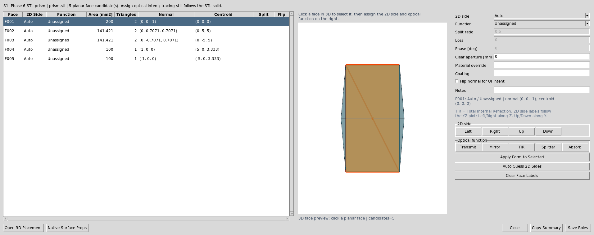

Display And Viewers
===================

The provisional manual documents ``Kos.display2d`` and ``Kos.display3d`` as the
primary display entry points for scripts. The current UI preserves those core
ideas but routes user interaction through shared scene data.

2D display
----------

The layout editor 2D view shows the optical layout, ray paths, folded previews,
ray clipping, cardinal markers, physical-distance annotations, and plot-linked
selection. The drawing path is unified around ``SceneBundle``: ``YZ`` and
``XZ`` are section views of traced 3D data, while ``XY`` is the top-view
footprint. The projection selector above the plot changes the view, not the
underlying optical prescription.

Lens drawing PDF export
~~~~~~~~~~~~~~~~~~~~~~~

``File -> Export Lens Drawing...`` opens a surface-properties dialog before it
writes the ISO-style PDF. The dialog saves drawing-only metadata in each row's
``DrawingProperties`` advanced attribute: clear aperture, form/power callout,
scratch-dig, coating note, and surface note. Blank fields remain placeholders in
the generated drawing. These fields are fabrication notes only; the ray tracer
continues to use the native KrakenOS surface attributes such as ``Rc``,
``Diameter``, ``Glass``, ``Coating``, and ``Drawing``.

3D display
----------

The manual's 3D viewer supports optical surfaces, rays, and STL-backed objects.
Current UI coverage:

* embedded 3D viewer
* Open 3D top controls split into a ``View`` row and a ``Scene`` row, with
  dense CAD/target, placement, and orientation actions grouped into category
  menus so the controls remain reachable on narrower windows; the
  ``validate_open3d_toolbar_layout`` contract keeps the dense commands out of
  the direct toolbar rows
* legacy 3D viewer compatibility
* ray show/hide toggles
* 3D ray click-to-inspect
* plain left-click selection without camera motion; left hold-drag rotates
  around the current view focal point with fixed sensitivity, and ``Ctrl`` +
  left drag follows the same path for compatibility
* middle-drag camera pan in the current view plane, matching the usual CAD
  lateral viewport shift
* ``Esc`` cancels active Open 3D carry/pick operations and clears the selected
  component; clicking blank viewport space also clears the current 3D selection
* ``Center Row->Optical Axis`` click workflow for centering a selected surface
  or CAD/STL row on the persistent dotted optical-axis guide while regular rays
  are hidden; imported STEP faces can use the same first-click gesture to arm
  normal-to-axis alignment, the first-click hover is highlighted, and the guide
  stays visible and pickable even when ``Show rays`` is off
* ``Snap Row->Target`` click workflow for moving a selected surface/CAD row or
  face onto another row or face
* ``Orient Row->Target`` click workflow for rotating a selected surface/CAD row
  or face normal onto another row or face normal
* ``Orient Row->Ray`` click workflow for rotating a selected surface/CAD row or
  face normal onto a clicked traced ray segment direction
* ``Orient Row->Source`` command for rotating a selected surface/CAD row or
  face normal onto the Source panel aim vector
* ``Orient Row->Path`` command for rotating a selected surface/CAD row or face
  normal onto the current Path-view frame
* ``Orient Row->CAD Axis`` command for rotating a selected surface/CAD row or
  face normal onto the selected local ``+X/-X/+Y/-Y/+Z/-Z`` axis
* ``Orient Row->Scene Source`` command for rotating a selected surface/CAD row
  or face normal onto an explicit Scene Source Manager source vector
* named normal selector for ``Active target``, ``Detector``, and ``Object``
  rows, with ``Preview Normal`` diagnostics and ``Orient Row->Normal`` apply
* optical surface meshes and solid-body meshes in the shared scene bundle
* double-sided Open 3D surface actors for scene meshes, so STEP/STL vendor
  winding does not make physical components vanish after a ray off/on refresh
* structured ``Open3DTrace`` diagnostics in the Debug panel and
  ``~/.cache/krakenos/logs/kraken_debug_latest.log`` for left clicks,
  right-click face context, matched face ids, face-function metadata writes,
  STEP promotion, ray toggles, refresh mesh rows, and actor counts
* row selection highlighting for surfaces and elements
* escaped non-sequential rays projected to the configured detector/Image plane
  as explicit missed-detector terminal markers
* dense 2D views suppress redundant detector-hit endpoint glyphs but keep
  missed detector, absorbed, escaped, and stopped terminal markers visible;
  missed detector/Image endpoints use a distinct orange marker in 2D and
  Open 3D
* active detector/Image footprints are drawn from the scene target detector
  metadata in 2D, embedded 3D, and legacy 3D. A missed-detector terminal adds
  an orange crosshair at the projected detector-plane intercept, making the
  active aperture and miss point directly comparable.
* 2D hover hints and 2D/3D ray selection messages show terminal diagnostics
  from the canonical ray event. For detector misses this includes detector
  surface, projected plane distance, radial miss, active half-aperture, local
  detector-plane X/Y, active detector width/height, and kernel terminal reason
  when available.
* ``Actions -> Detector Aperture Report`` groups the same event-owned detector
  terminals by detector/Image surface. It reports ray/path count, detector
  hits, missed detector projections, stopped/other terminals, hit fraction,
  hit and miss power, worst miss margin, worst local X/Y, and the dominant
  terminal reason, with a matching CSV export.
* the normal results panel includes detector aperture counts after each trace,
  and the status bar adds a compact detector-miss warning when a detector/Image
  aperture is clipped.
* Ray Inspector top rows include a per-ray detector aperture status and miss
  margin, so a selected path can be classified as a detector hit, detector
  miss, or detector bypass without opening a separate report.
* imported STEP axis centering: click ``Center STEP Axis`` and then click a
  planar/circular outer feature on any imported STEP component; the picked
  feature center moves onto the optical axis. If a STEP component is already
  selected, clicking a KrakenOS optical surface centers that STEP axis on the
  surface center.
* imported STEP normal-to-axis snapping: click a planar STEP face, then click
  the persistent dotted ``Optical Axis`` guide. The second click accepts only
  the optical-axis guide, which remains visible and pickable even when regular
  ray drawing is hidden. The picked face center moves onto the clicked optical
  axis point, and the picked face normal rotates parallel to the layout optical
  axis.
* persistent long dotted optical-axis guide in 3D at ``X=0, Y=0``

CAD/STL optical solids
----------------------

The manual examples include STL solids, an image slicer, and solid object
arrays. Vendor parts are more often supplied as STEP/IGES, so the UI accepts
STL directly and meshes STEP/STP/IGES/IGS through ``gmsh`` into a cached STL for
KrakenOS tracing. Current UI workflows:

* ``File -> Import Optical CAD/STL Solid...`` for first-class optical-solid
  import; after the row is inserted the face-assignment dialog opens
  automatically
* ``Actions -> 3D Place/Orient Selected CAD/STL Solid`` for in-view placement,
  axis alignment, and centring inside the existing 3D view
* ``Actions -> Assign CAD/STL Optical Faces`` for recording face roles, with
  assigned roles shown as coloured normal markers in the full face-role editor
  preview; direct Open 3D assignments are shown as coloured face outlines so
  they cannot look like extra glass; the face preview uses the same
  click-select and left-drag fixed-speed rotate behaviour as Open 3D
* direct Open 3D right-click face assignment on row-backed optical CAD/STL
  faces; this writes ``OpticalSolidFaces`` immediately and refreshes the traced
  scene, while the older ``Save Roles`` button remains specific to the full
  face-role editor dialog
* ``Shape...`` path staging for ``Solid_3d_stl``
* row tilt/decenter alignment for the solid object
* ``Actions -> Inspect Optical CAD/STL Solids`` topology and scale diagnostics
* Non-Sequential Scene Graph inspection of CAD/STL rows
* non-sequential tracing and trace-path diagnostics

An imported row stores the native KrakenOS ``Solid_3d_stl`` attribute in row
advanced metadata. For CAD sources, ``OpticalSolidSourcePath`` records the
original STEP/IGES file and ``Solid_3d_stl`` points to the cached mesh. The row
material controls refraction, the mesh supplies only geometry, and dimensions
are interpreted as millimetres. ``Auto`` scene trace resolves to
``Non-Sequential Preview`` for these rows so rays are traced with KrakenOS
``NsTraceLoop`` instead of the axial sequential special case. The 2D plot shows
a projected mesh footprint outline for file-backed solids so the solid body
remains visible even when rays pass through or overlap it.

For arbitrary prism shapes, use closed/manifold meshes with correct face
normals. Start from ``KrakenOS/Examples/Examp_Phase6_Optical_STL_Prism.py`` and
replace the mesh path, material, pose, and source bundle.

Arbitrary-prism workflow status: the current UI can import, diagnose, trace, and
display a closed optical solid, but raw table pose editing is not the intended
authoring experience. Treat ``TiltX/Y/Z`` and ``DespX/Y/Z`` as the saved
KrakenOS execution representation. The practical workflow should be a
face-role scene-object workflow:

1. Import the STEP/STL/IGES file. The UI inserts the optical-solid row and
   immediately opens the CAD/STL face-assignment dialog.
2. Select mesh/CAD faces and assign a 2D side label plus an optical function.
   Side labels are ``Left``, ``Right``, ``Up``, ``Down``, ``Front``, and
   ``Back``; the first four are referenced to the YZ 2D plot. Face interactions
   are ``Uncoated``, ``Full Reflecting``, ``Partial Reflecting / Transmitting``,
   or ``Absorbing / Mechanical``.
3. Assign the solid material and face coatings. A beam-splitter face also needs
   split ratio, loss, phase, and later P/S/Jones behavior.
4. Keep ``On Save: snap Input Port to traced ray`` enabled for the common
   prism convention. When roles are saved, the face marked ``Input Port`` is
   centered on the row plane or the selected traced input ray and its outward
   normal is aligned against the incoming direction. The
   ``Up``/``Down``/``Front``/``Back`` labels provide the roll constraint.
5. If the input ray is not the row optical axis, select the layout ray/path
   that should enter the prism and snap the chosen face to that ray instead.
6. Let the UI solve the object pose, then write only the solved transform back
   to the surface row.
7. Validate with a live chief-ray and bundle trace: show hit sequence, face
   role, incident/outgoing medium, surface normal, Snell/Fresnel/reflection/split
   decision, and stop reason.

For the standard axial prism workflow, side labels plus port roles are enough
to create an initial pose. Mark the entrance face as ``Input Port``; the usual
``Left`` side label only tells the YZ plot which side that face represents.
Leave the exit face on ``Auto`` for the common case, so downstream placement is
derived from the traced physical exit. Mark a downstream exit face as
``Output Port`` only when you want to override that traced exit and force
following elements to be placed from a specific face. Mark reflective, uncoated fold, beam-splitting, or
absorbing faces as ``Interaction Surface`` so they affect the ray without being treated
as entrance/exit ports. General off-axis placement still needs a ray/path
target, face-normal flip controls, clear apertures, internal reflecting faces,
material/dispersion, and optional virtual internal planes for vendor cube beam
splitters whose CAD contains only the outer cube.

The implemented face-role slice is available through ``Actions -> Assign
CAD/STL Optical Faces``. The dialog renders the actual STL/CAD mesh at the
current row pose and draws transparent selectable overlays plus outlines for
the planar face candidates. Click a coloured face in the preview to select
that candidate, then assign a ``2D side`` and an ``Optical function`` with the
quick buttons or the detailed form on the right. A plain click selects; left
hold-drag rotates the preview
around the current focal point with fixed sensitivity, matching Open 3D instead
of VTK's default accelerated trackball behaviour. ``Left``/``Right`` are along
the 2D layout Z direction and ``Up``/``Down`` are along Y; ``Front``/``Back``
are available for full 3D orientation notes. By default, ``Save Roles`` also
uses the ``Input Port`` face as the input-face convention, snaps that face to
the current Path view or the outgoing traced segment after the previous table
surface, and writes the solved ``TiltX/Y/Z`` and ``DespX/Y/Z`` pose back to the
row. If those are unavailable it uses the nearest traced 3D ray; if no traced
ray is available, it falls back to the old row-plane convention: outward normal
``-Z`` with incoming ray ``+Z``. ``Save Roles`` first applies the currently
selected face form, so a separate ``Apply Form to Selected`` click is optional
for the active selection.
For arbitrary prisms, use ``Fit ref normal`` on one nonparallel face to fix the
remaining roll after the entrance face is aligned. For example, ``+Y normal``
means the selected face normal should point upward in the layout; changing it
to ``-Y normal`` gives the corresponding Y-axis flip. ``2D side`` remains the
plot/path label, while ``Fit ref normal`` is the 3D orientation constraint.
For vendor drawings with an off-center entrance point, use ``Input snap U/V
[mm]`` on the chosen ``Input Port`` face. ``Save Roles`` snaps that in-face
anchor point, not only the face centroid, to the active traced input ray.
Use ``Pick In 3D`` to click the previewed face and back-fill those ``U/V``
values directly from the chosen world-space point. ``U`` prefers the
face-plane projection of local ``+Z``; ``V`` is the orthogonal in-plane axis.
The face list remains available as a fallback and as a
compact audit table. The face list emulates cell wrapping from the current
column width because Tk's native tree table does not wrap cell text by itself.
Drag a column separator to reflow the visible cells, or double-click a column
separator to auto-fit that column to its full content. The ``Uncoated`` face
mode uses ordinary glass/air Snell-Fresnel physics; total internal reflection
is then automatic when the incidence exceeds the critical angle. Split ratio is
only shown and editable for faces whose function is ``Partial Reflecting /
Transmitting``; phase and loss are enabled only for face functions where those
quantities are meaningful. Diffuse transmitting/reflecting behavior is not yet
implemented on imported CAD/STL faces; use a ``Diffuse Object`` row when the
required physics is Lambertian or BRDF-based scattering. If one physical optical
interface appears as two CAD
faces, such as a split cube-beam-splitter interface, select both face rows with
Shift/Ctrl and press ``Splitter`` so the same function metadata is applied to
both candidates.

For chained CAD/STL work, the UI uses one output-port pose resolver for all
views. A downstream CAD solid is displayed and traced from the upstream output
port pose, so 2D silhouettes, Open 3D meshes, face-role overlays, and Image
planes should stay aligned. If a chained solid looks different in 2D and 3D,
that is a resolver bug rather than a drawing preference.

If the installed VTK package does not ship ``libvtkRenderingTk.so``, the dialog
uses the Matplotlib/Tk 3D picker directly instead of first trying the broken
VTK/Tk widget path. This is expected for the standard pip VTK wheels: they ship
the Python ``vtkTkRenderWindowInteractor`` wrapper but not the native
``libvtkRenderingTk.so`` Tk widget library.

The same dialog now includes a ``Virtual Internal Plane`` workbench for
cube-style beam-splitter CAD. After labeling the outer ``Left``, ``Right``,
``Up``, and ``Down`` faces, use ``Auto Cube Splitter Plane`` to derive a saved
45-degree internal diagonal with split, loss, phase, and aperture metadata.
The plane is previewed in 3D and stored alongside the face labels inside
``OpticalSolidFaces``.

   ``Actions -> Assign CAD/STL Optical Faces`` opens the face table, 3D face
   preview, side labels, and optical-function quick buttons for the selected
   optical solid row.

The project devenv uses ``python313Packages.vtk`` from nixpkgs for the VTK
Python module and sets ``KRAKEN_VTK_TK_LIB_DIR`` to the same package's ``lib``
directory. ``kraken-install`` removes any pip-installed ``vtk`` wheel so the
venv does not shadow the Nix VTK build. Use ``devenv shell kraken-vtk-tk-check``
to verify that the UI can see the native VTK/Tk widget.

For a non-devenv setup, install or build VTK with ``VTK_USE_TK=ON`` and make the
directory containing ``libvtkRenderingTk.so`` visible to the UI. KrakenOS
searches the VTK package directory, the Python ``lib`` directory,
``/usr/local/lib``, ``TCLLIBPATH``, ``LD_LIBRARY_PATH``, and the explicit
``KRAKEN_VTK_TK_LIB_DIR`` or ``VTK_TK_LIB_DIR`` environment variables. Keep the
Python ``vtk`` module and ``libvtkRenderingTk.so`` from the same VTK build to
avoid ABI mismatches.

Assigned side/function labels are saved with the optical solid row as
``OpticalSolidFaces`` metadata. Direct Open 3D assignments are drawn as
coloured face outlines only; the full face-role editor can still preview
face-centre/normal markers when that dialog is being used. Snap-to-ray pose
solving remains the next scene-object workflow step.

The future prism workflow should validate these cases before it is considered
complete:

* BK7 wedge-prism deviation with the expected media transition
* right-angle prism total internal reflection
* classic prism dispersion pose, including visible output steering
* missed-ray and clipped-ray diagnostics on the selected solid
* agreement between 2D slice, 3D view, ray inspector, and STEP ray-envelope export

For finite detector apertures, a ray that exits the modeled optical geometry
but intersects the detector plane outside the active aperture is drawn to that
plane and marked as a missed detector. This is a diagnostic terminal event:
the ray is not counted as a detector hit, and the event/analysis CSV records
the detector surface, miss radius, active half-aperture, projected distance,
normal residual, and original kernel terminal reason.

Use ``Actions -> Detector Aperture Report`` when the plot shows clipped or
early-terminated rays near a detector. The report does not retrace rays and
does not infer detector state from the 2D drawing; it summarizes the active
``SceneBundle`` ray-analysis records, so the numbers match Ray Inspector,
Ray Events CSV, detector-miss crosshair overlays, and the detector aperture
rows in the normal results panel.
Ray Inspector CSV also includes normalized per-ray aperture status fields next
to the raw detector-miss event metadata.

Vendor CAD caveat: a downloaded cube beam-splitter STEP is usually mechanical
geometry, not a complete optical prescription. Import it for external cube
boundaries/placement, then add a table ``Beam Splitter`` surface or use
``Insert Component Below -> Cube Beam Splitter`` for the internal 45 degree
coating/path physics. The CAD mesh alone cannot infer coating ratio, phase, or
cemented internal splitter behavior.

The new virtual internal plane metadata helps author that missing diagonal and
keep it attached to the imported CAD row, but current tracing still follows the
closed STL/CAD envelope. Treat the virtual plane as saved authoring intent and
3D preview data for now; use the validated cube primitive or a real
``Beam Splitter`` row when you need traced reflected/transmitted branches today.

Face roles do not move or center a CAD/STL solid. They say which imported faces
are optically meaningful. To put the cube/prism on the beam, use
``Actions -> 3D Place/Orient Selected CAD/STL Solid`` and then
``Center Row->Optical Axis`` in the 3D inspector, or edit row ``TiltX/Y/Z`` and
``DespX/Y/Z`` directly. A future snap solver should combine the selected input
face, a clicked beam/path, and a roll/output constraint to solve this placement
automatically.

The placement dialog now provides the first explicit anchor/roll slice of that
future solver:

* ``Anchor face`` chooses one assigned optical face or ``Auto``.
* ``Roll constraint`` can use the saved side labels as a simple roll guide.
* ``Face -> +Z`` or ``Face -> -Z`` aligns the chosen face normal to the layout
  optical axis, then recenters that face on the row plane.
* ``Face -> Ray`` or ``Face <- Ray`` aligns the chosen face to the currently
  selected traced ray and snaps the face anchor onto the nearest picked point on
  that ray.
* ``Face -> Path`` or ``Face <- Path`` aligns the chosen face to the currently
  selected Path-view frame and snaps the face anchor onto the nearest point on
  that traced path axis.
* ``Anchor X/Y`` and ``Anchor On Row`` shift the selected face centroid instead
  of the whole mesh bounding box.

The selected ray can come from the 2D plot, 3D view, or Ray Inspector. The
current path frame comes from the top ``Path`` dropdown above the 2D plot. This
is still not a full output-constrained prism solver, but it is now a real
path-frame placement bridge between saved face metadata and traced scene data.

Virtual internal planes are drawn in the embedded 3D inspector and CAD placement
preview as translucent diagonal overlays with a normal arrow, so the stored
cube-splitter authoring intent remains visible while you place the solid.

The mesh diagnostics report checks triangle count, bounds, open boundary edges,
non-manifold edges, degenerate triangles, signed volume, and likely face winding.
It cannot certify optical design intent; it only catches the common mesh defects
that make a closed prism fail to steer rays according to Snell/reflection laws.

Placement workflow
~~~~~~~~~~~~~~~~~~

After importing a CAD/STL solid, first complete the automatically opened face
assignment dialog. If the saved ``Left`` input convention is not enough, select
that row and open ``Actions -> 3D Place/Orient Selected CAD/STL Solid`` for
manual pose controls. If embedded VTK/Tk is available, the embedded 3D
inspector highlights the solid row and opens a
``CAD/STL placement handler`` right-side panel inside the 3D inspector. The
panel stays visible when the main UI is tiled or fullscreen and does not cover
the 3D scene. If only the legacy PyVista viewer is available, the bottom
``STL`` row contains the placement buttons. Both paths
write the row ``TiltX``, ``TiltY``, ``TiltZ``, ``DespX``, ``DespY``, and
``DespZ`` values while the 3D view refreshes.

For scene authoring, row pose is now accompanied by optional
``ScenePlacement`` metadata. This stores linear snap spacing, angular snap
step, grid visibility, and the intended placement anchor on the surface row,
then publishes the same data as ``ScenePlacement3D`` records in ``SceneBundle``
and the Non-Sequential Scene Graph. Open 3D uses the selected or first visible
placement record to report active spacing, extent, snap state, and placement
count in the viewer, but the visible cube/grid planes are suppressed so they do
not cover CAD faces during assignment. Plain Object/Image reference targets stay
target records and do not create default placement handles; stale
``ScenePlacement`` metadata on those reference rows is ignored, and the
reference marker size follows the editable row diameter. The colored translation
handles move the selected row along global ``X/Y/Z`` by
``ScenePlacement.snap_mm`` when snap is enabled, or by the placement spacing
when snap is off. The arrowheaded rotation handles rotate the selected row
around global ``X/Y/Z`` by ``ScenePlacement.snap_deg`` when snap is enabled, or
by 15 degrees when snap is off; the Open 3D ``Rotation handles`` checkbox hides
these arcs when a clear face-picking view is needed. These actions write the
normal row ``DespX/Y/Z`` and ``TiltX/Y/Z`` fields and record the last placement
edit in ``ScenePlacement`` metadata. Dragging a placement handle accumulates
screen motion and applies repeated snap steps through the same row-backed
services; clicking without dragging remains the one-step precise fallback.
``Snap Row->Target`` adds the first target-surface constraint tool: click the
button, choose the movable surface/CAD row or face,
then click the target row or face. The editor solves the translation in world
coordinates, writes the normal row ``DespX/Y/Z`` fields, and records the
``target_surface`` constraint in the row's ``ScenePlacement`` metadata.
``Orient Row->Target`` follows the same two-click pattern but solves rotation:
the selected row or face normal is aligned to the target row or face normal,
the normal row ``TiltX/Y/Z`` fields are written, and the solved
``target_normal`` constraint is recorded in ``ScenePlacement`` metadata.
``Orient Row->Ray`` uses the same row-backed rotation service for traced data:
click the button, choose the movable surface/CAD row or face, then click a
traced ray. The selected row or face normal is aligned to the nearest segment
direction of that ray, the normal row ``TiltX/Y/Z`` fields are written, and
``target_ray`` metadata records the ray index, target vector, nearest point,
branch path, source id, and residual angle error.
``Orient Row->Source`` and ``Orient Row->Path`` are immediate commands for the
currently selected or picked row/face. ``Orient Row->Source`` aligns the row or
face normal to the Source panel aim vector and records ``source_vector``
metadata, including source origin, direction, model, and residual angle error.
``Orient Row->Path`` aligns the row or face normal to the current Path-view
frame near the row/face and records ``path_frame`` metadata, including branch
path, sample count, origin surface, nearest target point, target vector, and
residual angle error.
``Orient Row->CAD Axis`` uses the toolbar ``+X/-X/+Y/-Y/+Z/-Z`` selector as a
row-local axis target after the row's current world transform is applied. It
then writes the solved ``TiltX/Y/Z`` and records ``local_axis`` metadata,
including the target axis row, axis label, axis vector, target vector, and
residual angle error. ``Orient Row->Scene Source`` aligns the selected row or
face normal to a Scene Source Manager source. If a source row is selected in
the editable table, that source is used; otherwise the first enabled physical
source is used. The command records ``scene_source_vector`` metadata,
including source id/name, origin, direction, model, ray count, target vector,
and residual angle error.
The named normal selector uses the first matching scene target for
``Active target``, ``Detector``, or ``Object``. ``Preview Normal`` reports the
target row, role, normal vector, target point, and current angle error without
changing the prescription. ``Orient Row->Normal`` applies the same row-backed
rotation service and records ``active_target_normal``, ``detector_normal``, or
``object_normal`` metadata, including the target row/id/name/role, target
point, target normal, and residual angle error. These diagnostics appear in the
Non-Sequential Scene Graph and CSV export beside the row-backed
``ScenePlacement`` record.

Use ``Fit+Z``, ``Fit+X``, or ``Fit+Y`` to state which STL-local axis should
become the layout optical axis (layout ``+Z``). For example, use ``Fit+Z`` when
the prism was modeled along local Z, or ``Fit+X`` when the CAD model's length is
local X. ``Center`` translates the rotated mesh so its X/Y bounding-box centre
lies on the optical axis. ``Front`` translates the rotated mesh so its minimum Z
bound sits on the selected row plane.

The embedded handler also provides one-click ``X/Y/Z +/-90`` rotations,
``Center X/Y``, ``Front On Row``, and ``Done -> 2D``. Closing only the handler
keeps the 3D view open; pressing ``Done -> 2D`` refreshes the 2D plot from the
same row pose.

If ``OpticalSolidFaces`` metadata is present on the selected row, the 3D view
draws assigned side/function labels as coloured markers:

* grey: side-only or unassigned function
* blue: ``Transmit/Port`` and legacy ``TIR`` metadata
* silver: ``Mirror``
* red: ``Beam Splitter``
* black: ``Absorber/Mechanical``

Use the ``Faces...`` button in the embedded 3D inspector, or ``Assign Optical
Faces`` in the isolated placement preview, to reopen the role editor for the
selected solid. After saving roles, press ``Refresh`` or ``Render`` to redraw
the markers.

Use ``Center Row->Optical Axis`` when manual CAD placement is hard to judge
visually. Click the button, click the surface/CAD row to move, then click the
persistent dotted ``Optical Axis`` guide. The workflow hides regular rays during
the pick but does not hide the optical-axis guide. During the first click, the
guide is ignored by the source picker so an axis drawn through a solid does not
block selection of the row surface or imported STEP face underneath it, and the
hovered row or STEP face is highlighted before the click. ``Show rays`` only
controls traced rays; the dotted optical-axis guide remains visible and
pickable.

If the first click lands on an imported, unpromoted STEP face instead of a
KrakenOS row, the workflow becomes STEP face normal-to-axis alignment: the face
normal and feature center are cached, and the second click on the dotted guide
rotates/translates the imported STEP overlay so that face lands on the optical
axis. This is intentionally separate from row centering because
unpromoted STEP overlays do not yet own row metadata or ``DespX/Y/Z`` fields.
For ordinary rows the editor computes the selected row's surface plane, finds
where the picked guide crosses that plane, and writes the row
``DespX/Y/Z`` values so the surface center moves onto the optical axis without
changing the row orientation. For file-backed CAD/STL solids with saved
``OpticalSolidFaces`` metadata, the same action now prefers the best assigned
optical-face anchor
instead of the generic row center. That makes optical-axis placement more useful
for prisms and vendor CAD where the meaningful optical entry face is not the
mesh centroid. This is still an alignment aid; use ``Fit Axis`` and ``Min Z On
Row`` first when the CAD solid also needs orientation or front-face placement.

KrakenOS placement semantics are important:

* the previous row's ``Thickness`` sets the selected CAD/STL row's nominal Z station
* ``TiltX/Y/Z`` rotate the STL mesh about the STL file origin
* ``DespX/Y/Z`` translate the rotated STL mesh
* ``AxisMove`` affects transform propagation to later rows, not the local STL
  orientation itself

STEP and CAD overlays
---------------------

STEP support is beyond the 2021 manual but is available in the UI for real
hardware context:

* lens/camera/LED STEP import from the main File menu, plus arbitrary optical
  STEP import directly from the Open 3D ``CAD / target -> Import STEP`` menu.
  The arbitrary optical import uses a separate ``optical`` overlay slot and
  does not replace an existing lens STEP overlay.
* imported STEP carry placement in Open 3D: a newly imported optical STEP is
  selected and carried by the cursor immediately until the next click drops it.
  If the pointer is outside the VTK canvas when the file dialog closes, the
  first in-canvas pointer motion attaches the STEP center to the cursor plane.
  To move an already-imported STEP, hold the pointer on the STEP body briefly,
  or start dragging on the STEP body, until the carry anchor snaps to the STEP
  center and an in-scene grip cursor appears there. Release to drop and commit
  the placement. The OS pointer is not warped during hold-drag because synthetic
  Tk/VTK motion can be fed back into the drag loop and make the component jump.
  The carry path projects the cursor ray onto a drag plane through the STEP
  center and moves continuously on that plane.
  The old cube lattice and carry snap-step controls are removed. ``Ctrl+drag``
  keeps left-drag available for camera rotation, and ``Esc`` cancels active
  carry or pick modes. Use the STEP face-to-axis workflow after free placement:
  click a planar STEP face, then click the persistent dotted ``Optical Axis``
  guide. During that second click mode, arbitrary rays, surfaces, and STEP faces
  are ignored so the face normal can only align to the optical-axis guide.
* row-backed CAD/STL optical solids can also be centered on an optical axis by
  first clicking the exact face to use as the anchor and then clicking the
  dotted ``Optical Axis`` guide. Repeating the workflow with another picked face
  changes the centering anchor without editing side labels.
* direct Open 3D right-click face assignment writes physics intent immediately:
  ``Uncoated`` is stored as an interaction surface for physical ray events,
  while explicit input/output ports remain available in the full face-role
  editor for port-chain workflows.
* CAD axis offset picking
* selected STEP overlay rotation through in-scene coloured ``X/Y/Z`` rotation
  handles around the selected lens, optical, camera, or LED STEP component;
  hovering a handle highlights it, and clicking applies a persistent ``+/-90``
  degree step immediately around the component center without opening a
  floating popup
* selected CAD/STL row placement through a click-open ``CAD/STL placement
  handler`` with axis-fit, rotation, centering, front-plane, and ``Done -> 2D``
  actions
* active 3D workflow badges for ``Center STEP Axis``, ``Obj->LED``,
  ``Center Row->Optical Axis``, ``Snap Row->Target``, ``Orient Row->Target``,
  ``Orient Row->Ray``, and ``Source Target`` pick modes
* immediate selected-row orientation commands for ``Orient Row->Source``,
  ``Orient Row->Path``, ``Orient Row->CAD Axis``, and
  ``Orient Row->Scene Source``
* STEP export
* external camera overlay workflows

When imported vendor STEP CAD is present, ``Export 3D STEP`` preserves the
original imported STEP BReps, applies the same placement transform used by the
3D view, and adds only the outer traced ray envelope as thin solid STEP tubes.
The ray envelope is exported as renderable solid geometry because several CAD
viewers import STEP wire curves but do not display them by default. This keeps
mechanical review focused on clearance and beam footprint instead of every
individual preview ray. File size is expected to be at least the sum of the
imported vendor STEP files plus the ray envelope tubes and analytic optical
surfaces.
