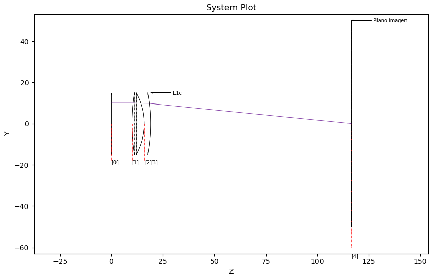
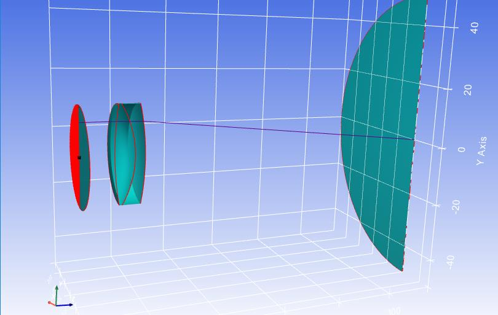
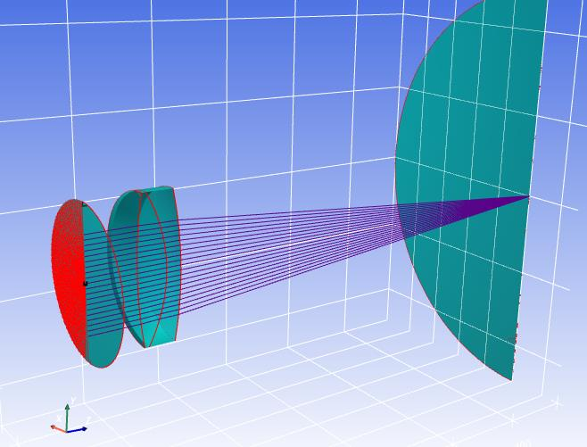

Working with the KrakenOS Library
=================================

This page is a faithful conversion of Section 3 of the provisional manual
(``KrakenOS/Docs/USER_MANUAL_KrakenOS_Provisional.pdf``, pages 10–19). It
walks a single doublet example end to end: declaring surfaces, building a
``system``, tracing a ray, harvesting ray state through the ``Raykeeper``
container, and rendering the result with the ``Display2D`` / ``Display3D``
helpers.

Python classes define an object with their attributes; instances acquire all
attributes available on the class. When creating a ``system``, the constructor
takes a list of surfaces and a configuration object — these can be named
freely. In this section the surface list is called ``A``, the configuration
``configuration_1`` and the optical system ``Doublet``. None of those names are
required by the library.

3.1 Ray generation
------------------

.. note::

   All rays and optical systems are drawn and traced from left to right.
   KrakenOS also allows tracing right to left: surface separations are positive
   left-to-right and negative otherwise. Negative ``Thickness`` values are
   common with mirrors — see *Example - Tel 2M Pupila* in the appendix.

Import the library:

.. code-block:: python

   import numpy as np
   import KrakenOS as Kos

In-code documentation is available through ``help(Kos)``, ``help(Kos.system)``
and ``help(Kos.surf)``.

All optical surfaces are declared independently. Each declaration can use any
subset of the parameters listed in :ref:`tbl-surf-class`. The five surfaces
below define a simple doublet plus its object and image planes.

.. code-block:: python
   :caption: Code 1 — declaring the doublet surfaces

   # Object plane
   P_Obj = Kos.surf()
   P_Obj.Rc = 0.0
   P_Obj.Thickness = 0.1
   P_Obj.Glass = "AIR"
   P_Obj.Diameter = 30.0

   # First face of the doublet — BK7 (crown glass, low dispersion)
   L1a = Kos.surf()
   L1a.Rc = 92.847
   L1a.Thickness = 6.0
   L1a.Glass = "BK7"
   L1a.Diameter = 30.0
   L1a.Axicon = 0

   # Cemented interface — F2 (flint glass, high dispersion)
   L1b = Kos.surf()
   L1b.Rc = -30.716
   L1b.Thickness = 3.0
   L1b.Glass = "F2"
   L1b.Diameter = 30

   # Third face of the doublet
   L1c = Kos.surf()
   L1c.Rc = -78.19
   L1c.Thickness = 97.37
   L1c.Glass = "AIR"
   L1c.Diameter = 30

   # Image plane
   P_Ima = Kos.surf()
   P_Ima.Rc = 0.0
   P_Ima.Thickness = 0.0
   P_Ima.Glass = "AIR"
   P_Ima.Diameter = 18.0
   P_Ima.Name = "Image plane"

BK7 and F2 are widely used together to build achromatic doublets
(Ref. 4, §11.6).

The ``Setup`` object configures the environment and, in particular, loads the
glass catalogs. ``Setup`` is defined in ``KrakenOS/SetupClass.py`` and can be
edited to include any catalog from the ``Cat`` directory. The default loads
four catalogs; ``UTILIDADES.AGF`` is required.

.. code-block:: python

   cat1 = (route + '/KrakenOS/Cat/SCHOTT.AGF')
   cat2 = (route + '/KrakenOS/Cat/TSPM.AGF')
   cat3 = (route + '/KrakenOS/Cat/INFRARED.AGF')
   cat4 = (route + '/KrakenOS/Cat/UTILIDADES.AGF')
   filepath = [cat1, cat2, cat3, cat4]

The default setup is loaded with:

.. code-block:: python

   configuration_1 = Kos.Setup()

With the surfaces and configuration in hand, the system is built from a list
of surfaces and the configuration object:

.. code-block:: python
   :caption: Code 2 — assembling the system

   A = [P_Obj, L1a, L1b, L1c, P_Ima]
   configuration_1 = Kos.Setup()
   Doublet = Kos.system(A, configuration_1)

Every ray has three parameters: an origin ``XYZ = [x1, y1, z1]`` and a
direction given by direction cosines ``LMN = [L, M, N]``. A ray parallel to the
optical axis has ``LMN = [0, 0, 1]``. In general the direction cosines are
defined by

.. math::

   L = \frac{x_2 - x_1}{\sqrt{(x_2 - x_1)^2 + (y_2 - y_1)^2 + (z_2 - z_1)^2}}

   M = \frac{y_2 - y_1}{\sqrt{(x_2 - x_1)^2 + (y_2 - y_1)^2 + (z_2 - z_1)^2}}

   N = \frac{z_2 - z_1}{\sqrt{(x_2 - x_1)^2 + (y_2 - y_1)^2 + (z_2 - z_1)^2}}

where ``[x2, y2, z2]`` is the intersection point on the first surface.

Before ray tracing, the first-surface hit point is unknown, so direction
cosines are expressed in terms of the angle of incidence. For a ray arriving
at angle ``Theta`` from the y-axis with no x-component: ``L = 0``,
``M = sin(Theta)``, ``N = cos(Theta)``. The wavelength is supplied as
``W`` in micrometres.

.. code-block:: python
   :caption: Code 3 — defining a ray

   XYZ = [0, 14, 0]
   Theta = 0.1   # field angle (degrees)
   LMN = [0.0, np.sin(np.deg2rad(Theta)), -np.cos(np.deg2rad(Theta))]
   W = 0.4

For rays sampled across the pupil, see the :doc:`pupilcalc_tool`.

The ray is traced through the doublet with:

.. code-block:: python

   Doublet.Trace(XYZ, LMN, W)

After ``Trace``, the system can be queried for the result using any of the
attributes in :ref:`tbl-system-class`. For example ``Doublet.GLASS`` returns
the materials the ray crossed:

.. code-block:: pycon

   >>> print(Doublet.GLASS)
   ['BK7', 'F2', 'AIR', 'AIR']

``Doublet.XYZ`` and ``Doublet.LMN`` return the per-surface coordinates and
direction cosines as NumPy arrays:

.. code-block:: pycon

   >>> np.shape(Doublet.XYZ)
   (5, 3)
   >>> np.shape(Doublet.LMN)
   (4, 3)

``XYZ`` contains one ``[x, y, z]`` per surface (object → image plane), while
``LMN`` contains the direction cosines for each *segment* between surfaces.
For a five-surface system the segment chain is::

   A = [P_Obj -> L1a -> L1b -> L1c -> P_Ima]

3.2 Extraction of ray information
---------------------------------

Most analyses (spot diagrams, wavefront fits, etc.) need many rays. The
``Raykeeper`` container stores per-ray results so the ``system`` object does
not have to. Separate containers can be created for separate fields,
wavelengths, or sources.

.. code-block:: python

   Rays = Kos.raykeeper(Doublet)

After each trace, call ``push()`` to commit the current ray into the
container:

.. code-block:: python

   Rays.push()

3.3 Generation of the optical system graph
------------------------------------------

Two helpers render a system together with the rays stored in a container:
``Display2D`` and ``Display3D``. Both take the ``system`` and a ``Raykeeper``,
plus a final parameter:

* ``Display2D(system, raykeeper, plane)`` — ``plane = 0`` plots the XZ plane,
  ``plane = 1`` plots the YZ plane.
* ``Display3D(system, raykeeper, cutout)`` — ``cutout`` controls how surfaces
  are unfolded:

  * ``0`` — full elements
  * ``1`` — 1/4 cutout
  * ``2`` — 1/2 cutout

For the doublet example:

.. code-block:: python

   Kos.Display2D(Doublet, Rays, 0)

The ray colour is derived from the wavelength used during ``Trace``. A
0.4 µm ray appears purple, 0.6 µm appears red, and so on; wavelengths outside
the visible range are drawn in black.

   Figure 1. 2D visualization of a ray traced through a doublet.

``Display2D`` accepts an optional fourth parameter (default ``0``); positive
values draw a direction arrow on every ray. The value sets the arrow size.

.. code-block:: python

   Kos.Display2D(Doublet, Rays, 0, 1)

For the same system in three dimensions:

.. code-block:: python

   Kos.Display3D(Doublet, Rays, 2)

   Figure 2. 3D visualization of a cross-section of the doublet and a ray.

Multiple rays can be pushed inside a loop. ``Code 4`` traces a fan of 20 rays
parallel to the optical axis:

.. code-block:: python
   :caption: Code 4 — looped trace + push

   for y in range(-10, 10):
       XYZ = [0.0, y, 0.0]
       LMN = [0.0, 0.0, 1.0]
       W = 0.4
       Doublet.Trace(XYZ, LMN, W)
       Rays.push(Doublet)

   Kos.Display3D(Doublet, Rays, 2)

Rays that do not hit any surface are recorded but not traced.

   Figure 3. 3D view of the optical system with several rays.

Raykeeper introspection
~~~~~~~~~~~~~~~~~~~~~~~

A ``Raykeeper`` holds essentially the same per-ray fields exposed on the
``system`` class, but indexed across all pushed rays — so each attribute is an
array of arrays. The number of stored rays is available as:

.. code-block:: pycon

   >>> print(Rays.nrays)
   100

Rays that never hit a surface (origin or direction missed the system) are
still recorded with their origin, direction and wavelength, but the rest of
the per-surface fields will be empty. These are called *empty rays*; rays
that did hit at least one surface are *valid rays*. The list of valid ray
indices is obtained with:

.. code-block:: pycon

   >>> print(Rays.valid())
   [[25] [26] [27] [28] ... [55]]

After calling ``valid()``, a parallel set of ``valid_*`` accessors becomes
populated. These mirror the regular accessors but contain only valid rays,
with the empty rays removed (so indices shift). A separate ``invalid_*``
namespace is also created for the empty-ray subset; only origin, direction
and wavelength can be retrieved for these.

.. list-table:: Table 3 — Raykeeper container attributes
   :header-rows: 1
   :widths: 34 34 32

   * - All rays
     - Valid rays
     - Invalid rays
   * - ``Raykeeper.RayWave[#]``
     - ``Raykeeper.valid_RayWave[#]``
     -
   * - ``Raykeeper.SURFACE[#]``
     - ``Raykeeper.valid_SURFACE[#]``
     -
   * - ``Raykeeper.NAME[#]``
     - ``Raykeeper.valid_NAME[#]``
     -
   * - ``Raykeeper.GLASS[#]``
     - ``Raykeeper.valid_GLASS[#]``
     -
   * - ``Raykeeper.S_XYZ[#]``
     - ``Raykeeper.valid_S_XYZ[#]``
     -
   * - ``Raykeeper.T_XYZ[#]``
     - ``Raykeeper.valid_T_XYZ[#]``
     -
   * - ``Raykeeper.XYZ[#]``
     - ``Raykeeper.valid_XYZ[#]``
     - ``Raykeeper.invalid_XYZ[#]``
   * - ``Raykeeper.OST_XYZ[#]``
     - ``Raykeeper.valid_OST_XYZ[#]``
     -
   * - ``Raykeeper.S_LMN[#]``
     - ``Raykeeper.valid_S_LMN[#]``
     -
   * - ``Raykeeper.LMN[#]``
     - ``Raykeeper.valid_LMN[#]``
     - ``Raykeeper.invalid_LMN[#]``
   * - ``Raykeeper.R_LMN[#]``
     - ``Raykeeper.valid_R_LMN[#]``
     -
   * - ``Raykeeper.N0[#]``
     - ``Raykeeper.valid_N0[#]``
     -
   * - ``Raykeeper.N1[#]``
     - ``Raykeeper.valid_N1[#]``
     -
   * - ``Raykeeper.WAV[#]``
     - ``Raykeeper.valid_WAV[#]``
     - ``Raykeeper.invalid_WAV[#]``
   * - ``Raykeeper.G_LMN[#]``
     - ``Raykeeper.valid_G_LMN[#]``
     -
   * - ``Raykeeper.ORDER[#]``
     - ``Raykeeper.valid_ORDER[#]``
     -
   * - ``Raykeeper.GRATING[#]``
     - ``Raykeeper.valid_GRATING[#]``
     -
   * - ``Raykeeper.DISTANCE[#]``
     - ``Raykeeper.valid_DISTANCE[#]``
     -
   * - ``Raykeeper.OP[#]``
     - ``Raykeeper.valid_OP[#]``
     -
   * - ``Raykeeper.TOP_S[#]``
     - ``Raykeeper.valid_TOP_S[#]``
     -
   * - ``Raykeeper.TOP[#]``
     - ``Raykeeper.valid_TOP[#]``
     -
   * - ``Raykeeper.ALPHA[#]``
     - ``Raykeeper.valid_ALPHA[#]``
     -
   * - ``Raykeeper.BULK_TRANS[#]``
     - ``Raykeeper.valid_BULK_TRANS[#]``
     -
   * - ``Raykeeper.RP[#]``
     - ``Raykeeper.valid_RP[#]``
     -
   * - ``Raykeeper.RS[#]``
     - ``Raykeeper.valid_RS[#]``
     -
   * - ``Raykeeper.TP[#]``
     - ``Raykeeper.valid_TP[#]``
     -
   * - ``Raykeeper.TS[#]``
     - ``Raykeeper.valid_TS[#]``
     -
   * - ``Raykeeper.TTBE[#]``
     - ``Raykeeper.valid_TTBE[#]``
     -
   * - ``Raykeeper.TT[#]``
     - ``Raykeeper.valid_TT[#]``
     -

To drop all rays from a container, either reassign the container or call
``clean()``:

.. code-block:: python

   Rays.clean()
