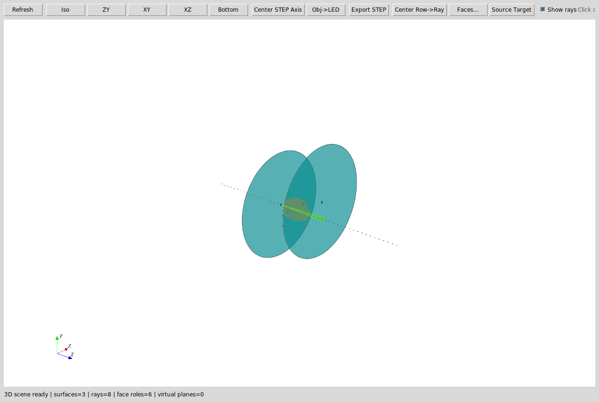
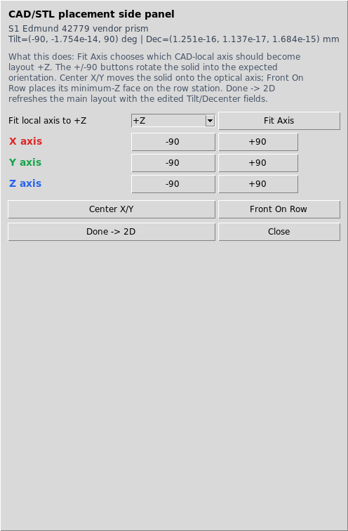
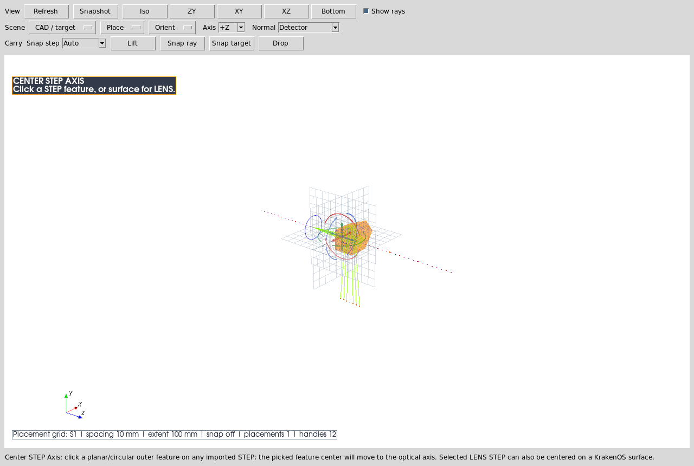
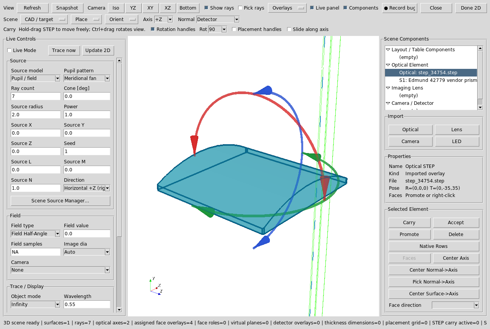
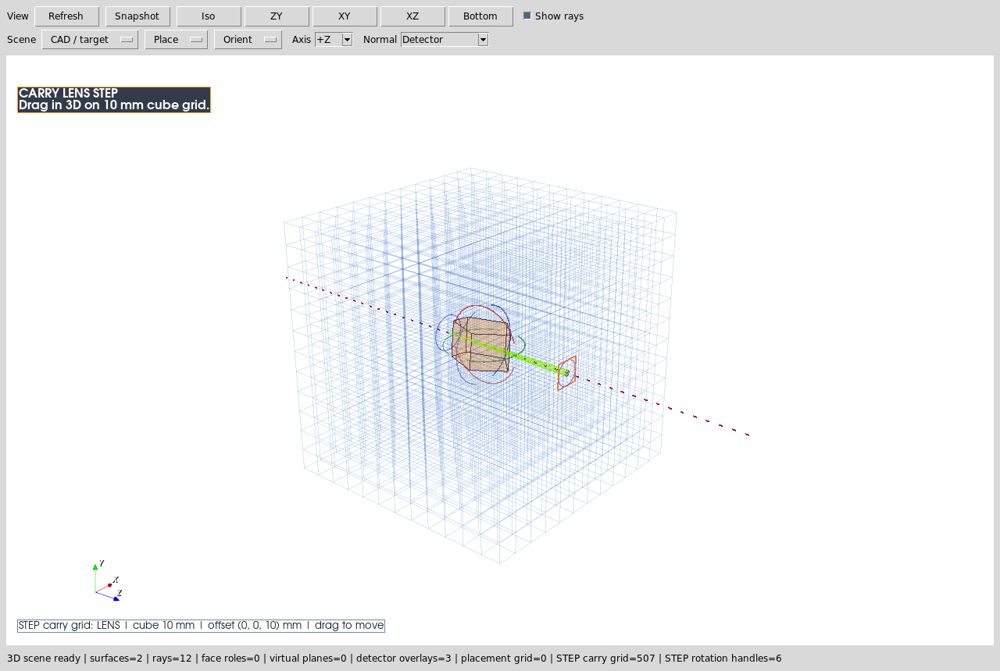
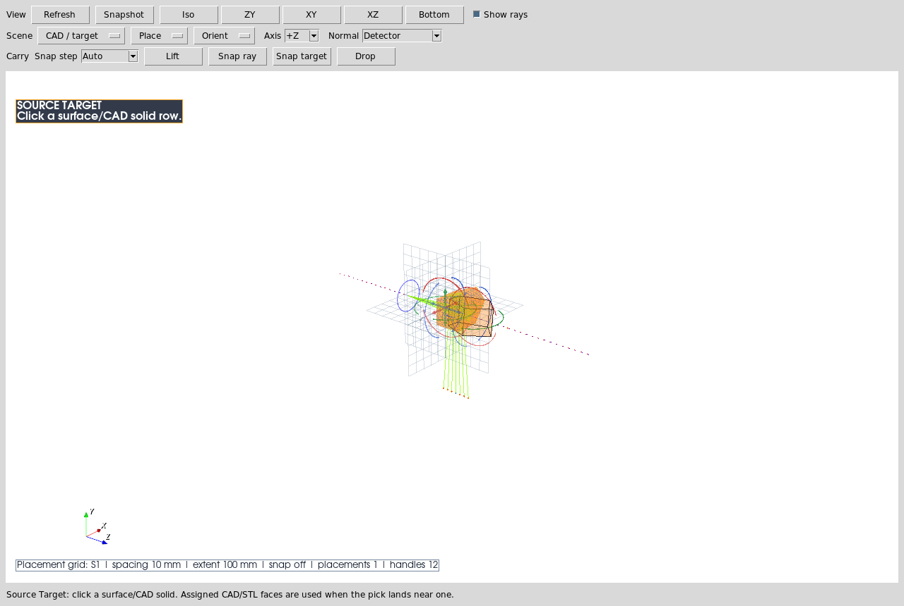

Case Study 14: 3D Hardware Alignment Workflows
================================================

Goal
----

This case study is a click-by-click tour of the embedded 3D tools that support
real hardware alignment. It complements the vendor-prism CAD case study by
focusing on the 3D controls themselves:

* open the embedded 3D inspector and read the optical-axis/face overlays;
* use the ``CAD/STL placement handler`` instead of a dense second toolbar;
* understand what each placement action changes in the table;
* arm a 3D pick workflow and read the active-mode badge;
* carry an imported STEP overlay on the Open 3D cube grid;
* use in-scene ``STEP rotation handles`` for repeated vendor-hardware rotations;
* know when to press ``Done -> 2D``.

The screenshots in this tutorial are generated from the live Tk/VTK UI with:

.. code-block:: bash

   python -m KrakenOS.UI.capture_3d_hardware_alignment_case_study_screenshots

The lightweight validator checks that the case-study page, screenshots, and UI
contracts are still present:

.. code-block:: bash

   python -m KrakenOS.UI.validate_3d_hardware_alignment_case_study

Open The 3D Inspector
---------------------

Start from the fitted vendor prism layout used in
:doc:`vendor_prism_cad_placement`. Select the CAD/STL prism row and choose
``Open 3D``.

   The long blue dotted line is the layout optical axis. The coloured face
   markers are the assigned CAD/STL optical-face roles. Plain left-click
   selects surfaces, rays, or imported hardware. Left hold-drag rotates the
   camera around the current view center.

Use The CAD/STL Placement Handler
---------------------------------

Click the CAD/STL solid row in the 3D view, or choose
``Actions -> 3D Place/Orient Selected CAD/STL Solid``. The embedded 3D view now
opens a contextual right-side panel instead of a floating popup or a permanent
second toolbar row. This keeps the controls visible when the main UI is tiled or
fullscreen, and it avoids covering the 3D scene.

   The help text is intentionally visible in the side panel:

   * ``Fit Axis`` chooses which CAD-local axis should become layout ``+Z``.
   * ``X/Y/Z +/-90`` rotates the solid and updates the row ``Tilt`` fields.
   * ``Center X/Y`` moves the solid onto the optical axis.
   * ``Front On Row`` places the minimum-Z face on the selected row station.
   * ``Done -> 2D`` refreshes the main 2D layout from the edited row pose.

Practical rule: first use ``Fit Axis`` for the gross CAD coordinate convention,
then use ``X/Y/Z +/-90`` for orientation, then use ``Center X/Y`` and
``Front On Row`` for placement. Close only hides the panel; ``Done -> 2D`` is
the button that applies the 3D placement back into the visible 2D layout.

Read Active-Mode Badges
-----------------------

Some 3D workflows need a second click. Those workflows now show a badge inside
the VTK scene so the user knows what the next click will do.

   ``Center STEP Axis`` is armed here. The next click should be either a
   planar/circular feature on an imported STEP body or, if a STEP component is
   selected, a KrakenOS surface whose axis should be used as the target.

The same badge mechanism is used by ``Obj->LED``, ``Center Row->Ray``, and
``Source Target``.

Rotate Imported STEP Hardware
-----------------------------

Clicking an imported lens, LED, or camera STEP overlay selects that component
and draws coloured ``X/Y/Z`` rotation handles around it inside the 3D scene.

   Click a red, green, or blue handle for successive ``X/Y/Z +/-90`` rotations
   while watching the imported STEP overlay move in the same 3D scene. This
   replaces the older floating popup and duplicate toolbar menu, so rotation is
   tied to the selected STEP component and does not cover the geometry.

Carry Imported STEP On The Grid
-------------------------------

Open 3D can import lens, camera, or LED STEP hardware directly from
``CAD / target -> Import STEP``. The imported component is selected immediately.
Use ``CAD / target -> Carry Selected STEP`` when an already-imported component
should be moved again.

   The visible cube grid is sized from the selected STEP body and current scene
   envelope. Dragging inside the 3D canvas walks the selected STEP overlay by
   discrete grid steps and writes persistent ``lens/camera/LED`` STEP placement
   offsets. The selected overlay keeps its rotation handles, so the normal
   workflow is: import, drag on the cube grid until the hardware is near the
   traced ray bundle, then click the coloured handles for coarse orientation.

This is a hardware-overlay workflow. It places real vendor CAD in the same 3D
scene as rays and optical objects, but it does not turn that overlay into a
traced optical surface. Use ``File -> Import Optical CAD/STL Solid...`` when
the STEP/STL geometry should participate in the KrakenOS trace.

Pick Source Targets From 3D
---------------------------

The 3D inspector can also arm ``Source Target`` selection. This is useful for
multi-source, source/object split, and beam-splitter workflows where a source
must aim at a CAD/STL face or surface row.

   When this badge is visible, the next click should be a surface or CAD/STL
   solid row. If the row has assigned optical-face metadata and the click lands
   near one of those faces, the Scene Source Manager can use that face anchor.

What This Proves
----------------

This case study exercises the user-facing 3D workflow rather than the optical
physics of one particular component:

* embedded VTK/Tk 3D inspector launch and refresh;
* optical-axis guide in the 3D scene;
* CAD/STL optical-face role markers;
* contextual CAD/STL placement side panel with inline help;
* table-backed row pose edits through ``Tilt`` and ``Desp`` fields;
* active-mode badges for multi-click 3D workflows;
* imported STEP carry placement on an automatically sized cube grid;
* selected STEP rotation handles for imported hardware overlays;
* source-target picking from the 3D view.

Common Mistakes
---------------

``I closed the placement panel but the 2D plot did not change.``
  Closing the placement panel only hides the handler. Press ``Done -> 2D`` or close the
  3D view when you want the 2D layout refreshed from the edited row pose.

``Fit Axis and X/Y/Z rotation look similar.``
  ``Fit Axis`` maps the CAD model's local coordinate convention onto layout
  ``+Z``. The rotation buttons are subsequent explicit 90-degree orientation
  edits.

``The active badge is just a status message.``
  Treat it as a modal instruction. While the badge is visible, the next click
  is consumed by that workflow rather than by normal row/ray selection.

``The STEP rotation handles rotate CAD/STL optical solid rows.``
  They rotate imported lens/LED/camera STEP overlays. File-backed optical
  CAD/STL rows use the separate ``CAD/STL placement handler``.

``I carried a STEP component but the ray trace did not change.``
  Open 3D STEP carry moves lens/camera/LED hardware overlays. It is for
  mechanical context and placement planning. Ray-traced CAD/STL optics must be
  inserted as optical solid rows so the kernel receives real surface geometry.
