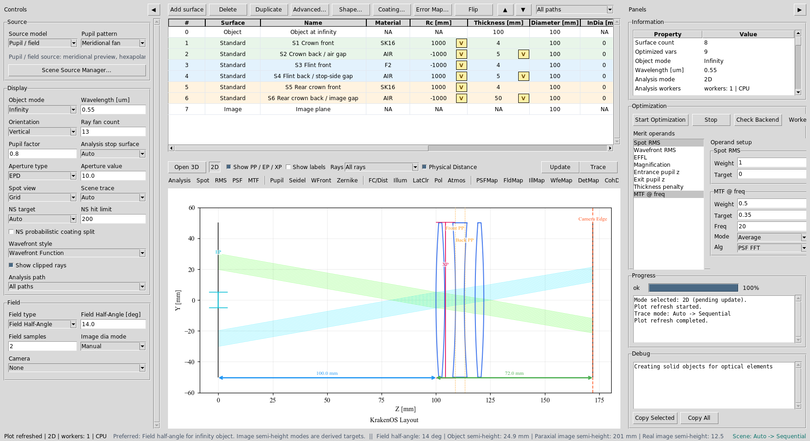
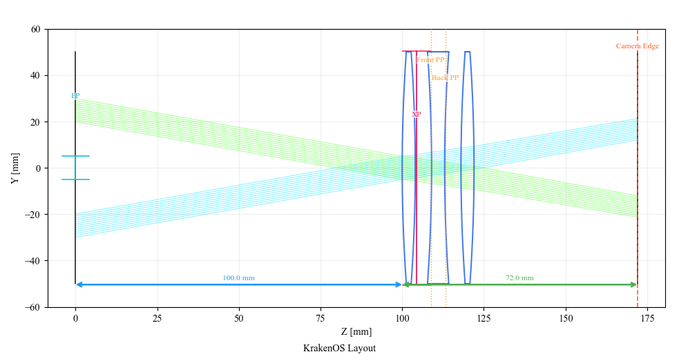
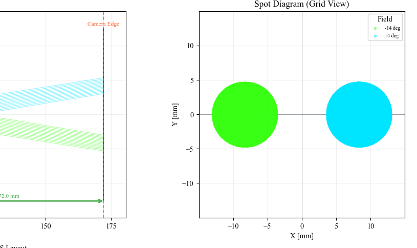
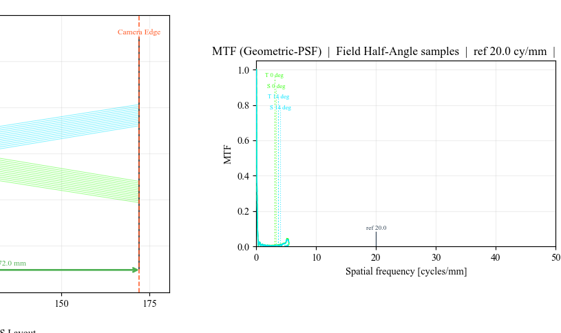
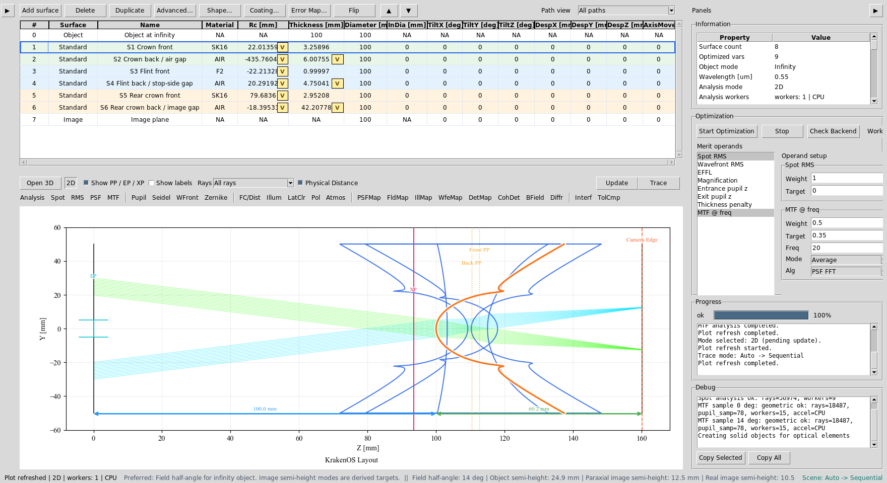
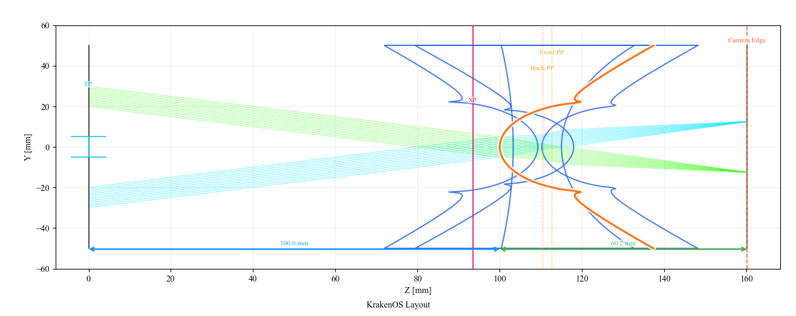
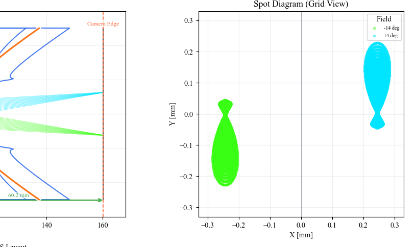
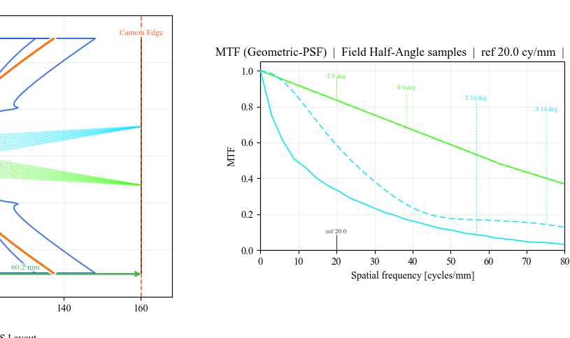

Case Study 15: Cooke Triplet Optimization From A Bad Start
==========================================================

Goal
----

This case study ports the useful workflow from Optiland
``Tutorial_5c_Optimization_Case_Study.ipynb`` into a KrakenOS UI sequence. It
starts from a deliberately poor air-spaced Cooke triplet, analyzes the bad
spot/MTF result, exposes the variables in the editable table, and applies a
known optimized prescription so the before/after result is deterministic for a
presentation.

The screenshots in this tutorial are generated from the live Tk UI with:

.. code-block:: bash

   python -m KrakenOS.UI.capture_cooke_triplet_case_study_screenshots

The physics validator is:

.. code-block:: bash

   python -m KrakenOS.UI.validate_cooke_triplet_case_study

Load The Poor Triplet
---------------------

1. Start the UI with ``python -m KrakenOS.UI.layout_editor``.
2. In the top menu, choose
   ``Layouts -> Starter Lenses -> Cooke Triplet Optimization Case Study``.
3. Confirm the analysis controls:

   * ``Object Mode = Infinity``;
   * ``Aperture = EPD``;
   * ``EPD = 10 mm``;
   * ``Field Type = Angle``;
   * ``Field Value = 14 deg``;
   * ``Field Count = 2``;
   * ``Wavelength = 0.55 um``.

The starting prescription intentionally uses very weak ``+/-1000 mm`` radii.
It has the right positive-negative-positive Cooke topology, but it is not a
useful image-forming lens yet.

   The starting Cooke-like triplet is loaded with radius and air-gap variables
   already marked in the table.

   The layout has three air-spaced elements, but the surfaces are nearly flat.

Make The Bad Analysis
---------------------

Click ``Spot`` and ``Update``. The primary-wavelength spot is intentionally
large. The validator checks that the starting point has more than ``2 mm`` RMS
spot radius both on-axis and at ``14 deg``.

   Starting Spot AOI: the nearly-flat prescription does not focus the EPD
   bundle.

Click ``MTF`` and ``Update``. Use ``MTF @ freq = 20`` cycles/mm with
``Alg = PSF FFT`` in the Optimization panel. The starting geometric MTF at
this frequency is nearly zero because the image blur is too large.

   Starting MTF AOI: the poor prescription has little useful contrast at the
   reference spatial frequency.

Understand The Variables
------------------------

The starting layout marks six radii and three air gaps for optimization:

.. list-table::
   :header-rows: 1

   * - Row
     - Variable
     - Bounds
     - Why it matters
   * - S1
     - Radius
     - ``15, 80``
     - Front crown power.
   * - S2
     - Radius and air gap
     - ``-800, -20`` and ``1, 12``
     - Back crown power and spacing to the flint.
   * - S3
     - Radius
     - ``-80, -10``
     - Front flint negative power.
   * - S4
     - Radius and air gap
     - ``10, 80`` and ``1, 10``
     - Back flint power and stop-side spacing.
   * - S5
     - Radius
     - ``20, 800``
     - Rear crown front power.
   * - S6
     - Radius and image gap
     - ``-80, -10`` and ``25, 70``
     - Rear crown back power and focus distance.

This is a true lens-design problem, not only a focus solve. The machine-vision
case study changes one sensor distance. This Cooke case changes the optical
prescription itself.

Apply The Optimized Prescription
--------------------------------

For a live demo, use this deterministic prescription instead of relying on a
long stochastic optimizer run. Enter these values in the table, or use the
layout's ``OPTIMIZED_SURFACES`` data as shown in
``KrakenOS/Examples/Examp_Cooke_Triplet_Optimization_Case_Study.py``.

.. list-table::
   :header-rows: 1

   * - Row
     - Radius mm
     - Thickness mm
     - Glass after surface
   * - S1 Crown front
     - ``22.01359``
     - ``3.25896``
     - ``SK16``
   * - S2 Crown back / air gap
     - ``-435.76044``
     - ``6.00755``
     - ``AIR``
   * - S3 Flint front
     - ``-22.21328``
     - ``0.99997``
     - ``F2``
   * - S4 Flint back / stop-side gap
     - ``20.29192``
     - ``4.75041``
     - ``AIR``
   * - S5 Rear crown front
     - ``79.68360``
     - ``2.95208``
     - ``SK16``
   * - S6 Rear crown back / image gap
     - ``-18.39533``
     - ``42.20778``
     - ``AIR``

   The final prescription is still the same three-element Cooke topology, but
   the radii and spacings now carry real optical power.

   Optimized layout: the primary-wavelength rays now come to focus near the
   Image row.

Verify The Improvement
----------------------

Click ``Spot`` and ``Update`` again. At ``0.55 um``, the validator checks that
the optimized RMS spot is below ``0.01 mm`` on axis and below ``0.06 mm`` at
``14 deg``.

   Optimized Spot AOI: the primary-wavelength spot collapses by more than
   ``50x`` in mean RMS radius.

Click ``MTF`` and ``Update``. At ``20 cycles/mm`` the optimized primary
prescription recovers useful geometric MTF, while the starting layout was
nearly zero.

   Optimized MTF AOI: the same analysis panel now shows usable contrast.

What This Proves
----------------

This case study exercises a sequential lens-design workflow:

* air-spaced multi-element prescription editing;
* real glass choices from the KrakenOS material catalog;
* six radii and three air gaps exposed as optimization variables;
* Spot and MTF analysis on a poor first design;
* deterministic optimized prescription entry;
* validator-checked primary-wavelength spot improvement.

Common Mistakes
---------------

``I typed angle as lowercase angle.``
  Use the UI control value ``Angle``. The KrakenOS UI maps that value to the
  correct field generator for off-axis rays.

``I expected all three wavelengths to match Optiland exactly.``
  This case study validates the primary wavelength. The imported Optiland-style
  prescription is a teaching endpoint, not a released achromat tolerance file.

``The optical diameters look generous.``
  They are deliberately generous in this teaching layout so the off-axis field
  analysis is about lens power and spacing, not mechanical vignetting.
