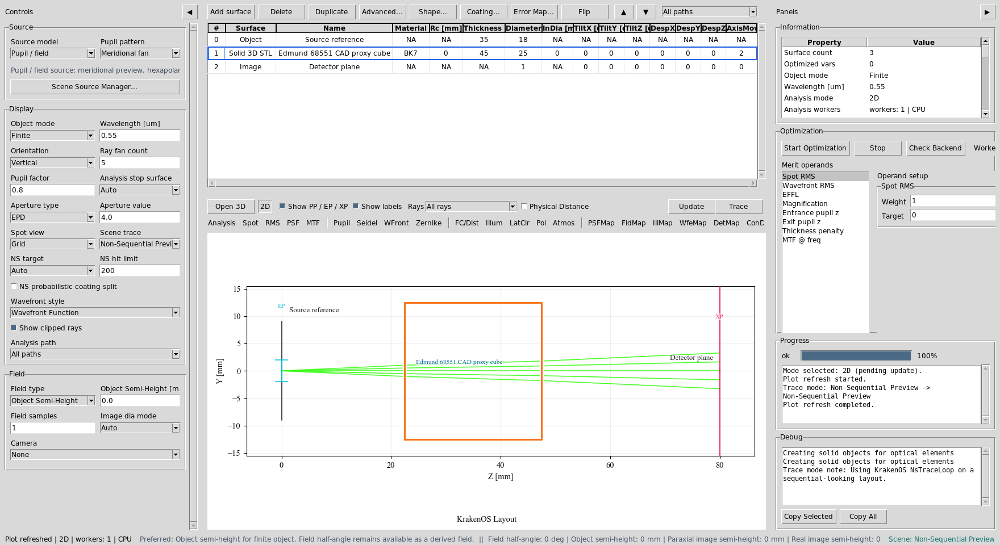
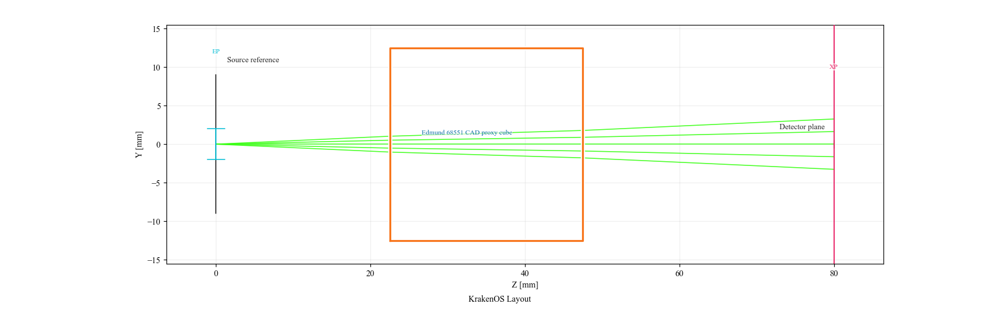
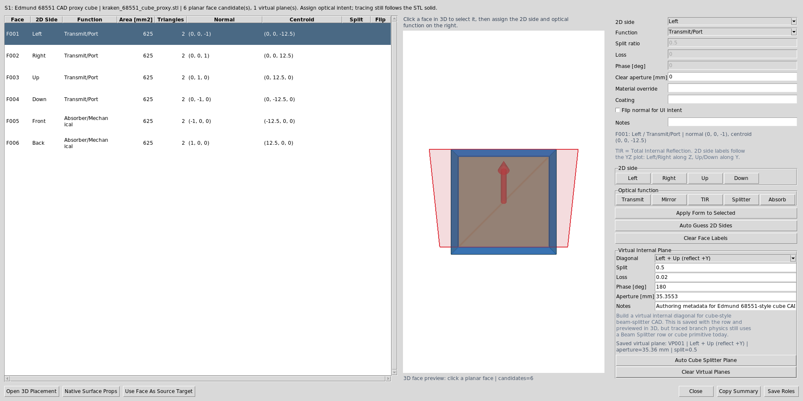
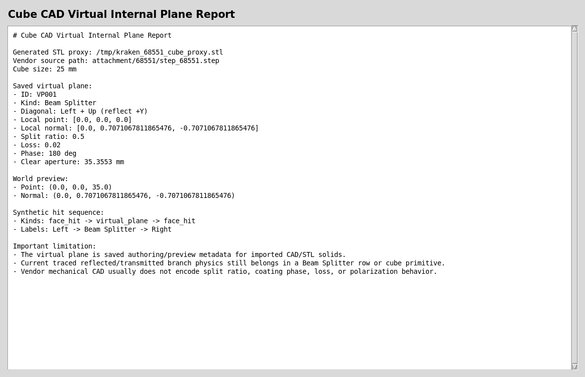
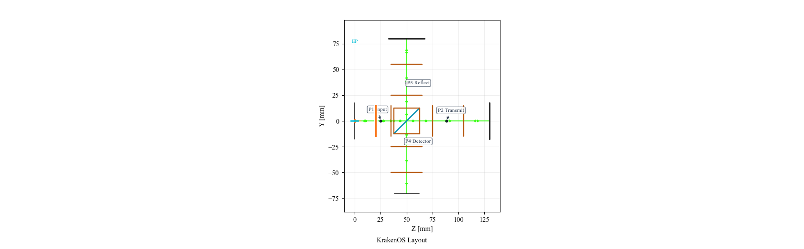
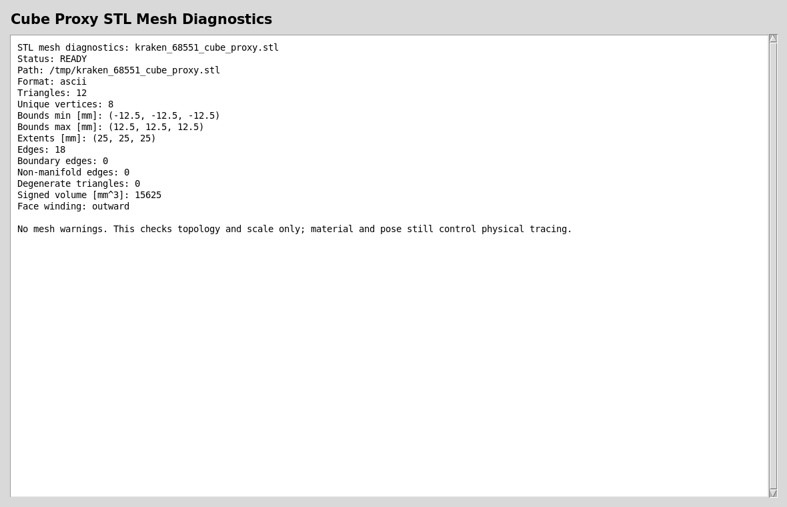

Case Study 11: Cube Beam Splitter CAD And Virtual Plane
=======================================================

Goal
----

This case study documents the current cube beam-splitter workflow without
overstating what imported CAD can do:

* use a vendor cube CAD/STL body as mechanical geometry;
* label the external cube faces;
* save a virtual internal 45 degree splitter plane as authoring metadata;
* understand why the CAD body alone does not create reflected/transmitted ray
  branches;
* compare that CAD workflow with the validated cube beam-splitter primitive.

The screenshots in this tutorial are generated from the live Tk UI with:

.. code-block:: bash

   python -m KrakenOS.UI.capture_cube_virtual_plane_case_study_screenshots

The capture script generates a 25 mm cube STL proxy so the tutorial is
reproducible without running STEP meshing during documentation builds. The row
still records the vendor reference path:

.. code-block:: text

   attachment/68551/step_68551.step

Load Or Import The Cube Body
----------------------------

In a live design, choose ``File -> Import Optical CAD/STL Solid...`` and select
the vendor cube STEP/STL/IGES file. For this tutorial, the screenshot uses a
generated 25 mm cube proxy with the same row metadata.

The important row is the file-backed ``Solid_3d_stl`` optical solid:

   The cube row stores material, pose, the generated STL path, and the original
   Edmund 68551 STEP source path. It is a real optical solid row, but not yet a
   traced beam-splitter coating.

Observe The Passive CAD Trace
-----------------------------

Click ``Update`` with ``Trace mode = Non-Sequential Preview``.

   The ray bundle interacts with the closed cube body. It does not split into
   reflected and transmitted branches because a mechanical CAD file does not
   encode split ratio, phase, loss, or polarization behavior.

Assign External Faces And Build A Virtual Plane
-----------------------------------------------

Select the cube row and choose ``Actions -> Assign CAD/STL Optical Faces``.
Label the external faces:

.. code-block:: text

   Left, Right, Up, Down = Transmit/Port
   Front, Back           = Absorber/Mechanical or unused mechanical faces

Then use the ``Virtual Internal Plane`` workbench:

.. code-block:: text

   Diagonal = Left + Up (reflect +Y)
   Split    = 0.5
   Loss     = 0.02
   Phase    = 180 deg

Click ``Auto Cube Splitter Plane``.

   The dialog stores the external face labels and one virtual internal
   beam-splitter plane in ``OpticalSolidFaces`` metadata. The virtual plane is
   visible in 3D preview and placement tools.

Read The Virtual Plane Report
-----------------------------

The generated report shows the exact metadata saved for the internal plane.

   The synthetic hit sequence inserts ``face_hit -> virtual_plane -> face_hit``
   between the external Left and Right faces. This is authoring and diagnostic
   metadata; it is not yet the active branch-tracing engine for a CAD cube.

Use The Primitive For Splitter Physics Today
--------------------------------------------

For real reflected/transmitted branch physics today, use a ``Beam Splitter``
row or the cube beam-splitter primitive. The Michelson preset uses an Edmund
68551-sized cube reference body plus an internal 45 degree ``Beam Splitter``
row for deterministic 50/50 splitting and recombination.

   This is the current validated workflow when reflected/transmitted branches,
   phase, coherent detector paths, and interferograms matter.

Check Mesh Readiness
--------------------

The cube proxy used for this tutorial is deliberately simple, but the same mesh
diagnostics apply to vendor CAD converted to STL.

   A useful optical CAD/STL body should have finite scale, no open boundary
   edges, no non-manifold edges, no degenerate triangles, and usable winding.

Run The Validators
------------------

Use these checks after changing the virtual-plane, face-role, or hit-sequence
code:

.. code-block:: bash

   python -m KrakenOS.UI.validate_optical_solid_virtual_plane
   python -m KrakenOS.UI.validate_optical_solid_hit_sequence
   python -m KrakenOS.UI.validate_optical_solid_face_roles

What This Proves
----------------

This case study exercises the cube-CAD side of the non-sequential-first
architecture:

* external cube CAD/STL import as mechanical geometry;
* face-role labeling for a closed optical solid;
* saved virtual internal splitter-plane metadata;
* transformed 3D preview records for the virtual plane;
* hit-sequence insertion of a virtual internal plane for diagnostics;
* clear separation between CAD authoring intent and active beam-splitter
  branch physics.

Common Mistakes
---------------

``I imported a cube STEP and expected it to split rays.``
  A STEP file usually contains only mechanical boundary geometry. It does not
  contain split ratio, coating phase, loss, or Jones/polarization data. Use a
  ``Beam Splitter`` row or cube primitive for active branch physics.

``I built a virtual internal plane but still see no reflected branch.``
  That is expected today. The virtual plane is saved authoring metadata for
  preview, placement, and diagnostics. It is a bridge toward CAD-first
  splitter authoring, not the current traced branch engine.

``Can I still use vendor CAD in a real design?``
  Yes. Use it for mechanical envelope, placement, exported STEP overlays, and
  face/port documentation. Keep the internal ``Beam Splitter`` row for traced
  optical behavior until active virtual-plane branch tracing is implemented.

``Which workflow should I present?``
  Present both: the CAD row proves the UI can import and label real geometry;
  the Michelson/cube primitive proves the current physics path for splitting,
  phase, recombination, and interferogram analysis.
