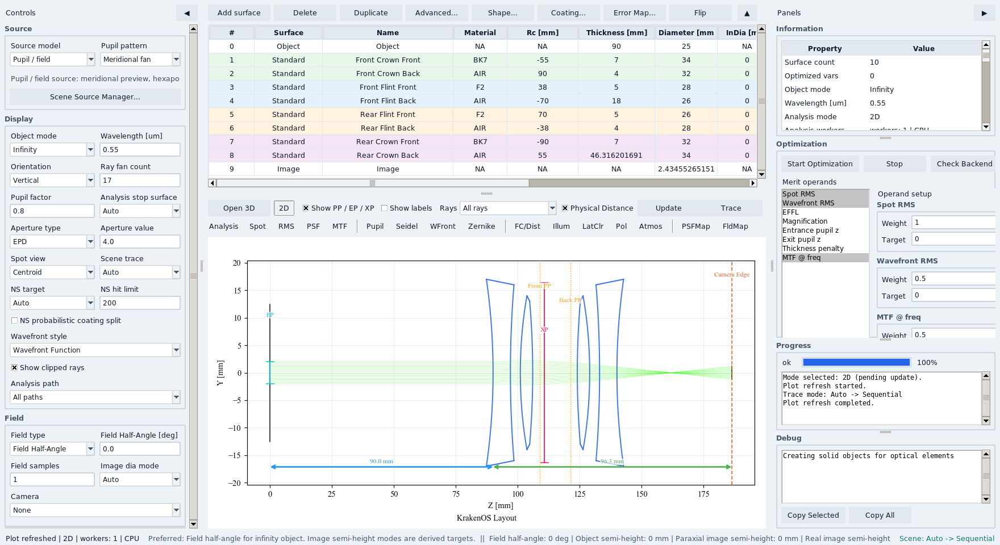
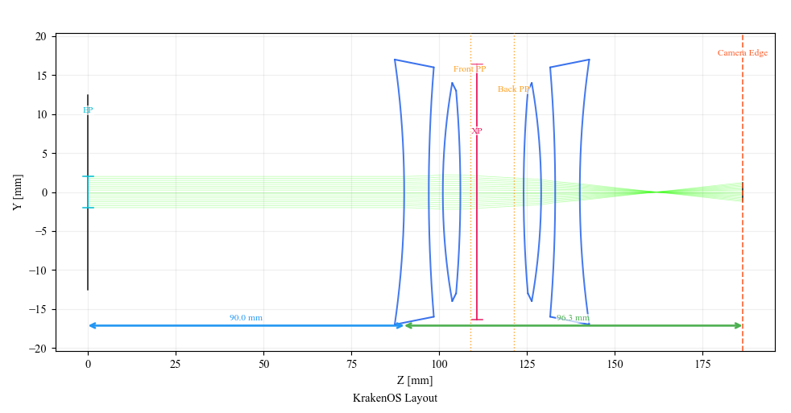
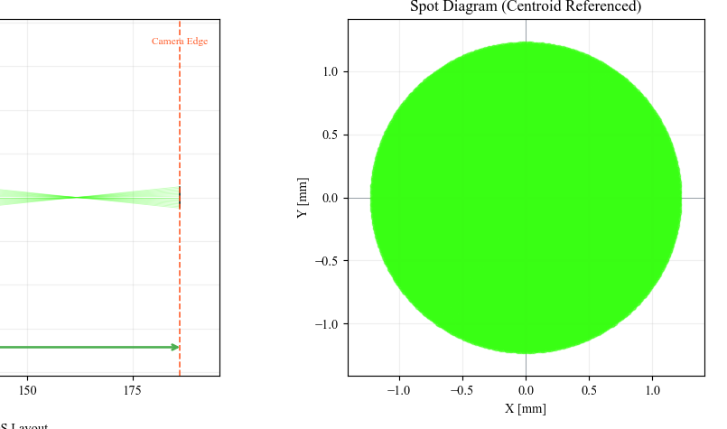
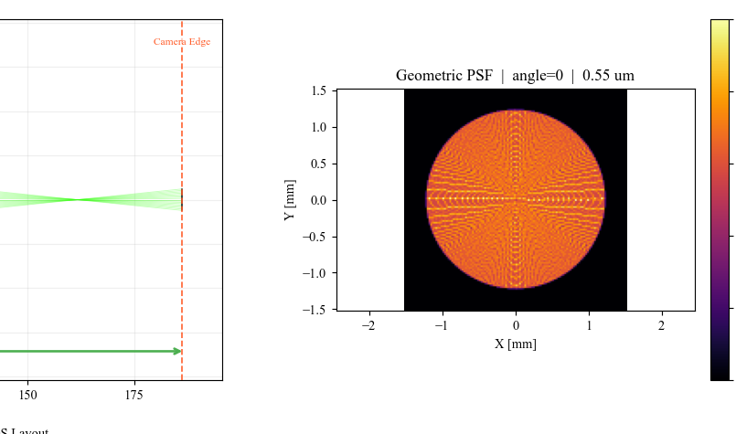
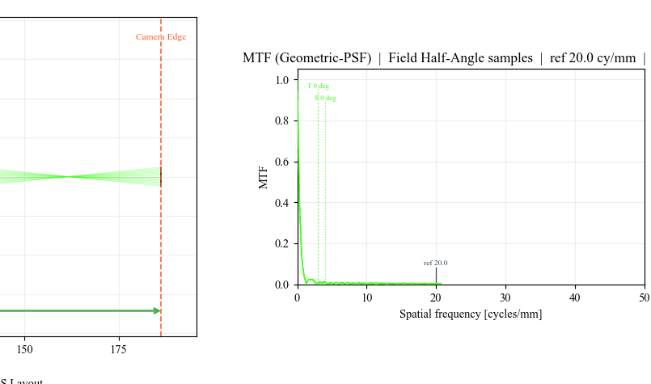
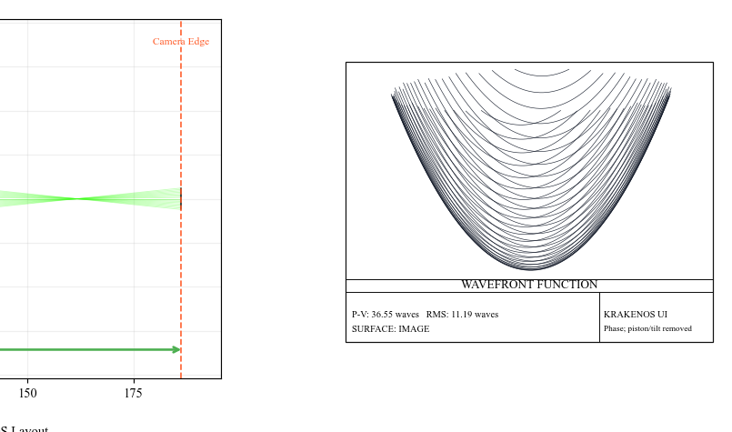
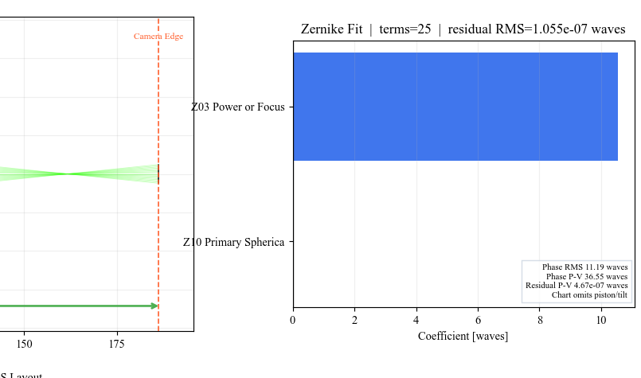

Case Study 18: One Lens, Many Analyses
======================================

Goal
----

This case study ports the analysis-breadth workflow from Optiland
``Tutorial_4b_PSF_&_MTF_Calculation.ipynb`` and
``Tutorial_4c_Zernike_Decomposition.ipynb`` into one KrakenOS UI sequence. A
single stable infinity-object Double Gauss prescription is used for Spot, PSF, MTF,
Wavefront, and Zernike analysis so the user can learn the analysis panels
without changing the optical design between steps.

The screenshots in this tutorial are generated from the live Tk UI with:

.. code-block:: bash

   python -m KrakenOS.UI.capture_double_gauss_analysis_case_study_screenshots

The physics validator is:

.. code-block:: bash

   python -m KrakenOS.UI.validate_double_gauss_analysis_case_study

There is also a scriptable example:

.. code-block:: bash

   python -m KrakenOS.Examples.Examp_Double_Gauss_Analysis_Suite

Load The Analysis Layout
------------------------

1. Start the UI with ``python -m KrakenOS.UI.layout_editor``.
2. In the top menu, choose
   ``Layouts -> Analysis / Diagnostics -> Double Gauss PSF MTF Wavefront Zernike Case Study``.
3. Confirm the controls:

   * ``Object Mode = Infinity``;
   * ``Aperture = EPD``;
   * ``EPD = 4 mm``;
   * ``Field Type = Angle``;
   * ``Field Value = 0 deg``;
   * ``Wavelength = 0.55 um``;
   * ``Wavefront Style = Wavefront Function``.

   The same infinity-object Double Gauss layout drives all analysis panels.

   The prescription is conventional and stable, so the tutorial can focus on
   interpreting the analysis outputs.

Spot: Check Geometric Focus
---------------------------

Click ``Spot`` and ``Update``. Use ``Centroid`` spot mode for the simplest
first read: the plot is centered on the geometric centroid, making the blur
shape easier to inspect.

   Spot is the fastest sanity check: rays should land in a compact finite
   cloud at the image plane.

PSF: Convert Samples Into Image Intensity
-----------------------------------------

Click ``PSF`` and ``Update``. The current KrakenOS panel is a geometric PSF:
it bins traced image-plane ray intercepts into normalized intensity. This is
not a diffraction PSF, but it is useful for finding blur shape and alignment
errors.

   The PSF panel makes the spot distribution easier to compare with detector
   sampling or image-processing expectations.

MTF: Read Contrast Versus Spatial Frequency
-------------------------------------------

Click ``MTF`` and ``Update``. In the Optimization panel, ``MTF @ freq`` is
preset to ``20`` cycles/mm with ``Alg = PSF FFT``. The plot shows tangential
and sagittal curves computed from the same geometric image-plane samples.

   MTF converts the blur cloud into a contrast metric that can be used in a
   merit function or a presentation checklist.

Wavefront: Inspect Pupil Phase
------------------------------

Click ``Wavefront`` and ``Update``. Keep ``Wavefront Style`` set to
``Wavefront Function``. This removes piston and best-fit tilt so the plot
emphasizes optical aberration instead of image-plane pointing.

   Use ``File -> Export Wavefront CSV...`` after this panel has been rendered
   if the pupil samples are needed outside the UI.

Zernike: Decompose The Wavefront
--------------------------------

Click ``Zernike`` and ``Update``. The Zernike panel fits the sampled
wavefront and stores both coefficient rows and residual samples for export.

   Use ``File -> Export Zernike CSV...`` after this panel has been rendered to
   capture coefficient values and residual statistics.

What This Proves
----------------

This case study is intended for quick review sessions. It proves that one
menu-backed sequential lens can drive the main KrakenOS analysis panels,
stores exportable wavefront/Zernike data, and gives the user a repeatable
workflow before moving to harder non-sequential or coherent examples.
