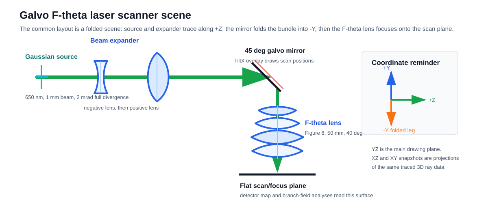
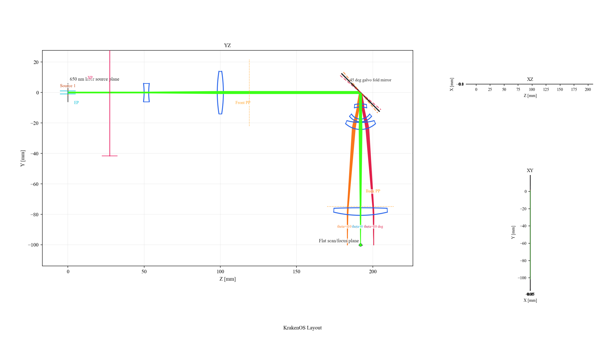
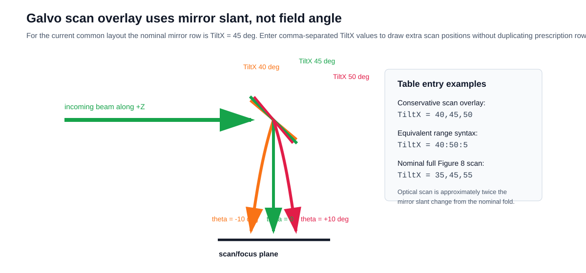
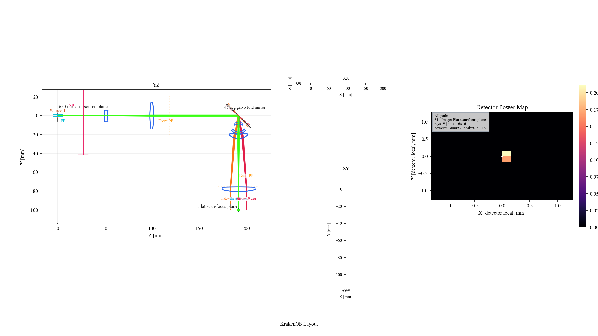
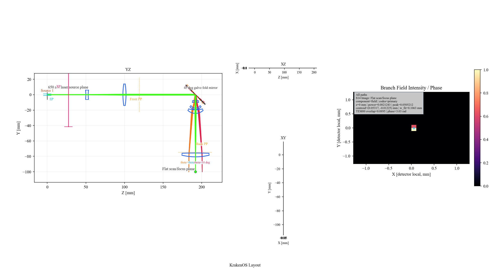
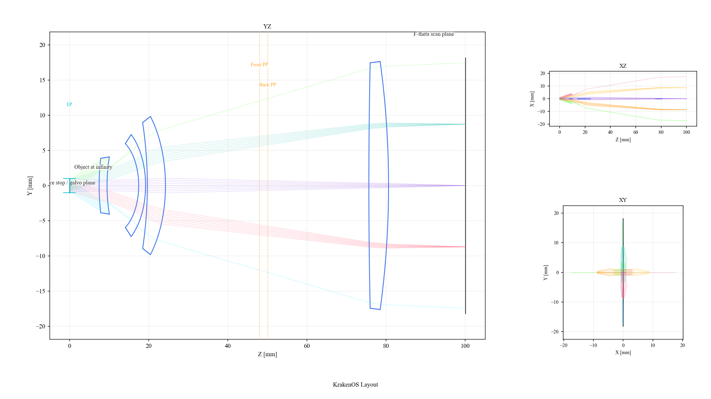

Case Study 17: Galvo F-Theta Laser Scanner
===========================================

Goal
----

This case study walks through the built-in ``Galvo F-Theta Laser Scanner``
layout as a scanner design workflow:

* load the common layout preset;
* read the Gaussian laser source, beam-expander, galvo mirror, F-theta lens,
  and scan-plane rows as one folded scene;
* understand the galvo scan-overlay angle convention;
* inspect detector power and branch-field snapshots at the scan plane;
* separate integrated scanner debugging from standalone F-theta lens
  prescription validation.

The static snapshots in this tutorial are generated from the common layouts
with:

.. code-block:: bash

   python -m KrakenOS.UI.render_layout_snapshot --layout "Galvo F-Theta Laser Scanner" --mode 2d --output docs/source/_static/tutorials/galvo_f_theta_laser_scanner/01_folded_layout_yz.png --dpi 150
   python -m KrakenOS.UI.render_layout_snapshot --layout "Galvo F-Theta Laser Scanner" --mode detector_map --output docs/source/_static/tutorials/galvo_f_theta_laser_scanner/02_detector_map.png --dpi 150
   python -m KrakenOS.UI.render_layout_snapshot --layout "Galvo F-Theta Laser Scanner" --mode branch_field --output docs/source/_static/tutorials/galvo_f_theta_laser_scanner/03_branch_field.png --dpi 150
   python -m KrakenOS.UI.render_layout_snapshot --layout "F-Theta Lens 50mm Figure 8" --mode 2d --output docs/source/_static/tutorials/galvo_f_theta_laser_scanner/04_standalone_f_theta_lens.png --dpi 150

Validate the page, assets, and current common-layout angle convention with:

.. code-block:: bash

   python -m KrakenOS.UI.validate_galvo_f_theta_case_study

Load The Preset
---------------

1. Start the UI with ``python -m KrakenOS.UI.layout_editor``.
2. Choose ``Layouts -> Sources / Illumination -> Galvo F-Theta Laser Scanner``.
3. Confirm these left-panel settings:

.. code-block:: text

   Source model       = Gaussian beam
   GB input mode      = Diameter + divergence
   GB diameter [mm]   = 1.0
   GB full div [mrad] = 2.0
   GB M2              = 1.1
   Wavelength [um]    = 0.65
   Trace mode         = Folded Preview
   Ray Count          = 9

The source is a physical Gaussian source, not an abstract field sample. The
scanner scene then sends representative rays through a two-lens beam expander,
reflects them from the galvo mirror, and traces the folded leg through the
F-theta lens to the scan plane.

   The scanner is a scene workflow. The beam expander, mirror, F-theta lens,
   and scan plane are physical entities along one traced path.

Read The Rows
-------------

The preset table is intentionally explicit. The row groups are:

.. list-table::
   :header-rows: 1
   :widths: 18 30 52

   * - Group
     - Rows
     - Purpose
   * - Laser source
     - ``Object``
     - Defines the Gaussian launch plane and source direction.
   * - Beam expander L1
     - two refractive rows
     - Negative lens that starts the expansion.
   * - Beam expander L2
     - two refractive rows
     - Positive lens that recollimates the beam near the galvo/stop.
   * - Galvo mirror
     - one ``Mirror`` row
     - A 45 deg fold. Its ``TiltX`` overlay draws scan positions.
   * - F-theta Figure 8 lens
     - eight refractive rows
     - The 50 mm, 40 deg full-field prescription transcribed from
       ``attachment/F-theta.pdf`` Figure 8. The source ``K9`` glass label is
       mapped to bundled CDGM ``H-K9L``.
   * - Scan plane
     - ``Image``
     - Flat scan/focus plane used by detector and branch-field analyses.

Click ``Update``. The YZ view should show the beam propagating along ``+Z``,
folding downward at the galvo mirror, then passing through the F-theta lens to
the scan/focus plane.

   The green center bundle is the nominal ``45 deg`` galvo pose. The orange
   and red bundles are the preset scan-overlay poses.

Use The Galvo Scan Overlay
--------------------------

The mirror row's ``TiltX`` cell is a mirror-slant value. It is not the F-theta
field angle. In the current common layout, the nominal fold is:

.. code-block:: text

   Galvo mirror TiltX = 45

To draw a conservative ``-10, 0, +10 deg`` optical scan overlay, enter:

.. code-block:: text

   TiltX = 40,45,50

The equivalent range syntax is:

.. code-block:: text

   TiltX = 40:50:5

Around the nominal ``45 deg`` fold, the reflected optical scan is approximately
twice the mirror slant change. For the nominal full Figure 8 ``-20, 0, +20 deg``
optical scan, use:

.. code-block:: text

   TiltX = 35,45,55

The middle value remains the nominal row value. The full list is stored as
display/path metadata and draws additional folded rays without duplicating
prescription rows.

   The table value is mirror slant. The reflected beam angle changes by about
   twice the slant change from the nominal fold.

Check The Scan Plane
--------------------

Use detector analysis to verify that traced power reaches the scan/focus plane:

1. Keep the preset loaded.
2. Click ``Detector`` or render the ``detector_map`` snapshot.
3. Inspect the map annotation: it should name the ``Flat scan/focus plane`` and
   report nonzero accumulated power.

   The default preset uses only nine representative rays, so the detector map
   is intentionally sparse. Increase ``Ray Count`` and detector bins when you
   need a smoother engineering map.

Use branch-field analysis when you want the coherent field grid rather than a
ray-hit power histogram:

   Branch field promotes the detector samples into an intensity/phase grid and
   reports the branch-local Gaussian-q fit on the scan plane.

Validate The F-Theta Lens Alone
-------------------------------

If the integrated scanner spot is not where you expect, do not start by editing
the fold mirror or beam expander blindly. First isolate the lens prescription:

1. Load ``Layouts -> Components -> F-Theta Lens 50mm Figure 8``.
2. Keep ``Object Mode = Infinity``.
3. Keep ``Field Type = Angle`` and ``Field Value = 20.0``.
4. Click ``Update``.

   The standalone lens layout removes the Gaussian source, beam expander, and
   fold mirror. Use it to verify the lens prescription before debugging the
   integrated scanner bench.

After the standalone lens is correct, return to the scanner and adjust the
upstream bench in this order:

1. Gaussian source diameter, divergence, and ``M2``.
2. Beam-expander spacing and lens powers.
3. Galvo ``TiltX`` nominal fold and overlay values.
4. Scan plane location or detector size.

Why This Is Non-Sequential-First
--------------------------------

This case uses ``Folded Preview`` because the scanner is not a simple axial
ordered lens train. The source, mirror, lens, scan plane, and path metadata are
scene entities. The YZ/XZ/XY panes are projections of traced 3D data, and the
detector/branch-field analyses read the selected terminal surface rather than
running a separate 2D simulation.

The standalone F-theta lens remains a valid sequential special case. Use it for
classic lens-prescription checks. Use the integrated galvo scanner when the
question includes the physical source, beam expander, fold mirror, scan
overlay, detector, or path metadata.

Common Checks
-------------

Use these quick checks when the scanner view looks wrong:

.. list-table::
   :header-rows: 1
   :widths: 32 68

   * - Symptom
     - Check
   * - The spot misses the scan plane
     - Validate the standalone F-theta layout first, then check beam-expander
       collimation at the galvo/entrance stop.
   * - Scan overlay looks mirrored
     - Confirm whether the current layout uses a positive ``45`` deg fold. For
       this preset, use ``40,45,50`` or ``35,45,55``.
   * - Detector map is blocky
     - Increase ``Ray Count`` and detector bins. The preset has only nine rays.
   * - XZ or XY appears collapsed
     - The preset is mostly a YZ folded bench. XZ and XY are still valid
       projections, but most geometry lies in the YZ plane.
   * - Wavefront comparison does not match a Zemax screenshot
     - Use ``F-Theta Lens 50mm Wavefront 0 Deg`` for the on-axis wavefront
       reference. The integrated scanner includes a finite Gaussian source and
       folded mirror, so it is not the same validation problem.

What This Proves
----------------

The case study exercises the North Star workflow:

* the scanner is loaded as a scene with physical source and folded path
  metadata;
* 2D views are projections of the traced scene;
* detector and branch-field results report on the selected scan plane;
* the sequential F-theta lens is still available as an ordered-prescription
  special case when that is the actual analysis question.
