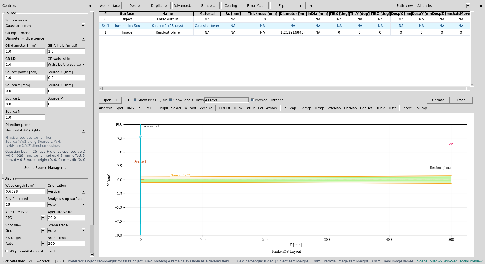
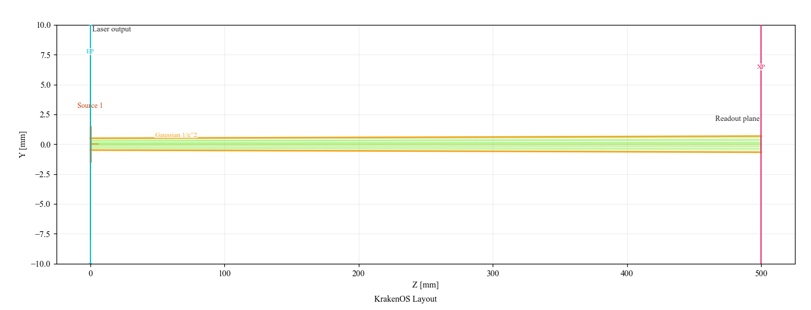
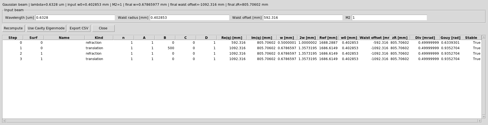
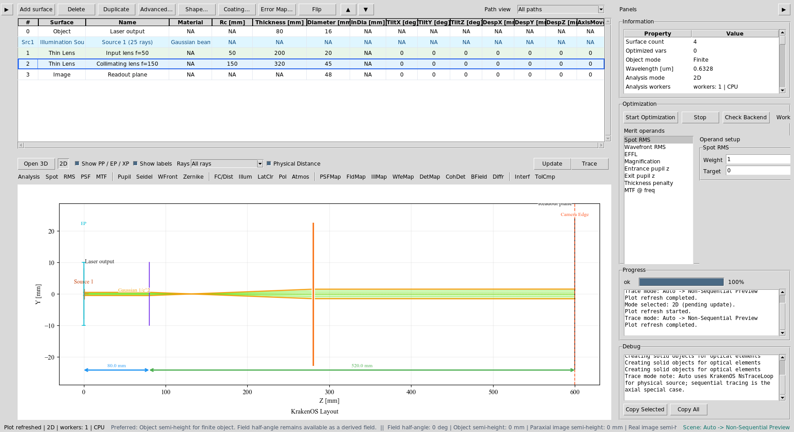
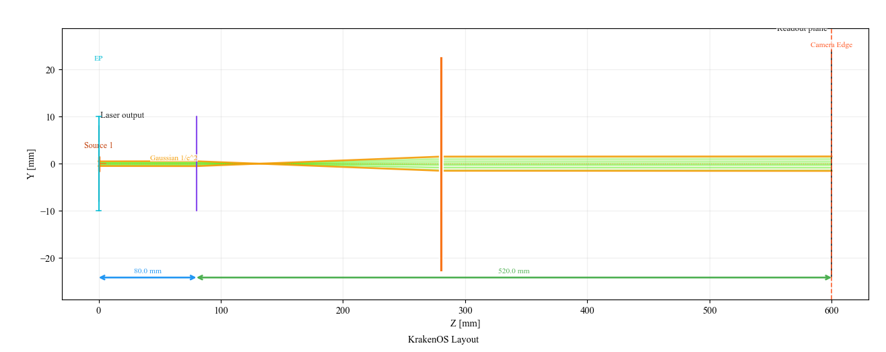
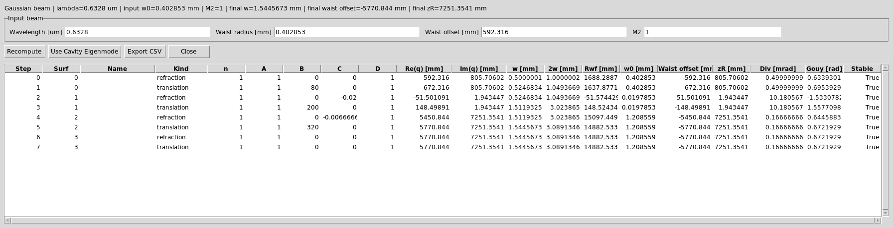
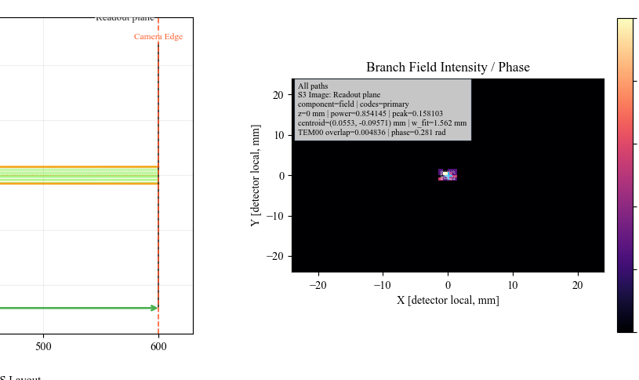

Case Study 3: Gaussian Laser Beam Expander
==========================================

Goal
----

This case study demonstrates the laser workflow in the UI:

* enter manufacturer-style laser data: beam diameter and full divergence;
* let KrakenOS back-calculate the waist radius and waist location;
* inspect the Gaussian ``q`` propagation report;
* convert a free-space laser line into a 3x Keplerian beam expander;
* verify the before/after beam size and divergence;
* run the ``BField`` analysis to show detector-plane field intensity and phase.

The screenshots in this tutorial are generated from the live Tk UI with:

.. code-block:: bash

   python -m KrakenOS.UI.capture_gaussian_beam_expander_case_study_screenshots

Load The Laser Line
-------------------

1. Start the UI with ``python -m KrakenOS.UI.layout_editor``.
2. In the top menu choose
   ``Layouts -> Sources / Illumination -> Gaussian Laser Beam Expander Case Study``.
3. Confirm the Source panel uses laser-datasheet input:

.. code-block:: text

   Source model       = Gaussian beam
   GB input mode      = Diameter + divergence
   GB diameter [mm]   = 1.0
   GB full div [mrad] = 1.0
   GB waist side      = Waist before source
   GB M2              = 1.0
   Wavelength [um]    = 0.6328

This means the laser output plane has a 1/e² beam diameter of ``1.0 mm`` and a
full far-field divergence of ``1.0 mrad``. The UI hides or disables the
ordinary field/pupil inputs because the physical Gaussian source now defines
the illumination.

   The Source panel is in ``Gaussian beam`` mode. Diameter and divergence are
   the active input fields; object-field controls are not part of this source
   workflow.

Click ``Update``. The 2D layout shows the traced representative source rays and
the amber 1/e² Gaussian envelope.

   Free-space baseline: a 1 mm diameter, 1 mrad full-divergence laser
   propagates to the readout plane.

Back-Calculated Waist
---------------------

Open ``Actions -> Gaussian Beam Report``.

For this laser input, KrakenOS computes approximately:

.. code-block:: text

   waist radius w0       ~= 0.403 mm
   waist location offset ~= 592 mm before the source plane

At the free-space readout plane, the beam is larger but the divergence is still
the original datasheet value:

.. code-block:: text

   final 1/e^2 diameter ~= 1.36 mm
   final half divergence ~= 0.50 mrad

   The Gaussian Beam Report lists the ABCD step, ``q`` value, beam radius,
   wavefront radius, waist offset, Rayleigh range, divergence, and Gouy phase.

Insert A 3x Keplerian Expander
------------------------------

The target is a 3x Keplerian expander. Use two positive lenses separated by
``f1 + f2``:

.. code-block:: text

   magnification = f2 / f1 = 150 / 50 = 3
   lens separation = f1 + f2 = 200 mm

Edit the table so it has these rows:

.. list-table::
   :header-rows: 1

   * - Row
     - Surface
     - Name
     - Rc [mm]
     - Thickness [mm]
     - Diameter [mm]
     - Material
   * - 0
     - Object
     - Laser output
     - 0
     - 80
     - 16
     - AIR
   * - 1
     - Thin Lens
     - Input lens f=50
     - 50
     - 200
     - 20
     - AIR
   * - 2
     - Thin Lens
     - Collimating lens f=150
     - 150
     - 320
     - 45
     - AIR
   * - 3
     - Image
     - Readout plane
     - 0
     - 0
     - 50
     - AIR

Practical click path:

1. Change row ``0`` ``Thickness`` from ``500`` to ``80``.
2. Click ``Add surface`` twice. New rows are inserted before ``Image``.
3. For each inserted row, right-click the ``Surface`` cell and choose
   ``Thin Lens``.
4. Fill the names, ``Rc`` focal lengths, thicknesses, and diameters from the
   table above. The UI will also show an automatic ``Src1`` illumination-source
   row between ``Object`` and the optical surfaces; that row is expected and is
   not one of the KrakenOS surface rows you are editing.
5. Click ``Update``.

   The table now contains the Keplerian expander: ``f1=50 mm`` followed by
   ``f2=150 mm``.

Verify The Expanded Beam
------------------------

The output beam should be about three times wider and about three times less
divergent than the input beam. Click ``Update`` and inspect the Gaussian
envelope.

   The amber envelope expands through the positive/positive lens pair and then
   propagates with lower divergence.

Open ``Actions -> Gaussian Beam Report`` again. The final readout-plane values
should be close to:

.. code-block:: text

   final 1/e^2 diameter ~= 3.09 mm
   final half divergence ~= 0.167 mrad

This is the expected 3x beam expansion and 3x divergence reduction.

   The report verifies the q-parameter propagation through both thin lenses.
   The final divergence is about one third of the original value.

Run BField Analysis
-------------------

The Gaussian ``q`` report is the paraxial design check. The ``BField`` button is
the detector-field check:

1. Set ``Detector bins = 64``.
2. Set ``Coherent sum = Mutual coherent``.
3. Set ``BField z [mm] = 0``.
4. Click ``BField`` and then ``Update``.

   ``BField`` promotes the detector samples into the branch-field grid and
   plots normalized field intensity, phase contours, centroid, and TEM00
   overlap diagnostics.

What This Proves
----------------

This case study exercises the laser-specific UI path:

* Gaussian source model with physical source position and direction;
* laser-datasheet input mode;
* automatic waist back-calculation;
* 1/e² Gaussian envelope overlay in the 2D layout;
* Gaussian Beam Report / ABCD q propagation;
* thin-lens beam-expander design;
* detector-side branch-field analysis.

Common Mistakes
---------------

``I entered half-angle divergence.``
  The UI field is full divergence in milliradians. A 1 mrad full-angle laser
  uses ``GB full div [mrad] = 1.0``.

``The ordinary Field panel disappeared.``
  That is intentional. For a physical Gaussian source, the source position,
  direction, diameter, divergence, and power define the illumination.

``The Gaussian envelope is not shown.``
  The amber q-envelope overlay is for centered +Z paraxial layouts. For tilted,
  folded, or beam-splitter layouts, use traced rays plus ``Gaussian Beam
  Report`` / ``Branch Gaussian Q Report``.

``The expander output is bigger, so did it make divergence worse?``
  No. A beam expander increases beam diameter and reduces angular divergence.
  In this example the diameter is about 3x larger and the divergence is about
  3x smaller.
