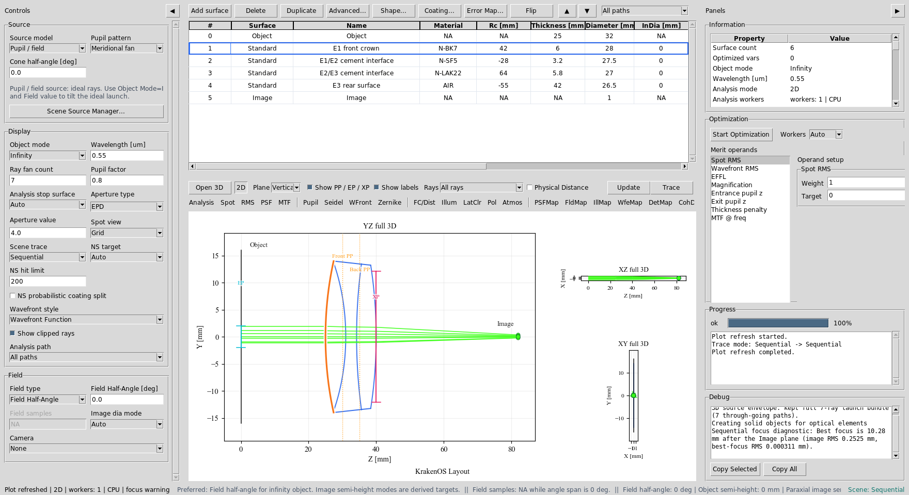
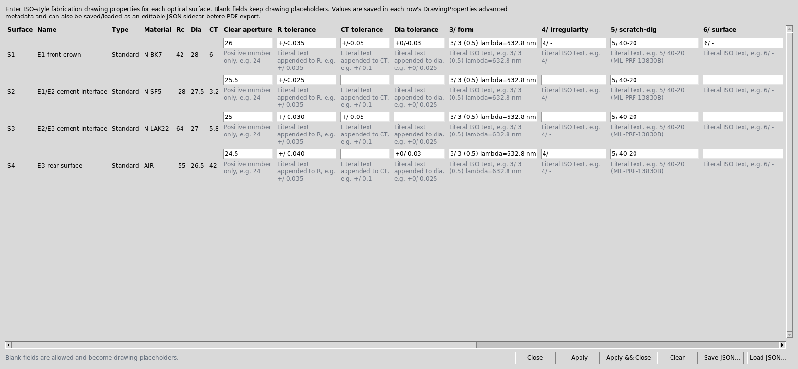
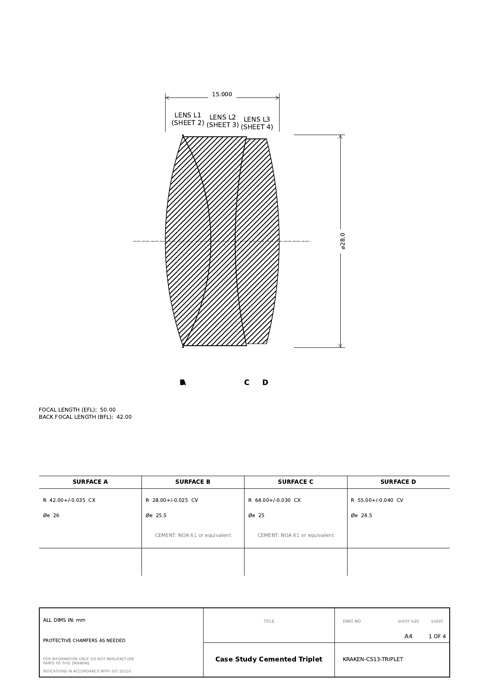
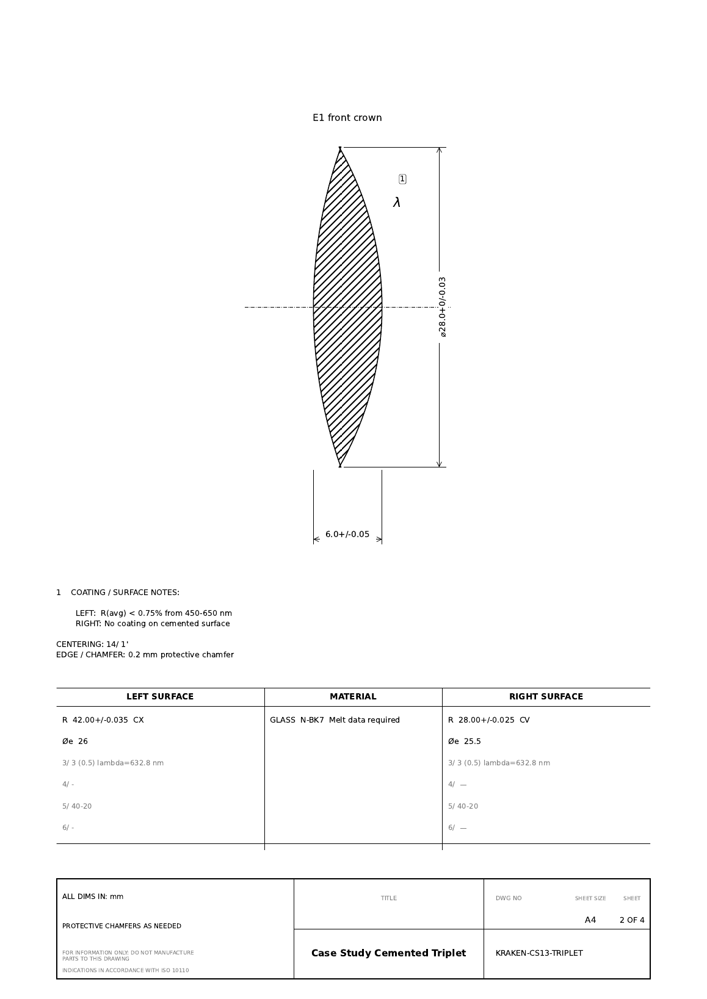
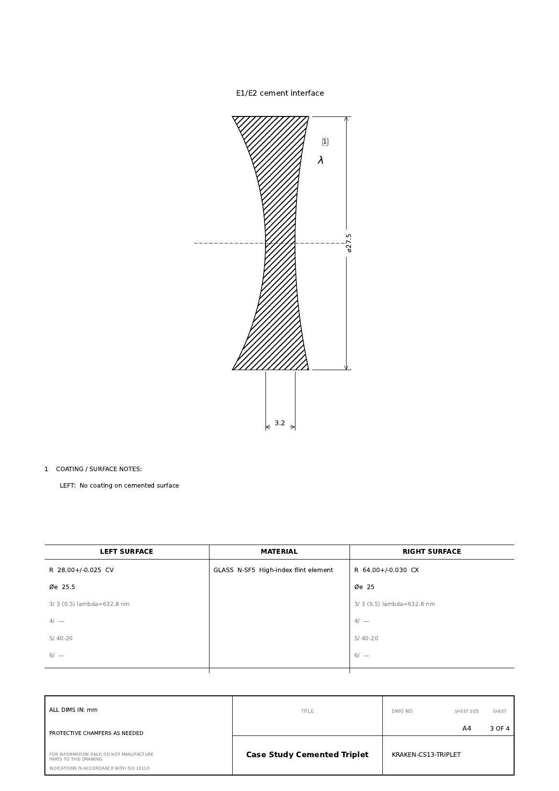
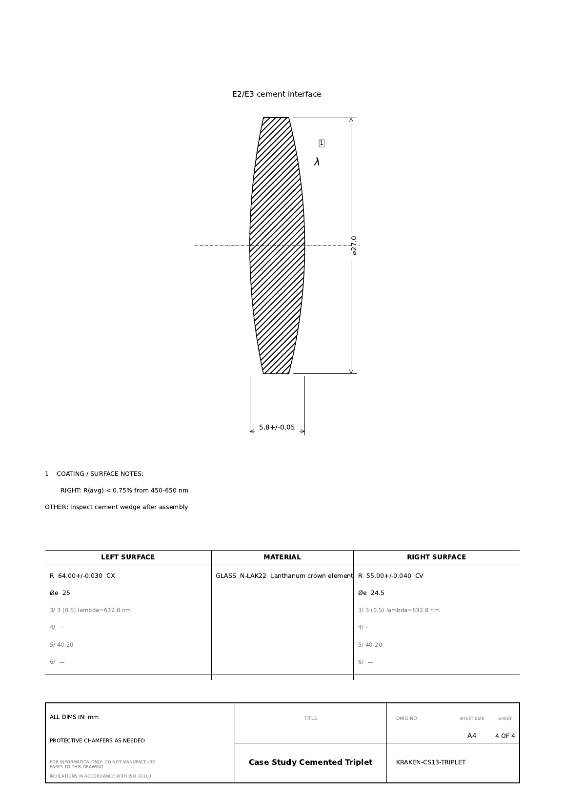

Case Study 15: Multi-Element Lens PDF Drawing Export
====================================================

Goal
----

This case study shows how a user enters a multi-element lens in the editable UI
table, adds per-surface fabrication metadata, and exports an ISO-style PDF
drawing package.

The example is a compact cemented triplet. It is not a released production
design; it is a reproducible workflow that proves the UI can carry optical
prescription data into a drawing-oriented output.

The screenshots and output files are generated with:

.. code-block:: bash

   python -m KrakenOS.UI.capture_lens_drawing_pdf_case_study_screenshots

The scriptable example is:

.. code-block:: bash

   python KrakenOS/Examples/Examp_Lens_Drawing_PDF_Export.py

Download the generated outputs:

* :download:`multi_element_lens_fabrication_drawing.pdf <../_static/tutorials/lens_drawing_pdf_export/multi_element_lens_fabrication_drawing.pdf>`
* :download:`triplet_surface_properties.json <../_static/tutorials/lens_drawing_pdf_export/triplet_surface_properties.json>`

Input The Surface Table
-----------------------

Start the UI with ``python -m KrakenOS.UI.layout_editor``. Create this table
with ``Add surface`` and direct cell edits:

.. list-table::
   :header-rows: 1

   * - Row
     - Surface
     - Name
     - Rc [mm]
     - Thickness [mm]
     - Diameter [mm]
     - Glass
   * - 0
     - Object
     - Object
     - NA
     - 25.0
     - 32.0
     - AIR
   * - 1
     - Standard
     - E1 front crown
     - 42.0
     - 6.0
     - 28.0
     - N-BK7
   * - 2
     - Standard
     - E1/E2 cement interface
     - -28.0
     - 3.2
     - 27.5
     - N-SF5
   * - 3
     - Standard
     - E2/E3 cement interface
     - 64.0
     - 5.8
     - 27.0
     - N-LAK22
   * - 4
     - Standard
     - E3 rear surface
     - -55.0
     - 42.0
     - 26.5
     - AIR
   * - 5
     - Image
     - Image
     - NA
     - 0.0
     - 32.0
     - AIR

Rows 1 through 3 have real glass after the surface. With zero air gap between
them, the drawing exporter identifies one cemented three-element group. Row 4
is the rear surface because the material after it is ``AIR``.

   The editable table contains the triplet prescription before drawing export.

Input Drawing Properties
------------------------

Choose ``File -> Lens Drawing Surface Properties...`` or
``File -> Export Lens Drawing...``. The export command opens the same dialog
before asking for a PDF filename.

Enter fabrication metadata on the optical surface rows:

.. list-table::
   :header-rows: 1

   * - Row
     - Clear aperture
     - R tolerance
     - CT tolerance
     - Dia tolerance
     - 3/ form
     - Coating / notes
   * - S1
     - 26.0
     - +/-0.035
     - +/-0.05
     - +0/-0.03
     - 3/ 3 (0.5) lambda=632.8 nm
     - R(avg) < 0.75% from 450-650 nm
   * - S2
     - 25.5
     - +/-0.025
     - blank
     - blank
     - 3/ 3 (0.5) lambda=632.8 nm
     - cement: NOA 61 or equivalent
   * - S3
     - 25.0
     - +/-0.030
     - +/-0.05
     - blank
     - 3/ 3 (0.5) lambda=632.8 nm
     - cement: NOA 61 or equivalent
   * - S4
     - 24.5
     - +/-0.040
     - blank
     - +0/-0.03
     - 3/ 3 (0.5) lambda=632.8 nm
     - R(avg) < 0.75% from 450-650 nm

Blank fields are allowed. They become placeholders or omitted notes in the
drawing. The dialog stores data in each row's ``advanced["DrawingProperties"]``
dictionary and can also save/load a JSON sidecar.

   Each row maps to one physical optical surface in the table.

Export The PDF
--------------

Choose ``File -> Export Lens Drawing...``. After reviewing the properties
dialog, click ``Apply && Continue`` and choose a PDF filename.

The generated PDF has four pages:

* one assembly page for the cemented triplet;
* one individual drawing page for each of the three elements.

   The assembly sheet shows the cemented group, total thickness, outside
   diameter, EFL/BFL entries, cement notes, and surface radius table.

   Element 1 shows its center thickness, diameter tolerance, left/right surface
   radii, clear apertures, coating notes, material note, and edge note.

   Element 2 inherits the cement-interface metadata from the shared surface
   rows.

   Element 3 carries the rear-surface coating note and final assembly
   inspection note.

Run The Validator
-----------------

Use this check after editing drawing properties, element identification, or PDF
export code:

.. code-block:: bash

   python -m KrakenOS.UI.validate_lens_drawing_pdf_case_study
   python -m KrakenOS.UI.validate_lens_drawing_properties

The first validator proves that this case study still identifies one cemented
three-element group, round-trips the JSON surface-property sidecar, and writes a
non-empty PDF. The second validator checks the lower-level drawing-property
schema and two-element cemented group export.

What This Proves
----------------

This case study exercises the engineering-output side of the UI:

* table cell prescription entry for a multi-element lens;
* automatic cemented-group identification from material and zero air gaps;
* per-surface drawing metadata stored in row ``Advanced`` data;
* editable JSON sidecar export/import for drawing properties;
* assembly-page and element-page PDF drawing generation;
* surface radius, clear aperture, coating, cement, material, centering, edge,
  and miscellaneous note export.

Important Limitation
--------------------

The exported PDF is a fabrication starting point, not a controlled released
drawing. Before manufacturing, verify tolerances, coating requirements, glass
melt data, edge/chamfer details, drawing number, revision policy, title block,
and vendor-specific drawing standards.
