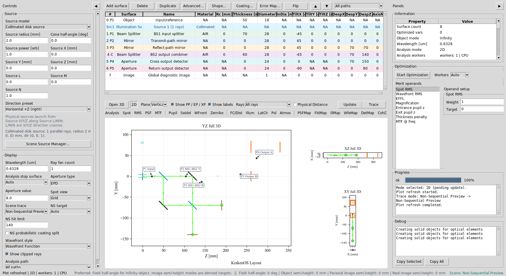
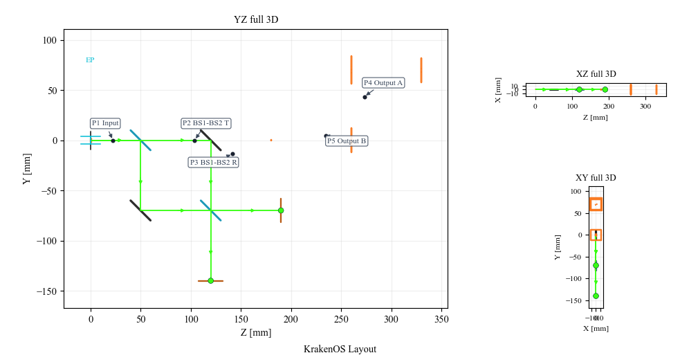
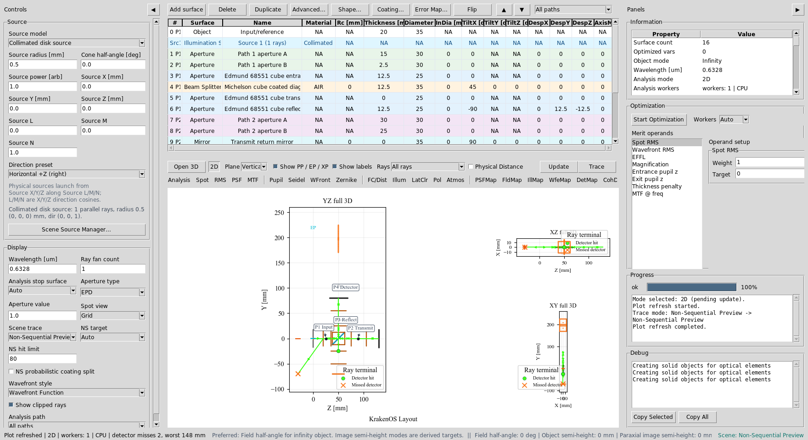
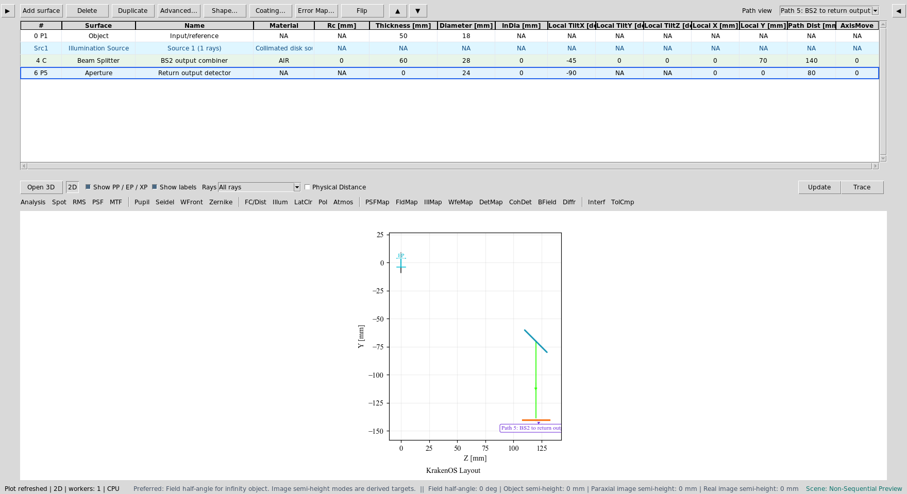
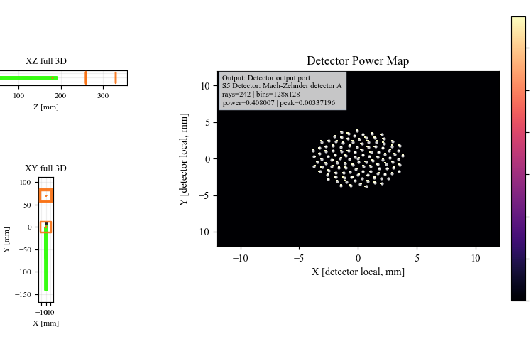
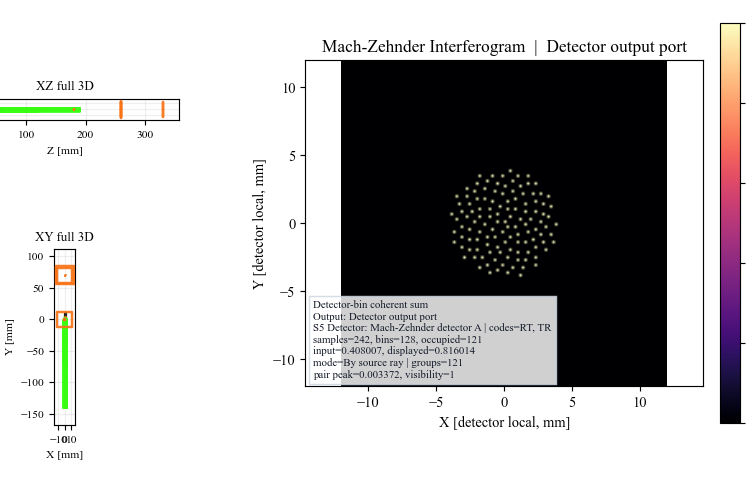
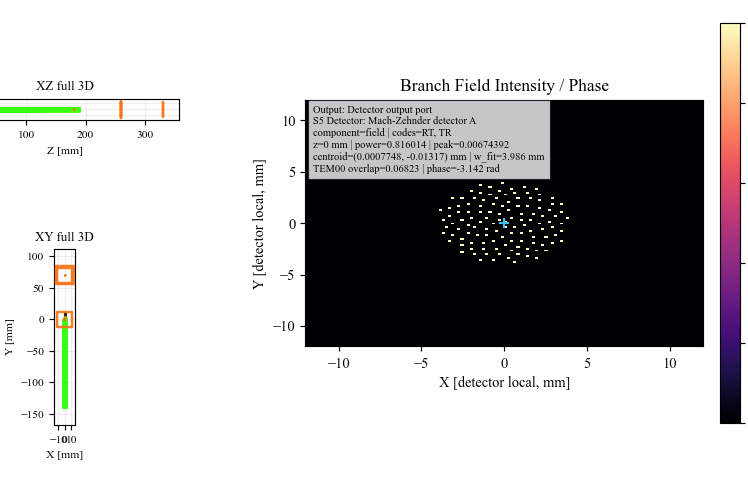
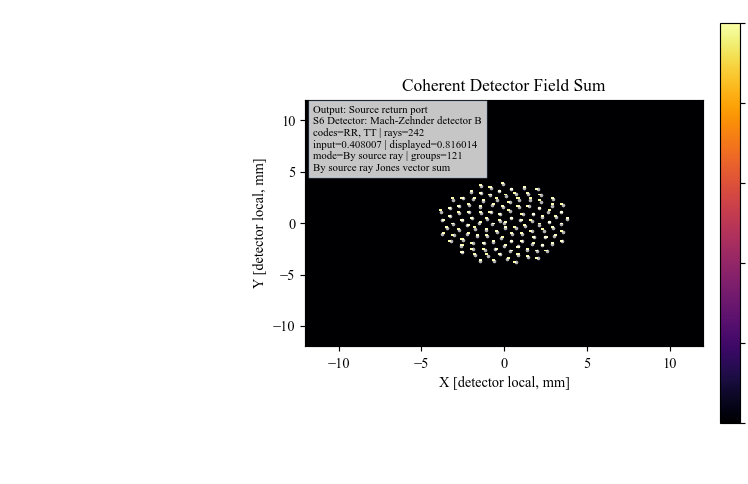

Case Study 7: Mach-Zehnder Two-Output Interferometer
====================================================

Goal
----

This case study demonstrates a cascaded beam-splitter workflow:

* load a Mach-Zehnder layout with two physical output ports;
* read the five path labels in the 2D plot;
* isolate each output port with ``Path view``;
* run detector, coherent detector, interferogram, and branch-field analyses;
* verify that the return output port is also available for analysis.

The screenshots in this tutorial are generated from the live Tk UI with:

.. code-block:: bash

   python -m KrakenOS.UI.capture_mach_zehnder_case_study_screenshots

Load The Mach-Zehnder Layout
----------------------------

1. Start the UI with ``python -m KrakenOS.UI.layout_editor``.
2. Choose
   ``Layouts -> Beam Splitters / Folds -> Mach-Zehnder Interferometer (Interferogram)``.
3. Keep ``Trace mode = Non-Sequential Preview``.
4. Keep ``NS probabilistic coating split`` off.

This layout uses two deterministic 50/50 beam splitters. ``BS1`` splits the
input source into the upper transmitted arm and lower reflected arm. ``BS2``
recombines those two arms and sends light to two detector ports.

The ``Object`` row is a scene/reference datum. Rays launch from the physical
Source panel, so source position, radius, direction, power, and ray count
control this example.

   The preset contains a physical source, ``BS1``, two fold mirrors, ``BS2``,
   a cross-output detector, and a return-output detector.

Read The Path Labels
--------------------

Click ``Update``. With the default chief-ray source, the 2D plot is intended to
read like a schematic. The black-dot labels identify the physical path
segments where the user can reason about adding optical components.

.. list-table::
   :header-rows: 1

   * - Plot label
     - Meaning
   * - ``P1 Input``
     - Source to ``BS1``.
   * - ``P2 BS1-BS2 T``
     - ``BS1`` transmitted arm to ``BS2``.
   * - ``P3 BS1-BS2 R``
     - ``BS1`` reflected arm to ``BS2``.
   * - ``P4 Output A``
     - Cross output from ``BS2`` to detector A.
   * - ``P5 Output B``
     - Return output from ``BS2`` to detector B.

   Path labels follow physical legs, not only branch codes. This is the
   convention used by the table ``Path view`` dropdown.

Use Path View For Each Output
-----------------------------

After ``Update``, open the table toolbar ``Path view`` dropdown and select:

.. code-block:: text

   Path 4: BS2 to cross output detector

This filters the table and plot to the common path plus output detector A.
This is the path where branch codes ``RT`` and ``TR`` recombine.

   ``Path view`` isolates output A without renumbering the underlying KrakenOS
   surface rows.

Now select:

.. code-block:: text

   Path 5: BS2 to return output detector

This filters the table and plot to the common path plus output detector B.
This is the path where branch codes ``RR`` and ``TT`` recombine.

   Output B is a separate detector path, so it can be inspected and optimized
   independently from output A.

Run Detector Analyses
---------------------

For analysis screenshots, use a denser source bundle:

.. code-block:: text

   Ray fan count = 121
   Source radius [mm] = 4.0
   Detector bins = 128
   Coherent sum = Mutual coherent
   Path view = All paths
   Analysis path = Output: Detector output port

Click ``DetMap`` and ``Update``. This maps detector power at output A.

   ``DetMap`` verifies that both recombining branches reach detector A.

Click ``CohDet`` and ``Update``. This uses the same detector hits but sums the
complex Jones field by coherence group instead of only summing power.

   ``CohDet`` reports the detector, branch codes, ray count, and polarization
   model used for the coherent sum.

Show The Interferogram
----------------------

Click ``Interf`` and ``Update``.

The Mach-Zehnder preset stores interferogram settings on ``BS2``. The
interferogram analysis uses the selected detector-output branch family and the
saved detector settings to display a detector-bin coherent interferogram.

   The plotted interferogram is sampled from traced detector hits. Increase
   source samples and detector bins when a smoother display is needed.

Run Branch Field
----------------

Set ``BField z [mm] = 0``. Click ``BField`` and ``Update``.

   ``BField`` promotes the coherent detector samples into a branch-field grid
   and reports intensity, phase, centroid, and mode diagnostics.

Check The Return Output
-----------------------

Change only the analysis filter:

.. code-block:: text

   Analysis path = Output: Source return port

Click ``CohDet`` and ``Update``. Output B uses the complementary branch pair,
so its branch codes differ from output A.

   The return-output detector is a first-class analysis target, not a hidden
   byproduct of the cross-output port.

What This Proves
----------------

This case study exercises the non-sequential beam-splitter workflow beyond the
single-output Michelson example:

* cascaded beam splitters;
* source/object separation;
* five physical path labels in the 2D plot;
* table filtering by each physical output path;
* two detector output ports;
* detector power analysis;
* coherent field recombination;
* interferogram generation;
* branch-field intensity/phase analysis.

Common Mistakes
---------------

``I expected Path view to show only one branch code.``
  Path view follows physical legs. A detector-output leg can contain multiple
  recombining branch codes.

``I selected All paths for coherent analysis and got the wrong output.``
  For a two-output interferometer, use ``Analysis path`` to choose the output
  port before running coherent detector, interferogram, or branch-field views.

``The detector pattern is sparse.``
  Increase ``Ray fan count`` and ``Detector bins`` for analysis. Keep
  ``Ray fan count = 1`` when you want the clean schematic view.

``The Object row moved but the source did not.``
  This preset launches from the Source panel. Move the source controls when
  you want to move illumination.
