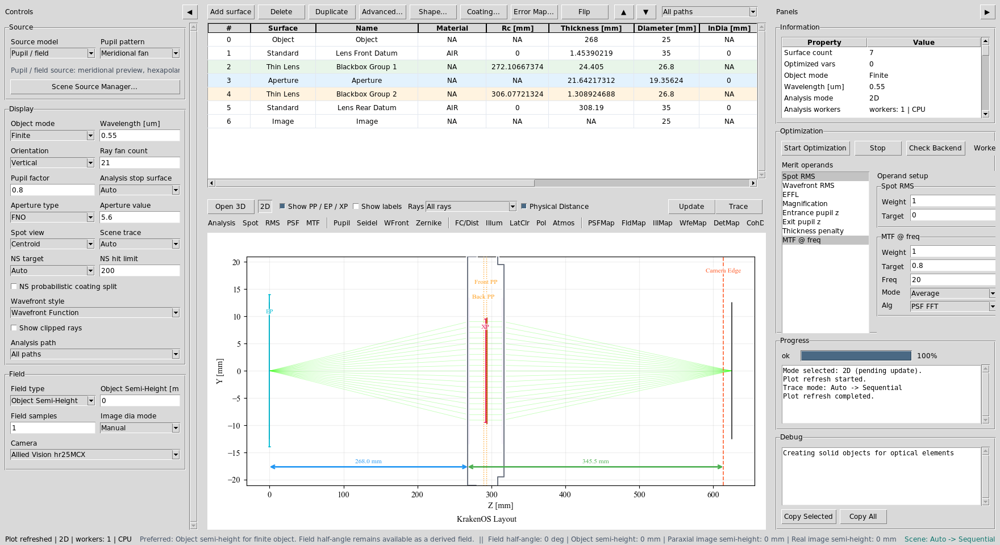
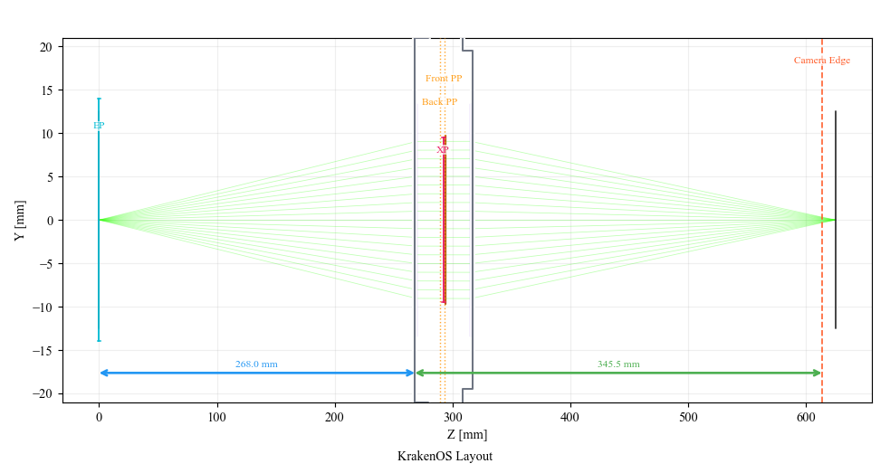
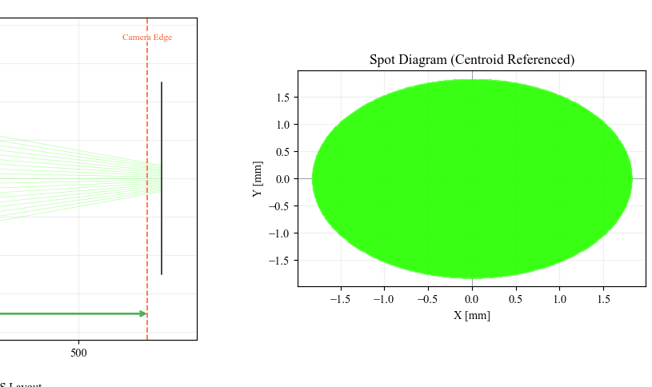
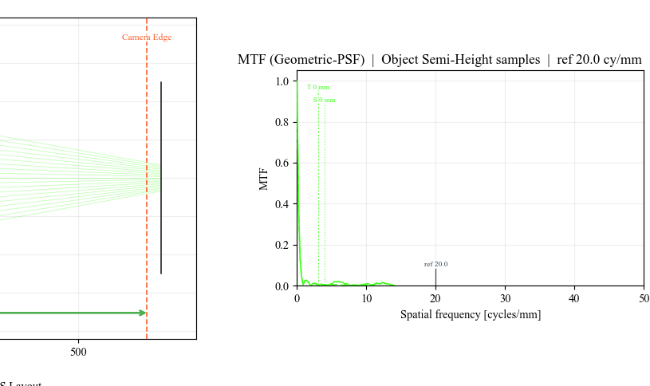
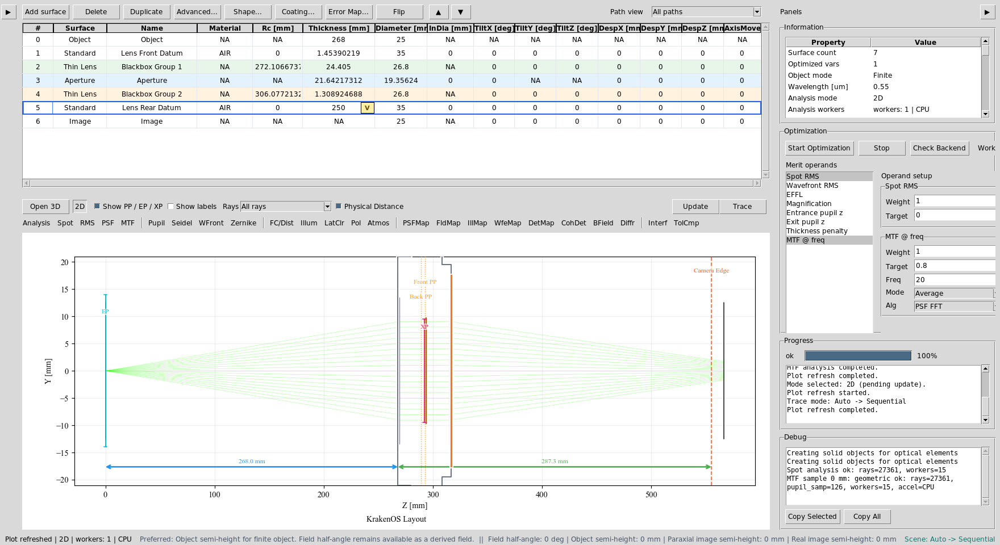
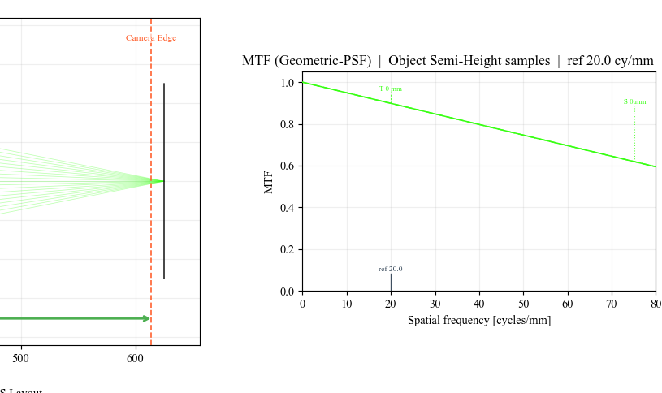
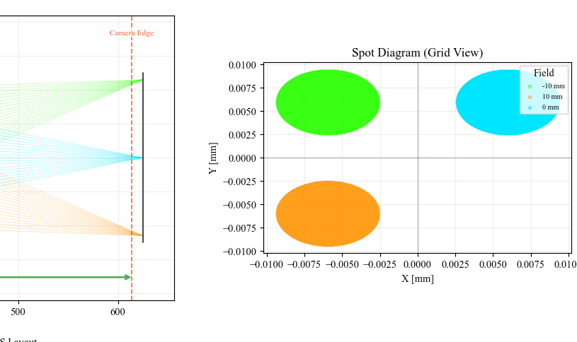

Case Study 2: Focus A Finite Machine-Vision Lens
================================================

Goal
----

This case study starts from the measured 150 mm machine-vision lens preset and
uses a deliberately wrong sensor position to show a complete sequential design
loop:

* load a finite-conjugate lens;
* make a poor first Spot and MTF analysis;
* choose the correct optimization variable;
* run a best-focus solve;
* verify that Spot and MTF improve.

The point is not to redesign the lens prescription. The lens is treated as a
measured black-box machine-vision lens. The user is only recovering the correct
sensor/image distance for a finite object.

The screenshots in this tutorial are generated from the live Tk UI with:

.. code-block:: bash

   python -m KrakenOS.UI.capture_machine_vision_case_study_screenshots

The analysis screenshots are area-of-interest crops from the Matplotlib plot
canvas so the result is readable during a presentation.

Load The Finite Lens
--------------------

1. Start the UI with ``python -m KrakenOS.UI.layout_editor``.
2. In the top menu, choose the machine-vision preset
   ``Machine Vision 150Mm Measured``.
3. Confirm the left/source panel is in finite-object mode:

   * ``Object Mode = Finite``;
   * ``Aperture = FNO``;
   * ``FNO = 5.6``;
   * ``Field Type = Object Height``;
   * ``Field Value = 0``;
   * ``Field Count = 1``.

This is the on-axis setup. Use it first because focus must be correct before a
wide-field comparison is meaningful.

   The measured finite-conjugate machine-vision lens is loaded. The table uses
   object distance, lens front/rear datums, black-box lens groups, aperture,
   and Image rows.

   Initial 2D layout: the finite object launches into the measured lens group
   and ends at the Image plane / sensor position.

Make A Bad First Analysis
-------------------------

In the table, find row ``S5 Lens Rear Datum``. This row thickness is the air
gap from the rear lens datum to the Image row, so it behaves like the sensor
position.

For the bad starting point, type:

.. code-block:: text

   S5 Thickness = 250

Then click ``Spot`` and ``Update``.

The on-axis spot is intentionally bad. In the generated screenshot, the spot
RMS is about ``1.21 mm`` because the sensor is much too close to the lens.

   Defocused Spot AOI: the sensor is at ``250 mm`` instead of near focus.

Click ``MTF`` and ``Update``. Use ``MTF @ freq = 20`` cycles/mm and
``Alg = PSF FFT`` in the Optimization panel. The defocused geometric MTF is
nearly gone at this frequency.

   Defocused MTF AOI: at ``20 cycles/mm`` the average geometric MTF is only
   around ``0.008`` for this deliberate sensor error.

Choose The Right Variable
-------------------------

The optimizer needs a variable. For this workflow the variable is not a lens
radius or glass. It is the sensor distance:

1. Right-click the ``S5 Lens Rear Datum`` ``Thickness`` cell.
2. Choose ``Optimization / Solves -> Select Thickness for optimization``.
3. Right-click the same cell again and choose ``Set bounds...``.
4. Use a practical focus-search range, for example:

.. code-block:: text

   240, 330

Keep the ``Spot RMS`` merit operand selected with target ``0``. This tells the
UI: move only the image distance until the on-axis spot is minimized.

   ``S5 Thickness`` is the focus variable. ``Spot RMS`` is the target metric.

Run The Focus Solve
-------------------

Use either workflow below.

Workflow A: best-focus solve
~~~~~~~~~~~~~~~~~~~~~~~~~~~~

This is the most direct click-through path:

1. Right-click ``S5 Lens Rear Datum`` ``Thickness``.
2. Choose ``Optimization / Solves -> Best Focus Solve``.
3. Accept the result and click ``Update``.

For this case study the solve moves the sensor to about:

.. code-block:: text

   S5 Thickness ~= 308.3 mm

The on-axis spot RMS improves from about ``1.21 mm`` to about ``0.0022 mm``.

Workflow B: general optimizer
~~~~~~~~~~~~~~~~~~~~~~~~~~~~~

This demonstrates the same idea through the Optimization panel:

1. Keep only ``S5 Thickness`` marked as a variable.
2. Keep ``Spot RMS`` selected with target ``0`` and weight ``1``.
3. Click ``Start Optimization``.
4. Click ``Update`` after the run finishes.

Use the best-focus solve for a live demo because it is deterministic and fast.
Use the general optimizer when several variables or operands are active.

Verify The Improvement
----------------------

Click ``Spot`` and ``Update`` again. The spot should collapse near the origin.

   Refocused Spot AOI: the Image plane is back near best focus.

Click ``MTF`` and ``Update`` again. At ``20 cycles/mm`` the average MTF rises
to about ``0.90`` in the generated case-study data.

   Refocused MTF AOI: the focused lens now has useful contrast at the reference
   spatial frequency.

Check The Wide Field
--------------------

After the on-axis focus is correct, switch back to the measured wide-field
setup:

.. code-block:: text

   Field Type  = Real Image Height
   Field Value = 11.52
   Field Count = 3
   Spot View   = Grid

Click ``Spot`` and ``Update``. The grid view separates the sampled field points
so the user can compare center and edge behaviour.

   Wide-field spot AOI: after focus recovery, the center and edge field points
   can be compared without confusing the analysis with gross defocus.

What This Proves
----------------

This case study exercises a sequential, finite-conjugate lens workflow:

* finite object/image geometry;
* F-number aperture control;
* table editing of the image distance;
* Spot and MTF analysis modes;
* variable selection and bounds;
* deterministic best-focus optimization;
* before/after verification with regenerated screenshots.

Common Mistakes
---------------

``I changed the Image row thickness.``
  The Image row thickness is normally zero. Change the thickness of the row
  before Image. In this preset that is ``S5 Lens Rear Datum``.

``I optimized a lens radius instead of sensor distance.``
  That changes the lens prescription. For focus recovery, mark only the final
  air gap / sensor distance as variable.

``The wide-field plot still looks worse than the on-axis plot.``
  That is expected. The wide-field analysis includes off-axis field points.
  First remove gross defocus on-axis, then judge field performance.

``Best Focus Solve and Start Optimization are both available.``
  Best Focus Solve is a deterministic one-variable focus search. Start
  Optimization is more general and is useful once you have multiple variables
  and multiple operands.
