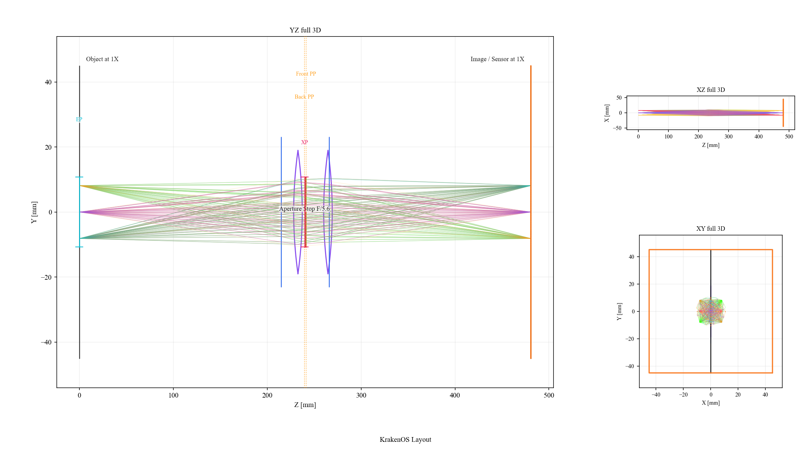

Case Study: PYRITE 120 mm Machine-Vision Surrogate
==================================================

This page documents the surrogate layout
``Machine Vision 120 mm Pyrite (Datasheet 1X)``. It is based on the local
datasheet:

.. code-block:: text

   attachment/Lens/PYRITE_56_120_10x_V38_1097277_datasheet.pdf

What The Surrogate Is
---------------------

The vendor datasheet does not provide the internal prescription. The KrakenOS
layout is therefore a first-order blackbox model, not a decoded Schneider
prescription. It uses two ideal thin-lens groups and one aperture stop inside
the published optical vertex span. The goal is to make the UI behave like the
120 mm machine-vision lens at the level needed for layout work, field sampling,
camera-distance studies, and Open 3D placement.

The model uses these public datasheet values:

.. list-table::
   :header-rows: 1

   * - Quantity
     - Datasheet value
     - Surrogate use
   * - Product
     - PYRITE 5.6/120/1.0x V38, ID 1097277
     - Menu title and documentation identity
   * - Effective focal length
     - 120.68 mm
     - Paraxial effective focal length
   * - Magnification range
     - -1.0 recommended, -1.125 to -0.875 usable
     - Default layout is the 1x conjugate
   * - F-number range
     - F/5.6 to F/64
     - Default aperture is F/5.6
   * - Numerical aperture
     - 0.05 object side, 0.05 image side
     - Sanity check for the F/5.6 finite-conjugate model
   * - Maximum sensor size
     - 90 mm
     - Image and object row diameter; the default sampled field uses the shared camera workflow below
   * - Maximum angle of view
     - 21 degrees
     - Field sanity check
   * - Working-distance range
     - 198 mm to 228 mm
     - Checked against the recommended magnification range
   * - ``SF``
     - -94.33 mm
     - Front focal distance from the first optical vertex
   * - ``S'F'``
     - 94.33 mm
     - Back focal distance from the last optical vertex
   * - ``HH'``
     - -1.78 mm
     - Principal-plane separation
   * - ``SEP`` / ``S'AP``
     - 26.21 mm / -26.48 mm
     - Stop placement sanity check
   * - ``Σd``
     - 50.91 mm
     - Rounded optical vertex span; model uses the exact STEP glass span that rounds to this value

Vendor STEP Overlay
-------------------

The preset also records the local vendor STEP file:

.. code-block:: text

   attachment/Lens/1097277_00155156_002.stp

The STEP is used as a mechanical overlay, while the KrakenOS table remains the
paraxial blackbox optical surrogate. OpenCascade extraction finds the two usable
glass vertex surfaces as:

.. list-table::
   :header-rows: 1

   * - STEP face
     - Role in this surrogate
     - STEP local axis coordinate
   * - ``S001/F193``
     - First glass surface / front optical vertex
     - ``+8.832740626 mm``
   * - ``S001/F155``
     - Last glass surface / rear optical vertex
     - ``-42.077263665 mm``

Those two surfaces are separated by ``50.910004290 mm``. That is the
datasheet ``Σd = 50.91 mm`` rounded to the nearest 0.01 mm plus about
``4 nm``. The surrogate uses the exact STEP glass span for its front-to-rear
vertex distance, which still rounds to the datasheet value. It also stores a
lens STEP placement offset of ``-3.137787154 mm`` so the STEP's first and last
glass vertices overlay the surrogate's front and rear optical vertex datums.
The mechanical front shoulder of the STEP is intentionally not used as the
optical datum.

Default UI Settings
-------------------

The preset intentionally follows the same working defaults as
``Machine Vision 150Mm Measured`` so the two layouts can be used the same way in
Open 3D. It inherits the same ray display, source, detector, non-sequential,
tolerance, atmosphere, optimization, and CAD overlay defaults. In particular,
it opens with the same Allied Vision ``hr25MCX`` camera model and
``attachment/Cameras/3D_CAD_HR25xCXP.STEP`` camera overlay.

Only lens-specific defaults differ from the 150 mm measured layout:

* The aperture default is ``F/5.6`` from the PYRITE datasheet.
* The real-image field default is ``11.52 mm`` so the initial field sampling
  matches the shared camera workflow rather than the full 90 mm image-circle
  capability.
* The lens STEP overlay uses ``attachment/Lens/1097277_00155156_002.stp`` and
  the glass-vertex alignment offset described above.

How The Blackbox Is Built
-------------------------

The first principal plane is inferred from:

.. code-block:: text

   H1 = SF + f'eff = -94.33 + 120.68 = 26.35 mm

The second principal plane is inferred from:

.. code-block:: text

   H2 = Σd + S'F' - f'eff = 50.910004290 + 94.33 - 120.68 = 24.560004290 mm

The resulting ``H2 - H1`` is about ``-1.79 mm``, matching the published
``HH' = -1.78 mm`` after rounding.

The surrogate rows are:

.. list-table::
   :header-rows: 1

   * - Row
     - Role
     - Distance / power
   * - Object
     - 1x finite object plane
     - 215.01 mm before the first optical vertex datum
   * - Front Optical Vertex Datum
     - First optical vertex reference
     - 17.760867505 mm to group 1
   * - Blackbox Group 1
     - Ideal thin-lens group
     - ``f = 153.305042833 mm``
   * - Aperture Stop F/5.6
     - Stop / F-number control
     - 8.449132495 mm after group 1
   * - Blackbox Group 2
     - Ideal thin-lens group
     - ``f = 448.895372088 mm``
   * - Rear Optical Vertex Datum
     - Last optical vertex reference
     - 215.01 mm to image at 1x
   * - Image / Sensor
     - 1x sensor plane
     - 90 mm image circle

The same cardinals imply these finite-conjugate working points when measured
from the optical vertex datums:

.. list-table::
   :header-rows: 1

   * - Magnification
     - Object to front optical vertex
     - Rear optical vertex to image
   * - 0.875x
     - 232.25 mm
     - 199.925 mm
   * - 1.0x
     - 215.01 mm
     - 215.01 mm
   * - 1.125x
     - 201.601111 mm
     - 230.095 mm

Rendered Layout
---------------

   The surrogate uses optical vertex datums, two blackbox thin-lens groups, an
   F/5.6 stop, and the 1x image plane. It is meant for layout and camera
   placement studies, not manufacturing-level lens analysis.

Known Limits
------------

* Internal curvatures, glasses, aspheres, coatings, tolerances, and MTF are not
  reconstructed from the datasheet.
* The two thin-lens groups reproduce first-order cardinal data; they do not
  reproduce the vendor's high-resolution aberration correction.
* The mechanical V38 mount, filter thread, and barrel outline are represented
  by the STEP overlay rather than by the sequential surrogate rows.
* The STEP overlay is for placement and clearance. The ray trace still uses the
  two-thin-group blackbox unless the STEP is promoted/rebuilt as native optical
  surfaces with explicit glass assignments.

Validation
----------

The validation script checks that the layout is discoverable in the Machine
Vision menu and that the two-thin-group paraxial matrix reproduces the published
effective focal length, front focal distance, and back focal distance. It also
loads the vendor STEP and checks that ``S001/F193`` and ``S001/F155`` remain the
matched first and last glass surfaces:

.. code-block:: bash

   python -m KrakenOS.UI.validate_machine_vision_pyrite_120_surrogate
