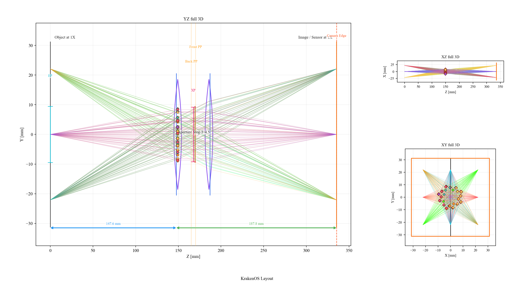

Case Study: PYRITE 85 mm Machine-Vision Surrogate
=================================================

This page documents the surrogate layout
``Machine Vision 85 mm Pyrite (Datasheet 1X)``.  It is based on the local
datasheet:

.. code-block:: text

   ~/Downloads/PYRITE_45_85_05x-20x_V38_1072517_datasheet.pdf

What The Surrogate Is
---------------------

The vendor datasheet does not provide the internal prescription.  The KrakenOS
layout is therefore a first-order blackbox model, not a decoded Schneider
prescription.  It uses two ideal thin-lens groups and one aperture stop inside
the published optical vertex span.  The goal is to make the UI behave like the
85 mm machine-vision lens at the level needed for layout work, field sampling,
camera-distance studies, and Open 3D placement.

The model uses these public datasheet values:

.. list-table::
   :header-rows: 1

   * - Quantity
     - Datasheet value
     - Surrogate use
   * - Product
     - PYRITE 4.5/85/0.5x-2.0x V38, ID 1072517
     - Menu title and documentation identity
   * - Effective focal length
     - 85.13 mm
     - Paraxial effective focal length
   * - Magnification range
     - 0.5x to 2.0x, nominal 1x
     - Default layout is the 1x conjugate
   * - F-number range
     - F/4.5 to F/8
     - Default aperture is F/4.5
   * - Numerical aperture
     - 0.06 object side, 0.06 image side
     - Sanity check for the F/4.5 finite-conjugate model
   * - Maximum sensor size
     - 62.5 mm
     - Image and object row diameter; real-image half-field 31.25 mm
   * - Maximum angle of view
     - 21 degrees
     - Field sanity check
   * - Working-distance range
     - 100 mm to 228 mm
     - Checked against the 0.5x to 2.0x model conjugates
   * - ``SF``
     - -62.45 mm
     - Front focal distance from the first optical vertex
   * - ``S'F'``
     - 63.18 mm
     - Back focal distance from the last optical vertex
   * - ``HH'``
     - -5.12 mm
     - Principal-plane separation
   * - ``SEP`` / ``S'AP``
     - 22.02 mm / -22.62 mm
     - Stop placement sanity check
   * - ``Σd``
     - 39.52 mm
     - Optical vertex span used by the model

The mechanical drawing also shows a 47.8 mm barrel length, 142.9 mm working
distance and 149.4 mm image-side distance at beta prime ``-1.0``.  The
surrogate's table distances are measured from optical vertex datums, not from
the external mechanical shoulders, so they are close but not identical to those
mechanical drawing dimensions.

How The Blackbox Is Built
-------------------------

The first principal plane is inferred from:

.. code-block:: text

   H1 = SF + f'eff = -62.45 + 85.13 = 22.68 mm

The second principal plane is inferred from:

.. code-block:: text

   H2 = Σd + S'F' - f'eff = 39.52 + 63.18 - 85.13 = 17.57 mm

The resulting ``H2 - H1`` is about ``-5.11 mm``, matching the published
``HH' = -5.12 mm`` after rounding.

The surrogate rows are:

.. list-table::
   :header-rows: 1

   * - Row
     - Role
     - Distance / power
   * - Object
     - 1x finite object plane
     - 147.58 mm before the first optical vertex datum
   * - Front Optical Vertex Datum
     - First optical vertex reference
     - 1.71545542 mm to group 1
   * - Blackbox Group 1
     - Ideal thin-lens group
     - ``f = 150.17565687 mm``
   * - Aperture Stop F/4.5
     - Stop / F-number control
     - 20.30454458 mm after group 1
   * - Blackbox Group 2
     - Ideal thin-lens group
     - ``f = 148.63880626 mm``
   * - Rear Optical Vertex Datum
     - Last optical vertex reference
     - 148.31 mm to image at 1x
   * - Image / Sensor
     - 1x sensor plane
     - 62.5 mm image circle

The 1x layout is the default because the datasheet drawing explicitly labels
the beta-prime ``-1.0`` case.  The same cardinals imply these finite-conjugate
working points when measured from the optical vertex datums:

.. list-table::
   :header-rows: 1

   * - Magnification
     - Object to front optical vertex
     - Rear optical vertex to image
   * - 0.5x
     - 232.71 mm
     - 105.745 mm
   * - 1.0x
     - 147.58 mm
     - 148.31 mm
   * - 2.0x
     - 105.015 mm
     - 233.44 mm

The published working-distance range is measured to the first mechanical
element, so the 0.5x and 2.0x optical-vertex distances bracket the datasheet
range with the expected mechanical offset.

Rendered Layout
---------------

   The surrogate uses optical vertex datums, two blackbox thin-lens groups, an
   F/4.5 stop, and the 1x image plane.  It is meant for layout and camera
   placement studies, not manufacturing-level lens analysis.

Known Limits
------------

* Internal curvatures, glasses, aspheres, coatings, tolerances, and MTF are not
  reconstructed from the datasheet.
* The two thin-lens groups reproduce first-order cardinal data; they do not
  reproduce the vendor's high-resolution aberration correction.
* The mechanical V38 mount, lock screws, filter thread, and barrel outline are
  documented by the datasheet but are not modelled as CAD solids in this
  sequential surrogate.
* For Open 3D mechanical clearance work, import the vendor STEP separately and
  align it to this surrogate's optical axis.

Validation
----------

The validation script checks that the layout is discoverable in the Machine
Vision menu and that the two-thin-group paraxial matrix reproduces the published
effective focal length, front focal distance, and back focal distance:

.. code-block:: bash

   python -m KrakenOS.UI.validate_machine_vision_pyrite_85_surrogate
