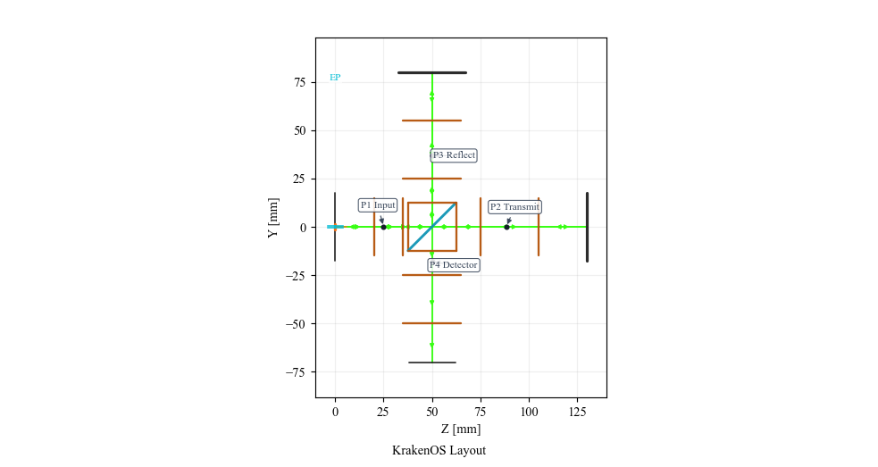
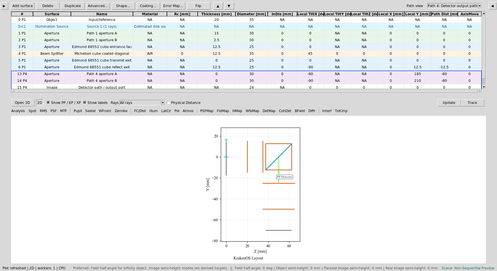
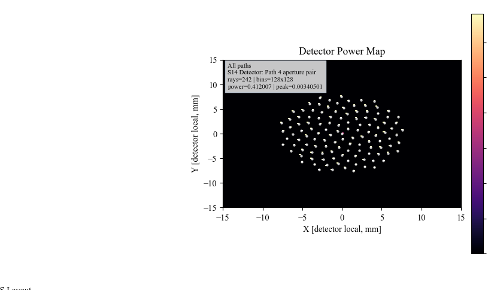
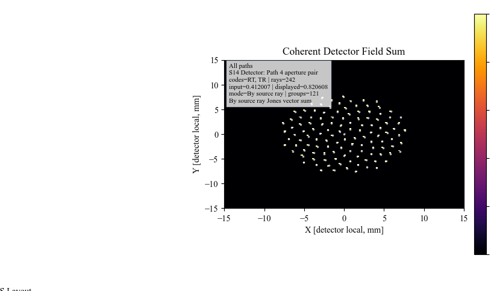
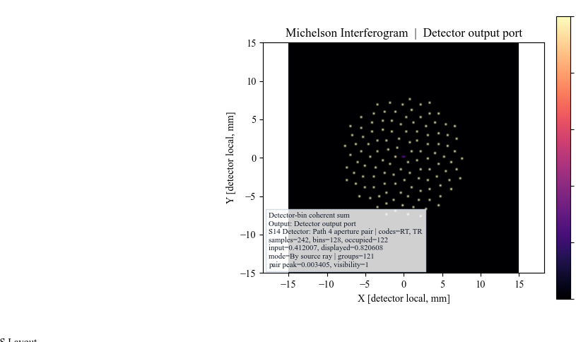
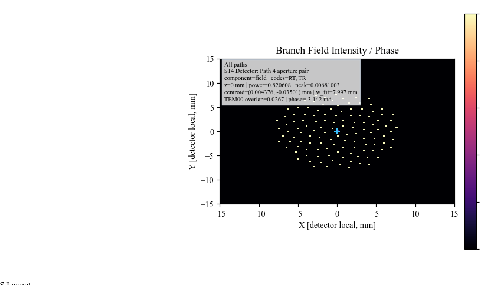

Case Study 4: Michelson Beam Splitter And Interferogram
=======================================================

Goal
----

This case study demonstrates the non-sequential beam-splitter workflow:

* load a physical-source Michelson layout;
* understand that ``Object`` and ``Source`` are separate scene entities;
* inspect deterministic beam-splitter paths in the 2D plot;
* use ``Path view`` to isolate the detector path in the table;
* run detector power, coherent detector, interferogram, and branch-field
  analyses.

The screenshots in this tutorial are generated from the live Tk UI with:

.. code-block:: bash

   python -m KrakenOS.UI.capture_michelson_case_study_screenshots

Load The Michelson Layout
-------------------------

1. Start the UI with ``python -m KrakenOS.UI.layout_editor``.
2. Choose
   ``Layouts -> Beam Splitters / Folds -> Michelson Interferometer (Interferogram)``.
3. Keep ``Trace mode = Non-Sequential Preview``.
4. Keep ``NS probabilistic coating split`` off. This example uses deterministic
   beam-splitter child paths.

The ``Object`` row is only a scene/reference datum in this layout. Rays launch
from the physical source in the Source panel, not from the ``Object`` row. The
table therefore shows an automatic ``Src1`` illumination-source scene row in
addition to the KrakenOS optical surface rows.

.. figure:: ../_static/tutorials/michelson_interferometer/01_loaded_michelson_ui.png
   :alt: Michelson interferometer loaded with source/object split and beam splitter paths
   :width: 100%

   The Michelson preset contains a physical source, a cube beam splitter,
   two return mirrors, grouped path apertures, and a detector output path.

Read The Path Labels
--------------------

Click ``Update``. With the default chief-ray settings, the 2D plot is intended
to read like a schematic. The black-dot labels identify the path segments:

.. list-table::
   :header-rows: 1

   * - Plot label
     - Meaning
   * - ``P1 Input``
     - Source to beam splitter.
   * - ``P2 Transmit``
     - Beam splitter to the transmitted return mirror.
   * - ``P3 Reflect``
     - Beam splitter to the reflected return mirror.
   * - ``P4 Detector``
     - Recombined output path toward the detector plane.

   The plot labels the physical path segments rather than only the splitter
   branch codes. This makes it clear where components belong.

Use Path View
-------------

After ``Update``, open the table toolbar ``Path view`` dropdown and select:

.. code-block:: text

   Path 4: Detector output path

The table and plot are filtered to the common path plus the selected detector
path. This is the workflow to add or audit components on one path without
visually parsing the whole interferometer.

   ``Path view`` isolates the detector-output path while preserving KrakenOS
   surface indices.

Run Detector Analyses
---------------------

For analysis screenshots, use a denser source bundle:

.. code-block:: text

   Ray fan count = 121
   Source radius [mm] = 8.0
   Detector bins = 128
   Coherent sum = Mutual coherent
   Path view = All paths

Click ``DetMap`` and ``Update``. This maps incoherent detector power from all
paths that hit the detector plane.

   ``DetMap`` verifies that recombined rays reach the detector path and shows
   detector-plane power distribution.

Click ``CohDet`` and ``Update``. This uses the same detector hits but sums the
complex Jones field by coherence group instead of only summing power.

   ``CohDet`` is the detector-bin coherent field sum. The annotation lists the
   recombined branch codes, ray count, and polarization model.

Show The Interferogram
----------------------

Click ``Interf`` and ``Update``.

The Michelson preset stores interferogram settings on the recombining beam
splitter. A small detector tilt is included so the coherent detector-bin output
is not just a uniform bright/dark sample. With the current traced-ray detector
model, the display is a sampled interferogram; increasing source samples and
detector bins makes it more continuous.

   ``Interf`` uses the recombined detector paths and the saved Michelson
   interferogram settings to display the detector-bin coherent interferogram.

Run Branch Field
----------------

Set ``BField z [mm] = 0``. Click ``BField`` and ``Update``.

   ``BField`` promotes the coherent detector samples into a branch-field grid
   and reports intensity, phase, centroid, and mode-overlap diagnostics.

What This Proves
----------------

This case study exercises the non-sequential-first workflow:

* source/object separation;
* deterministic beam-splitter path spawning;
* physical path labels in the 2D plot;
* table filtering by traced path;
* detector-hit analysis;
* coherent field recombination;
* interferogram generation;
* branch-field intensity/phase analysis.

Common Mistakes
---------------

``I expected the Object row to launch the rays.``
  In this scene workflow, the physical Source panel launches rays. The Object
  row is a reference datum.

``I changed Path view and thought surface indices were renumbered.``
  Path view filters the visible rows. KrakenOS surface indices remain stable.

``The final detector image is sparse.``
  Increase ``Ray fan count`` and ``Source radius`` for detector analyses. Keep
  the chief-ray default when you want a clean schematic.

``I turned on probabilistic coating split.``
  Leave it off for this demo. Deterministic splitters intentionally spawn both
  transmitted and reflected child paths.

``The interferogram is not a full wave-optics propagation model.``
  Correct. It is a detector-bin coherent recombination model for the traced
  branch paths. Use ``BField`` for the current branch-field grid diagnostic.
