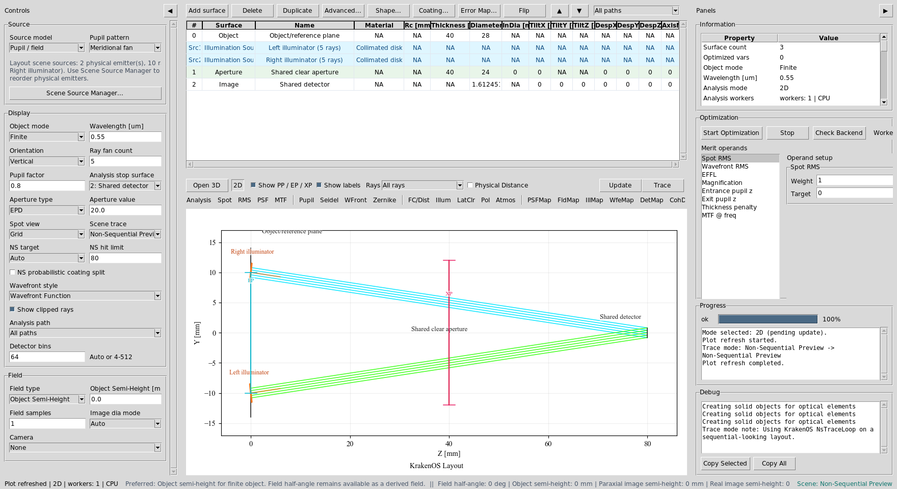
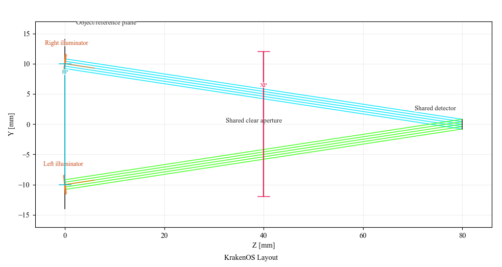
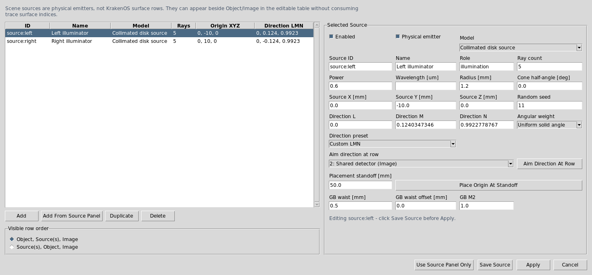
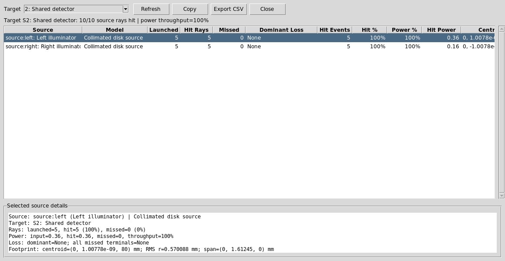
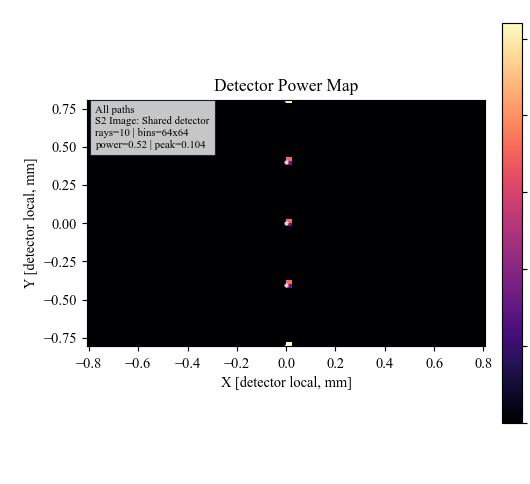
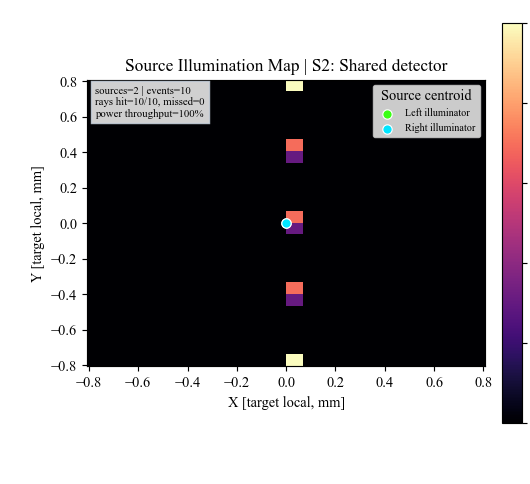

Case Study 8: Multi-Source Illumination
=======================================

Goal
----

This case study demonstrates explicit multi-source authoring:

* load a layout with two independent physical source records;
* verify that source rows do not consume KrakenOS surface indices;
* inspect both sources in Scene Source Manager;
* audit per-source throughput in Source Illumination Report;
* run detector and source-illumination maps at the shared detector.

The screenshots in this tutorial are generated from the live Tk UI with:

.. code-block:: bash

   python -m KrakenOS.UI.capture_multi_source_case_study_screenshots

Load The Layout
---------------

1. Start the UI with ``python -m KrakenOS.UI.layout_editor``.
2. Choose ``Layouts -> Sources / Illumination -> Multi-Source Illumination Example``.
3. Keep ``Trace mode = Non-Sequential Preview``.
4. Click ``Update``.

The table contains one ``Object`` row, two ``Illumination Source`` scene rows,
a shared aperture, and a shared detector. The source rows are scene entities:
they are visible in the table but do not consume KrakenOS optical-surface
indices.

   ``Src1`` and ``Src2`` are independent source records. The detector remains
   surface ``S2``.

Read The Layout
---------------

The left illuminator launches upward from ``Y=-10 mm`` and the right
illuminator launches downward from ``Y=+10 mm``. Both pass through the same
clear aperture and land on the shared detector.

   The two source bundles are separate physical emitters aimed at the same
   detector path.

Inspect Scene Sources
---------------------

Choose ``Actions -> Scene Source Manager...``. The manager edits the explicit
``SETTINGS["scene_sources"]`` records.

   Each source has its own ID, position, direction, radius, ray count, power,
   seed, and source model. Editing these fields changes the physical emitter,
   not the Object row.

The preset source powers are:

.. code-block:: text

   source:left  power = 0.6
   source:right power = 0.4

Audit Per-Source Throughput
---------------------------

Choose ``Actions -> Source Illumination Report`` and set ``Target`` to:

.. code-block:: text

   2: Shared detector

   The report groups hits by ``SOURCE_ID``. This is the key diagnostic for
   multi-source layouts because it shows whether each source reaches the target
   and how much power each source contributes.

Run Detector Analyses
---------------------

Set:

.. code-block:: text

   Analysis path = All paths
   Analysis surface = 2: Shared detector
   Detector bins = 64

Click ``DetMap`` and ``Update``.

   ``DetMap`` sums detector power from both sources.

Click ``Illum`` and ``Update``.

   ``Illum`` plots the same target-hit records and overlays per-source
   centroids so source balance is visible.

Run The Python Example
----------------------

The same layout has a scriptable example:

.. code-block:: bash

   python KrakenOS/Examples/Examp_Multi_Source_Illumination.py

The script prints both source records and then lists each traced ray with its
``SOURCE_ID``, surface sequence, detector-hit state, and source weight.

What This Proves
----------------

This case study exercises the explicit multi-source scene contract:

* multiple physical sources are stored in ``SETTINGS["scene_sources"]``;
* source rows are visible table scene rows, not optical ``surf`` rows;
* each source keeps its own origin, direction, power, radius, and random seed;
* traced rays preserve ``SOURCE_ID`` metadata;
* source reports and illumination maps group results by physical source;
* detector analysis can still show the combined target power.

Common Mistakes
---------------

``I expected source rows to be numbered like optical surfaces.``
  Source rows are scene rows. They appear as ``Src1`` and ``Src2`` and do not
  change the KrakenOS surface indices.

``I changed the Source panel and expected both source rows to change.``
  Explicit scene-source layouts are edited through Scene Source Manager or the
  source-row context menu. The Source panel is only the fallback single-source
  authoring path.

``The detector map does not show which source made which spot.``
  Use ``Source Illumination Report`` or ``Illum`` for per-source grouping.
  ``DetMap`` is the combined detector power map.
