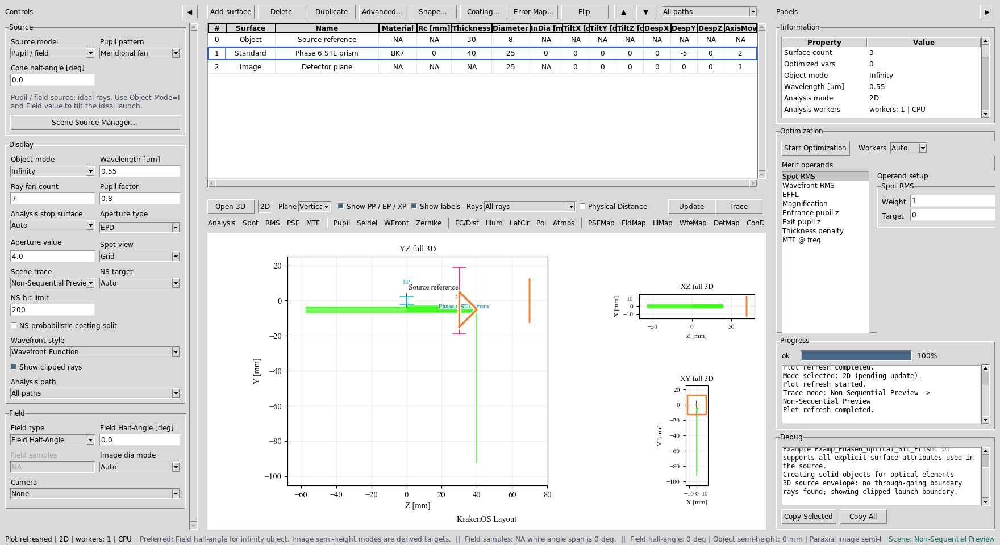
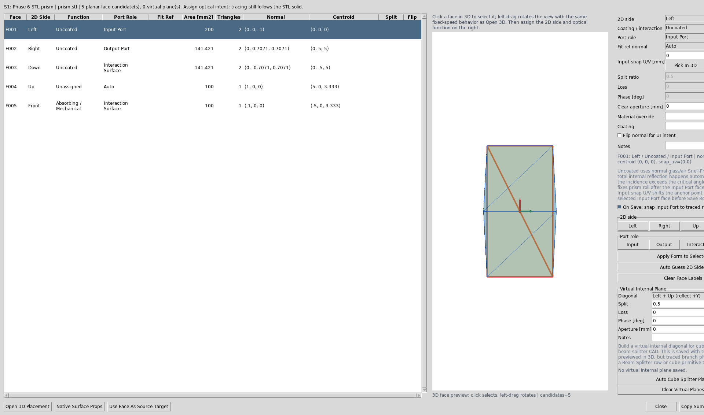
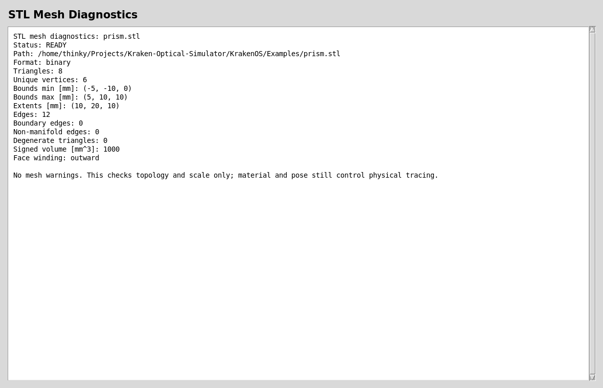
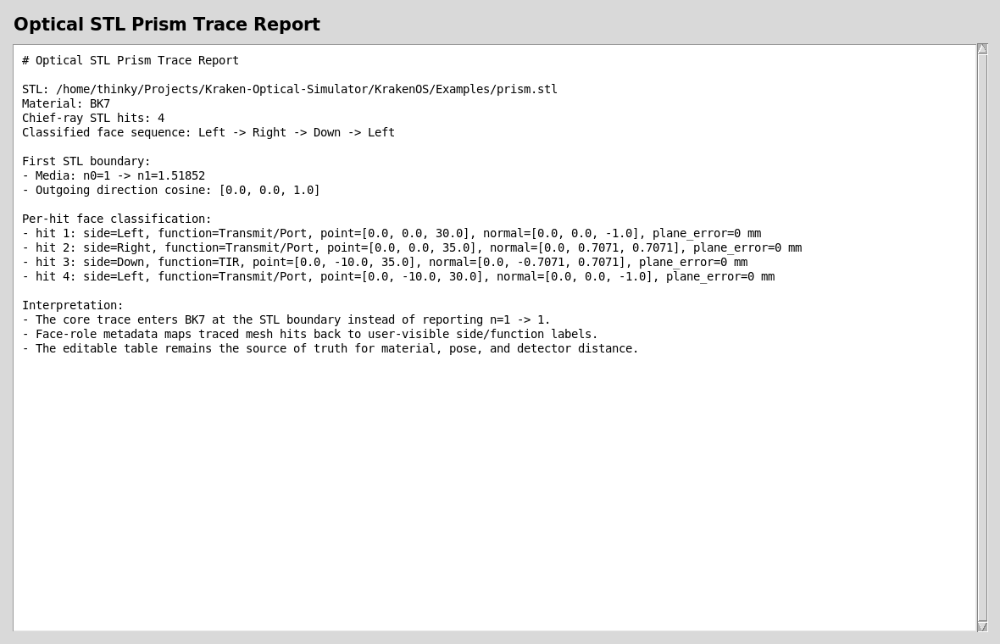

Case Study 10: Optical STL Prism And Face Roles
===============================================

Goal
----

This case study shows the arbitrary optical-solid workflow:

* load a closed STL prism as a KrakenOS ``Solid_3d_stl`` optical row;
* trace through the row material instead of treating the mesh as decoration;
* inspect the mesh before trusting it;
* assign side labels and optical functions to imported CAD/STL faces;
* verify that traced STL hits map back to the assigned face metadata.

The screenshots in this tutorial are generated from the live Tk UI with:

.. code-block:: bash

   python -m KrakenOS.UI.capture_optical_stl_prism_case_study_screenshots

Load The Optical STL Prism
--------------------------

1. Start the UI with ``python -m KrakenOS.UI.layout_editor``.
2. Choose
   ``Examples -> Non-Sequential / Advanced Surfaces -> Examp_Phase6_Optical_STL_Prism``.
3. Keep ``Trace mode = Non-Sequential Preview``.
4. Click ``Update``.

The optical row is ``S1 Phase 6 STL prism``. It stores the native KrakenOS core
attribute:

.. code-block:: text

   Solid_3d_stl = KrakenOS/Examples/prism.stl
   Glass        = BK7

The STL file is not just drawn in the viewer. KrakenOS traces the ray through
the closed mesh using the row material, row pose, and row distance settings.

   The table contains a file-backed STL prism row between the source reference
   and detector plane.

The Source panel opens ``Scene Source Manager...`` for geometric launch-bundle
details. For random geometric sources, ``Cone half-angle [deg]`` in the manager
sets the ray divergence half-angle. For Gaussian laser sources, switch to
``Source model -> Gaussian beam`` in the Source panel and use
``GB input mode -> Diameter + divergence``; the ``GB full div [mrad]`` field is
the full-angle far-field divergence normally quoted on laser datasheets.

Read The 2D Trace
-----------------

With ``Non-Sequential Preview`` active, the plot shows the ray bundle entering
the STL prism and interacting with the closed mesh. In this stress-pose example
the chief ray has several STL hits; not every displayed ray needs to reach the
detector before the hit-sequence diagnostics are useful.

   The projected solid footprint comes from the STL mesh. The ray path comes
   from KrakenOS non-sequential tracing, not from a decorative overlay.

Assign Optical Faces
--------------------

Select row ``S1 Phase 6 STL prism`` and choose
``Actions -> Assign CAD/STL Optical Faces``.

For this demo, use these labels:

.. code-block:: text

   Left  = Input,  function Transmit/Port
   Right = Output, function Transmit/Port
   Down  = TIR,    function TIR

Front/back mechanical faces can be marked ``Absorber/Mechanical`` when they
are not intended optical ports.

   The dialog clusters planar STL triangles into selectable face candidates.
   Side labels make the same imported solid usable in placement, 3D inspection,
   and hit-sequence diagnostics.

Face roles are metadata. They document optical intent and support placement and
diagnostic tools. ``Mirror`` faces now force reflective STL hits in
non-sequential tracing, while ``TIR`` remains a physical Snell-law outcome that
only occurs when the incidence angle is above critical. For uncoated prisms,
the physical trace still follows the closed STL geometry, material, and pose.
``Transmit/Port`` output faces also define where rows after the optical solid
are anchored. The optical-solid row ``Thickness`` is the standoff distance from
the selected output port to the next row, such as an ``Image`` detector plane.

Inspect Mesh Readiness
----------------------

Before trusting arbitrary vendor geometry, choose
``Actions -> Inspect Optical CAD/STL Solids``.

   A trace-ready optical mesh should have finite scale, no open boundary
   edges, no non-manifold edges, no degenerate triangles, and usable winding.

Verify The Trace Sequence
-------------------------

The generated report below uses the same core prism example, traces one chief
ray, then maps each STL hit back to the saved face-role metadata.

   The important physics check is the first STL boundary:
   ``n0=1 -> n1~=1.518`` at ``0.55 um`` for BK7. The classified face sequence
   should read ``Left -> Right -> Down -> Left`` for this bundled prism pose.

Run The Python Examples And Validators
--------------------------------------

The direct KrakenOS core example is:

.. code-block:: bash

   python KrakenOS/Examples/Examp_Phase6_Optical_STL_Prism.py

The regression checks behind this case study are:

.. code-block:: bash

   python -m KrakenOS.UI.validate_stl_prism_media
   python -m KrakenOS.UI.validate_optical_solid_face_roles
   python -m KrakenOS.UI.validate_optical_solid_hit_sequence

Use these after changing STL import, non-sequential tracing, face-role
assignment, or CAD/STL placement code.

What This Proves
----------------

This case study exercises several KrakenOS core and UI capabilities:

* native ``Solid_3d_stl`` optical-solid tracing;
* file-backed STL mesh display in the UI;
* BK7 material transition at the first mesh boundary;
* non-sequential ray paths through an arbitrary closed solid;
* planar face clustering for imported STL/CAD geometry;
* side labels and optical function metadata;
* face-hit sequence classification for ray/debug reports.

Common Mistakes
---------------

``I imported a mesh but rays pass straight through.``
  Check that the row has ``Glass = BK7`` or another real material, not ``AIR``.
  Also run ``validate_stl_prism_media``; the first hit should not report
  ``n=1 -> 1``.

``I assigned face roles but the prism did not move.``
  Face roles do not pose the solid. Use
  ``Actions -> 3D Place/Orient Selected CAD/STL Solid`` or edit
  ``TiltX/Y/Z`` and ``DespX/Y/Z``. Face roles are used by placement helpers and
  diagnostics after the pose is solved.

``Rays leave the output face but the detector is still axial.``
  Make sure the output face is labeled ``Transmit/Port`` and press
  ``Save Roles``. The following row will be anchored to that output face, and
  the optical-solid row ``Thickness`` controls the distance to that row.

``My vendor STEP cube beam splitter does not split rays.``
  Mechanical CAD usually contains only the outer cube. It does not define the
  internal coating, split ratio, phase, or loss. Use the UI beam-splitter
  primitive for traced splitting today, or save a virtual internal plane as
  authoring metadata for future CAD-first cube workflows.

``The mesh diagnostics report says CHECK.``
  Fix the mesh first. Open boundaries, non-manifold edges, inverted winding, or
  wrong scale can make the optical result meaningless even when the table
  material is correct.
