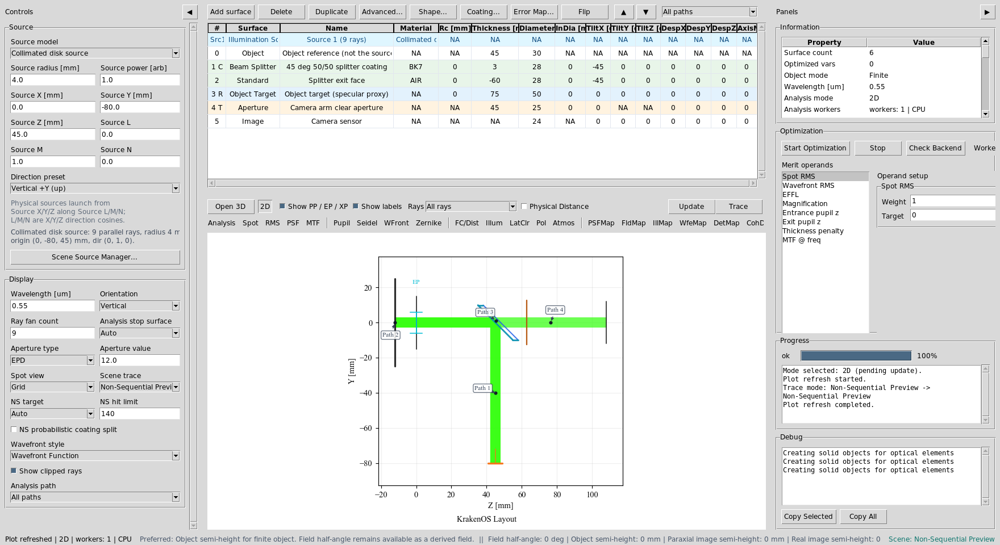
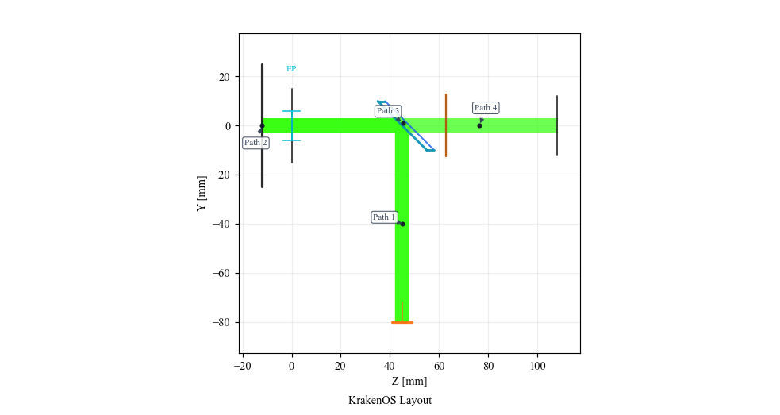
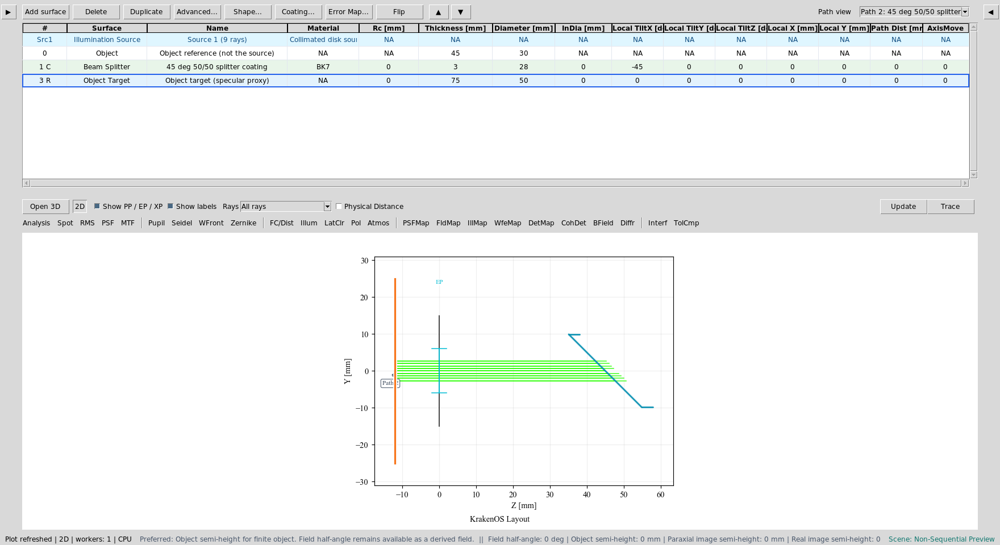
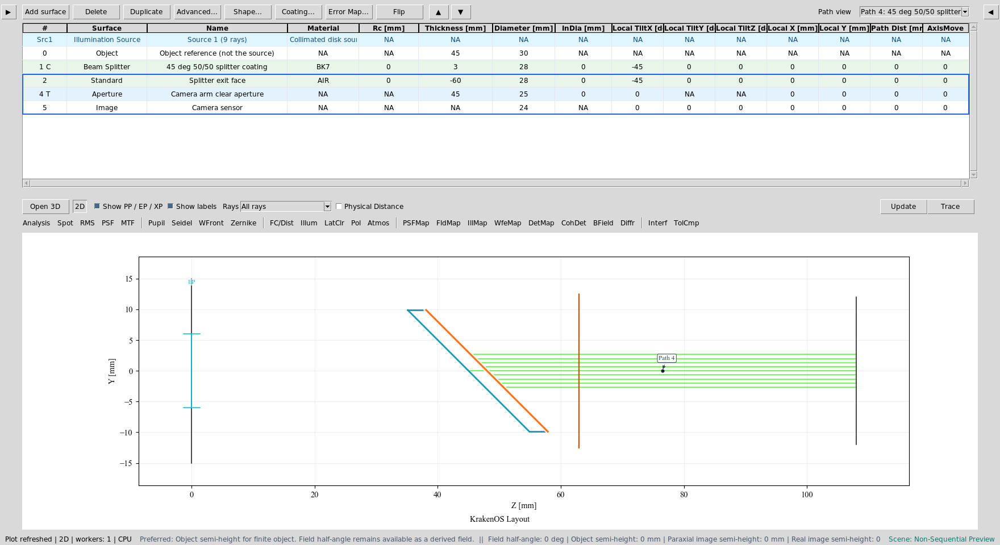
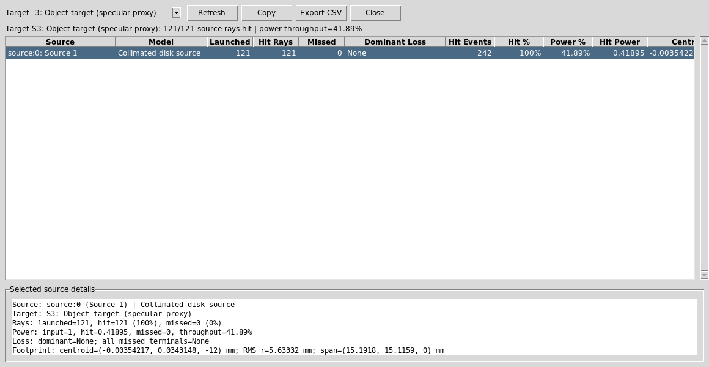
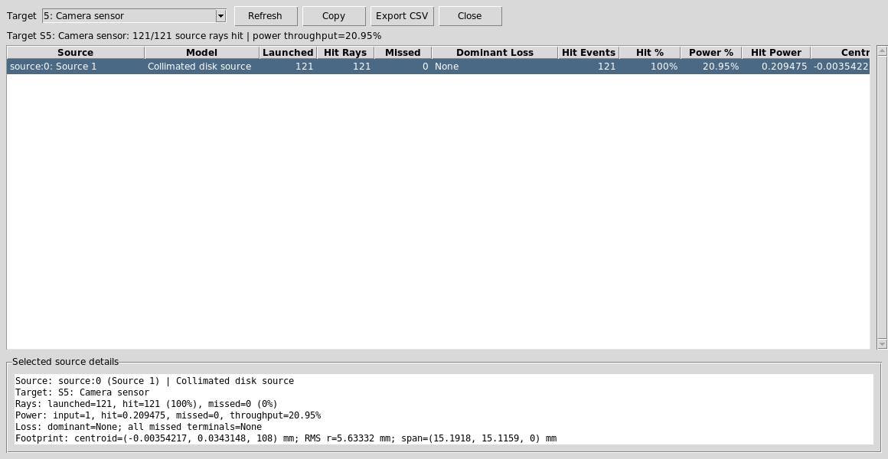
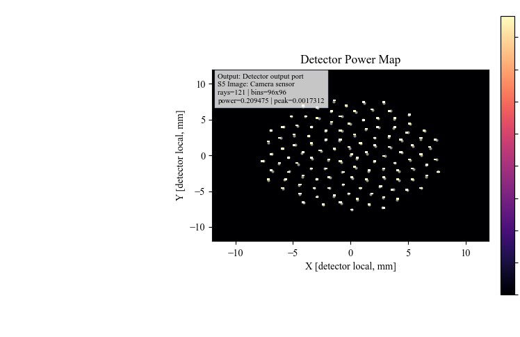

Case Study 6: Source/Object Split Through A Beam Splitter
=========================================================

Goal
----

This case study demonstrates a source/object workflow where the illumination
source is not the Object row:

* load a right-angle beam-splitter illumination layout;
* verify that ``Src1`` is an independent illumination source row;
* trace source light through a 45 degree beam splitter to an object target;
* follow the object-return path to a camera sensor;
* use ``Source Illumination Report`` to audit source throughput at both the
  object and camera targets;
* run a detector power map at the camera plane.

The screenshots in this tutorial are generated from the live Tk UI with:

.. code-block:: bash

   python -m KrakenOS.UI.capture_right_angle_beam_splitter_case_study_screenshots

Load The Layout
---------------

1. Start the UI with ``python -m KrakenOS.UI.layout_editor``.
2. Choose
   ``Layouts -> Beam Splitters / Folds -> Right-Angle Beam-Splitter Illumination``.
3. Keep ``Trace mode = Non-Sequential Preview``.
4. Keep ``NS probabilistic coating split`` off.

The first visible row is ``Src1``. That row is a scene source, not a KrakenOS
surface. The ``Object`` row is reference geometry only. In this preset, the
physical source starts at ``(0, -80, 45) mm`` and points along ``+Y`` toward the
45 degree splitter.

   ``Src1`` launches the illumination. The Object row no longer has to be the
   ray source.

Read The Physical Paths
-----------------------

Click ``Update``. The schematic shows the source entering from the side, the
splitter sending the useful reflected branch to the object target, and the
returning object branch transmitting toward the camera sensor.

   The useful path is not a straight object-to-image sequential chain. It is a
   folded non-sequential source path.

Use Path View
-------------

After ``Update``, open the table toolbar ``Path view`` dropdown and select:

.. code-block:: text

   Path 2: 45 deg 50/50 splitter coating to 45 deg 50/50 splitter coating via Object target (specular proxy)

This isolates the object-return leg. The current ``Object Target`` row is a
specular proxy: it lets the beam return through the splitter and camera path.
Use a ``Diffuse Object`` surface when the required physics is Lambertian or
BRDF scattering rather than a mirror-like proxy.

   The object-return path is separate from the source and camera legs.

Now select:

.. code-block:: text

   Path 4: 45 deg 50/50 splitter coating to Camera sensor via Splitter exit face, Camera arm clear aperture

This isolates the useful camera leg after the returning object branch passes
through the splitter.

   The camera path contains the splitter exit face, clear aperture, and Image
   sensor.

Audit Source Illumination
-------------------------

For the report screenshots, use:

.. code-block:: text

   Ray fan count = 121
   Source radius [mm] = 8.0
   Detector bins = 96
   Path view = All paths

Choose ``Actions -> Source Illumination Report``. Set ``Target`` to:

.. code-block:: text

   3: Object target (specular proxy)

   The report verifies that source rays reach the object target and reports the
   power throughput after the first beam-splitter interaction.

Now change ``Target`` to:

.. code-block:: text

   5: Camera sensor

   The camera report verifies that the object-return path reaches the Image
   plane. The lower throughput is expected because the useful path has passed
   through two 50/50 splitter interactions.

Run The Camera Detector Map
---------------------------

Set the analysis controls to:

.. code-block:: text

   Analysis path = Output: Detector output port
   Analysis surface = 5: Camera sensor

Click ``DetMap`` and ``Update``.

   ``DetMap`` shows the final camera-plane power distribution for the useful
   source-to-object-to-camera path.

Run The Python Example
----------------------

The same layout has a scriptable example:

.. code-block:: bash

   python KrakenOS/Examples/Examp_Right_Angle_Beam_Splitter_Illumination.py

The script prints the source origin/direction and a per-ray trace summary,
including whether each ray hits the object target and reaches the camera.

What This Proves
----------------

This case study exercises the source/object separation needed for inspection,
projector, and coaxial-illumination workflows:

* the Source panel and ``Src1`` scene row define illumination;
* the Object row is reference/object geometry, not the ray launcher;
* a 45 degree splitter can route illumination to the object;
* an object-return branch can pass back through the splitter to a camera;
* source-hit records preserve throughput and footprint diagnostics;
* detector analysis can be run on the resulting camera path.

Common Mistakes
---------------

``I moved the Object row and expected the source to move.``
  Move the source controls or open Scene Source Manager. Object geometry and
  illumination source are separate scene entities.

``I expected diffuse object scattering from Object Target.``
  ``Object Target`` is currently a specular reflective proxy in this preset.
  Use ``Diffuse Object`` examples for Lambertian or rough scattering.

``The camera power is about half of the object-target power.``
  That is expected for this deterministic 50/50 splitter path. The useful beam
  reflects once to reach the object and transmits once to reach the camera.

``Path view changed the visible rows.``
  Path view filters the table and plot. It does not renumber KrakenOS surface
  indices or convert source rows into surfaces.
