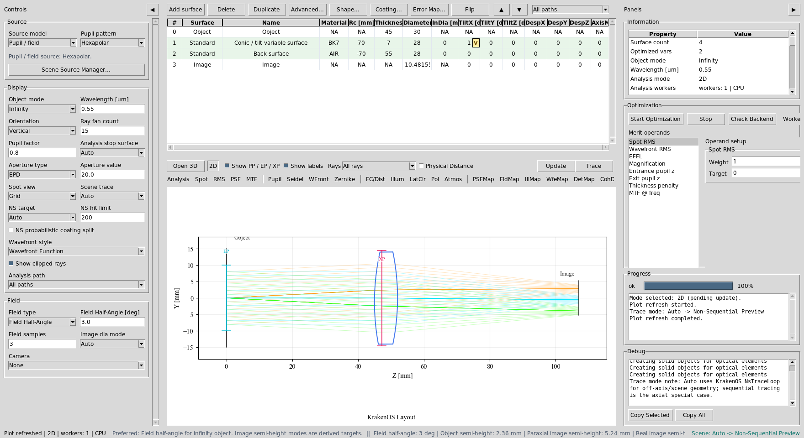
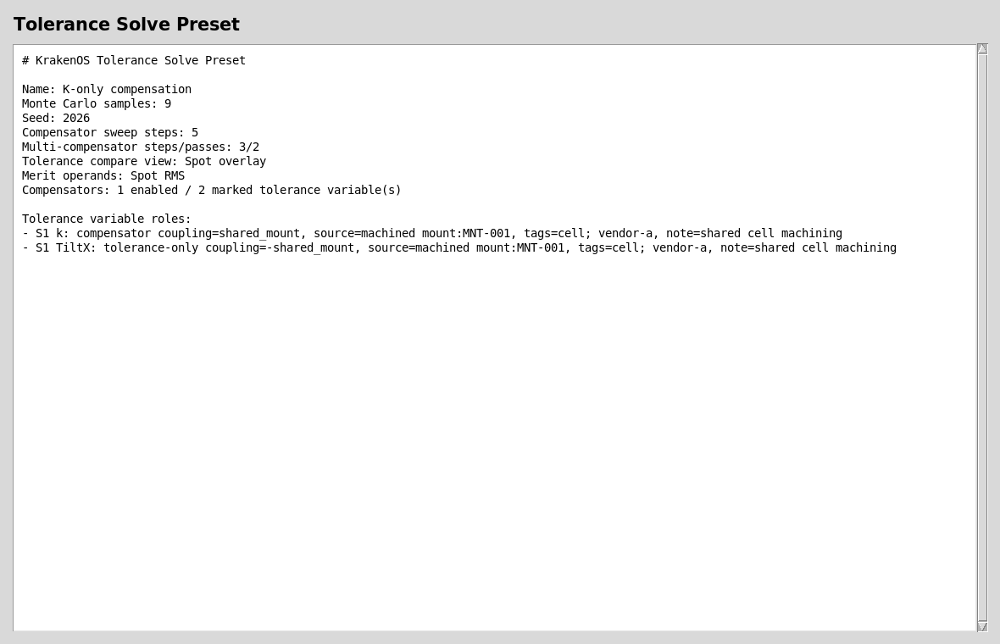
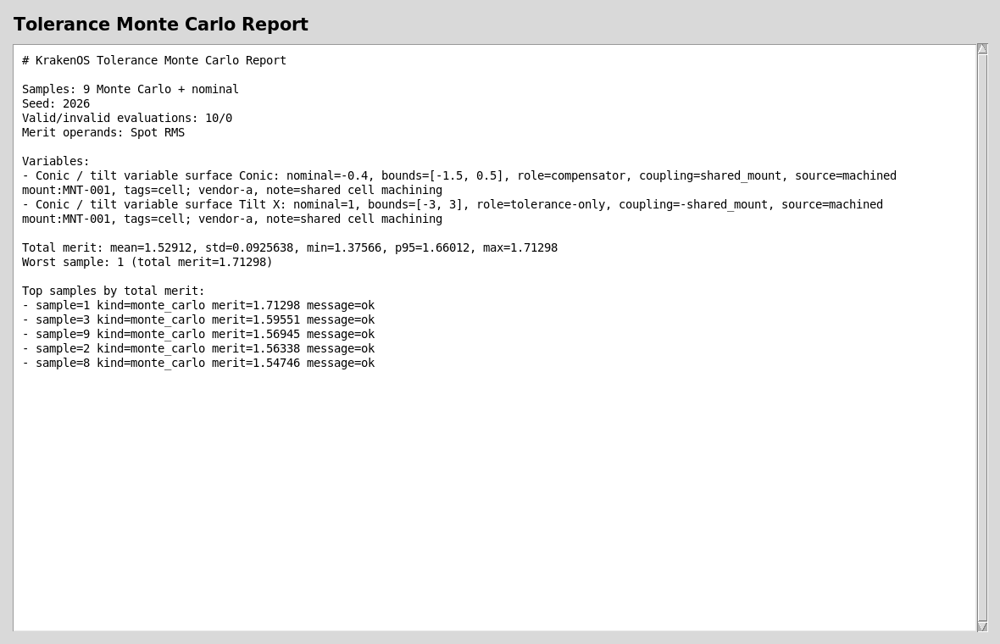
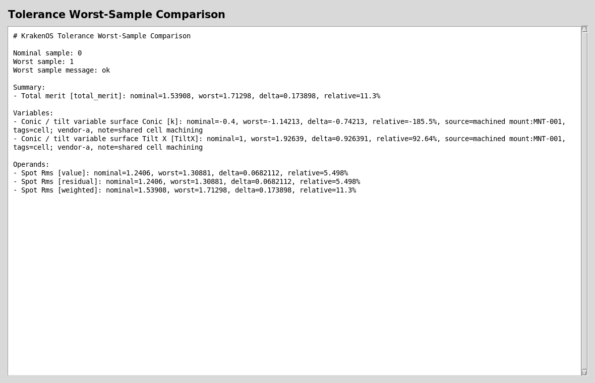
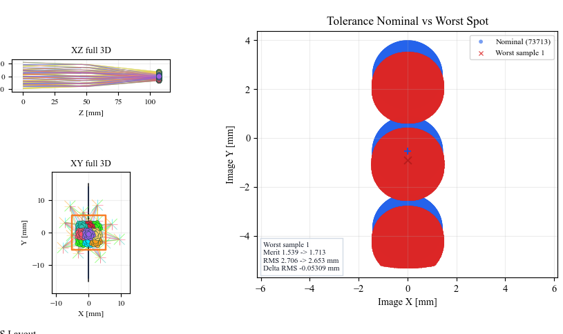
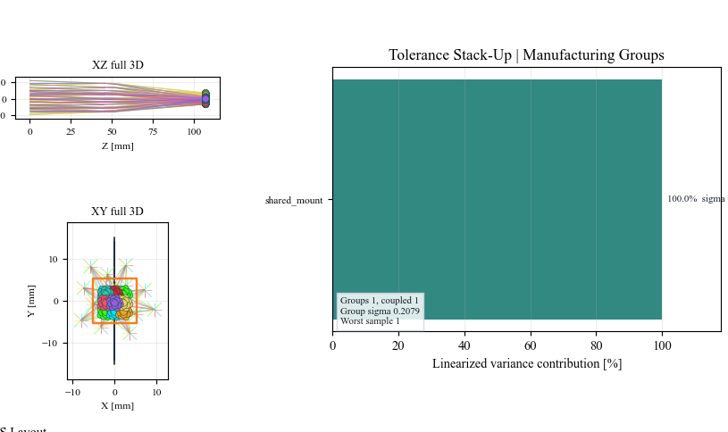
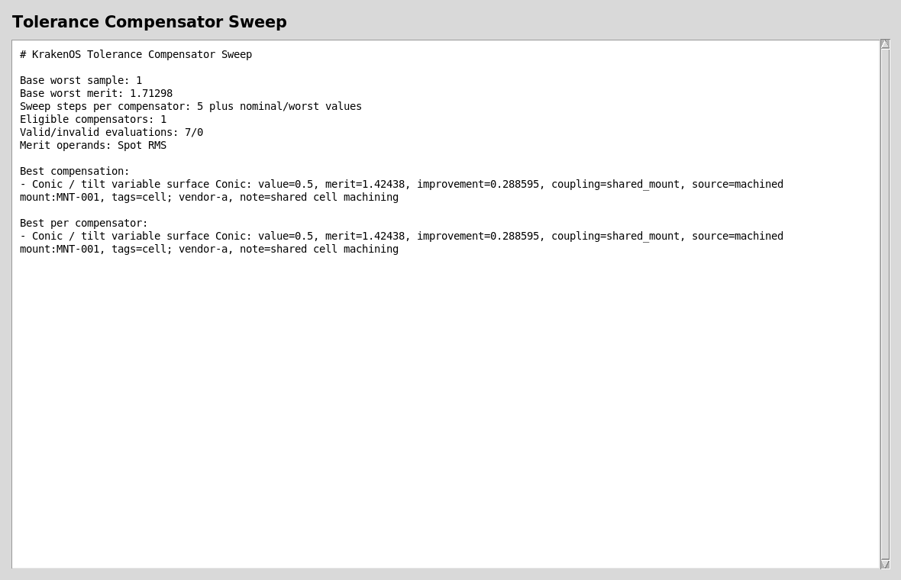
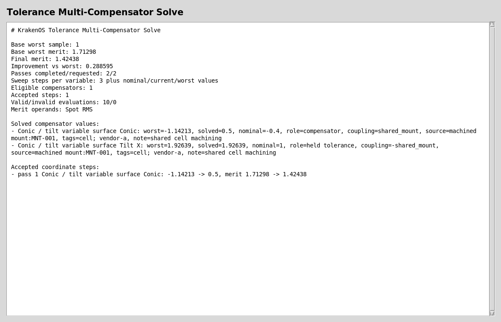
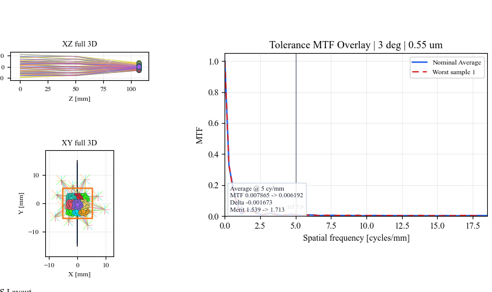

Case Study 11: Tolerance Monte Carlo And Compensators
=====================================================

Goal
----

This case study shows the tolerance workflow that follows an optimized nominal
design:

* load a layout with native KrakenOS variables already marked;
* sample manufacturing perturbations with a deterministic Monte Carlo run;
* keep one variable as a compensator and one variable as tolerance-only;
* couple both variables to one physical manufacturing source;
* inspect worst-sample, stack-up, and compensator reports;
* verify the same result visually with the ``TolCmp`` analysis button.

The screenshots in this tutorial are generated from the live Tk UI with:

.. code-block:: bash

   python -m KrakenOS.UI.capture_tolerance_monte_carlo_case_study_screenshots

Load The Native-Variable Layout
-------------------------------

1. Start the UI with ``python -m KrakenOS.UI.layout_editor``.
2. Choose
   ``Layouts -> Advanced Surfaces / Materials -> Native Variable Breadth Example``.
3. Keep ``Object Mode = Infinity``.
4. Keep ``Field Type = Angle``, ``Field Value = 3.0``, and ``Field Count = 3``.
5. Keep the ``Spot RMS`` merit operand selected.

The important row is ``S1 Conic / tilt variable surface``. It has two marked
native variables:

.. code-block:: text

   k bounds     = -1.5, 0.5
   Tilt X bounds = -3 deg, 3 deg

   The nominal prescription is small on purpose. The case study focuses on the
   tolerance workflow, not lens complexity.

Choose Tolerance Roles
----------------------

Right-click the marked ``S1 k`` cell and keep it as a tolerance compensator.
Right-click the marked ``S1 Tilt X`` cell and choose:

.. code-block:: text

   Optimization / Solves -> Do not use TiltX as tolerance compensator

This means both variables are sampled as manufacturing errors, but only ``k``
may be moved during compensator sweeps. That is the usual workflow when one
parameter can be adjusted during assembly and another is a fixed build error.

Now assign both variables to one manufacturing source:

1. Right-click ``S1 k`` and choose
   ``Optimization / Solves -> Set tolerance coupling group...``.
2. Enter ``shared_mount``.
3. Right-click ``S1 Tilt X`` and choose the same command.
4. Enter ``-shared_mount``.

The minus sign means ``Tilt X`` uses the opposite random quantile of the same
sampled manufacturing degree of freedom. This avoids treating one machined
mount error as two independent random errors.

Attach manufacturing metadata with:

.. code-block:: text

   machined mount | MNT-001 | cell, vendor-a | shared cell machining

Save this as a template named ``Shared machined mount`` and apply it to both
variables. Reports and CSV exports carry this metadata so an optical tolerance
row can be traced back to a real process, drawing, vendor spec, or mount.

   The preset captures sample count, seed, selected operands, compensator
   eligibility, coupling groups, and manufacturing metadata.

Run Monte Carlo
---------------

Choose ``Actions -> Tolerance Monte Carlo Report...``. For this tutorial use:

.. code-block:: text

   Monte Carlo sample count = 9
   Random seed = 2026

The report samples each marked variable inside its bounds, evaluates the
selected merit operand, and leaves the nominal table unchanged.

   The variable list shows which entries are compensators, which are
   tolerance-only, which coupling group they belong to, and which manufacturing
   source generated the tolerance.

Compare The Worst Sample
------------------------

Choose ``Actions -> Tolerance Worst-Sample Comparison...``. This compares the
nominal system with the worst valid perturbed sample from the last Monte Carlo
run.

   Use this report when you need concrete variable deltas and operand deltas,
   not only statistical summary values.

Plot The Worst-Sample Spot Overlay
----------------------------------

Click ``TolCmp`` and set:

.. code-block:: text

   Tolerance compare view = Spot overlay

Then click ``Update``.

   ``Spot overlay`` rebuilds temporary nominal and worst-sample systems and
   overlays their image-plane spot clouds. It does not change the editable
   table.

Read The Stack-Up Bars
----------------------

Set:

.. code-block:: text

   Tolerance compare view = Stack-up bars

Then click ``Update``.

   Coupled variables are shown as one manufacturing group. This is the view to
   use when discussing which physical tolerance source dominates the merit
   variance.

Run Compensator Sweeps
----------------------

Choose ``Actions -> Tolerance Compensator Sweep...`` and use ``5`` steps. The
UI holds the system at the worst Monte Carlo sample and sweeps each eligible
compensator through its bounds.

   Only ``k`` is swept because ``Tilt X`` was explicitly marked
   tolerance-only. The report is diagnostic and does not mutate the nominal
   prescription.

Choose ``Actions -> Tolerance Multi-Compensator Solve...`` to run the same idea
as a bounded coordinate solve.

   Tolerance-only variables stay fixed at their worst-sample values. Eligible
   compensators can move only when the move improves the merit.

Check MTF Impact
----------------

Set:

.. code-block:: text

   Tolerance compare view = MTF overlay

Then click ``Update``.

   ``MTF overlay`` is a quick visual check for whether the worst sample changes
   contrast at the selected spatial frequency.

Run The Python Example
----------------------

The same workflow is scriptable:

.. code-block:: bash

   python KrakenOS/Examples/Examp_Tolerance_Compensator_Sweep.py

The example prints the preset, Monte Carlo, stack-up, compensator sweep, and
multi-compensator reports, plus CSV schema summaries for external review.

What This Proves
----------------

This case study exercises the Phase 7E tolerance/manufacturing workflow:

* native KrakenOS variable discovery from row ``advanced["Var"]`` metadata;
* deterministic Monte Carlo sampling with fixed seed;
* explicit compensator versus tolerance-only roles;
* coupled manufacturing degrees of freedom;
* reusable manufacturing metadata templates;
* worst-sample comparison reports;
* covariance-aware stack-up dashboard;
* single- and multi-compensator diagnostic solves;
* ``TolCmp`` spot, stack-up, and MTF overlays.

Common Mistakes
---------------

``I expected the table values to change after Monte Carlo.``
  Tolerance runs rebuild temporary systems. The nominal editable table stays
  unchanged unless you manually accept a design change.

``Every variable was swept as a compensator.``
  By default, marked tolerance variables are eligible compensators. Right-click
  a marked variable cell and disable compensator use when the variable is a
  fixed manufacturing error.

``The stack-up shows one bar for two variables.``
  That is correct when both variables share the same coupling group. It means
  the UI is ranking the physical manufacturing source, not double-counting each
  row as an independent random error.

``The reports mention source=machined mount:MNT-001.``
  That is manufacturing metadata. It does not change the ray trace, but it
  makes the tolerance report auditable against a real mount, spacer, vendor
  process, or drawing.
