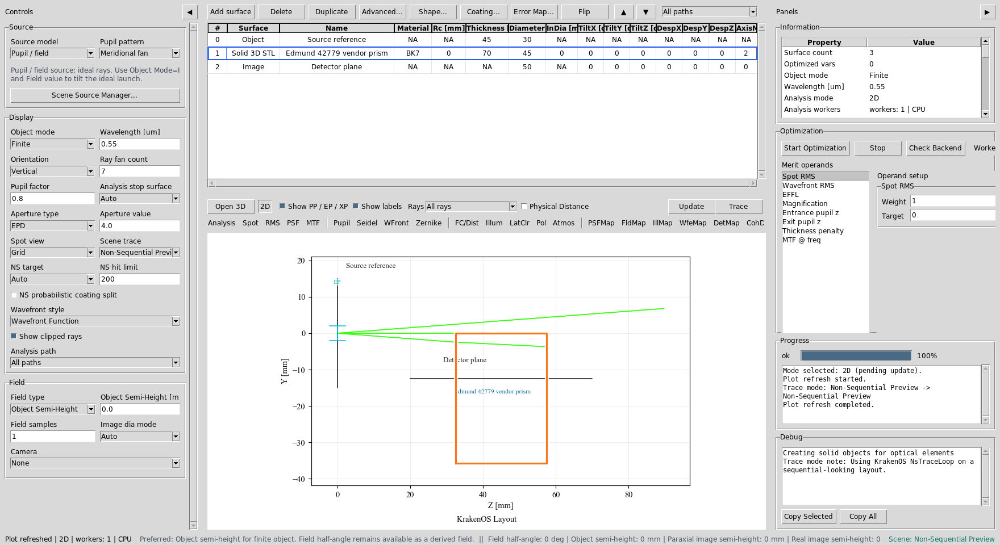
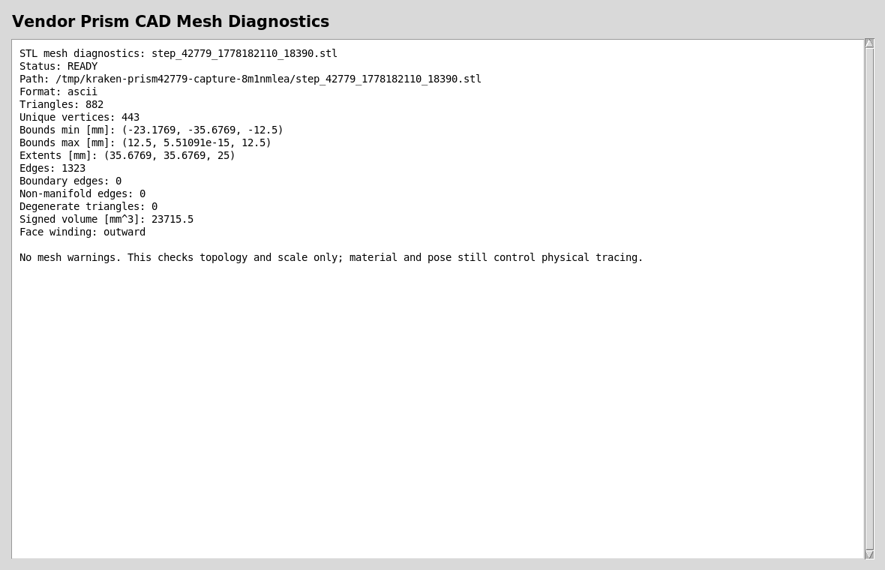
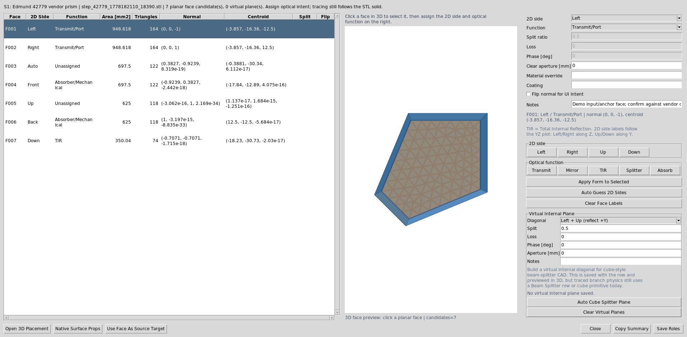
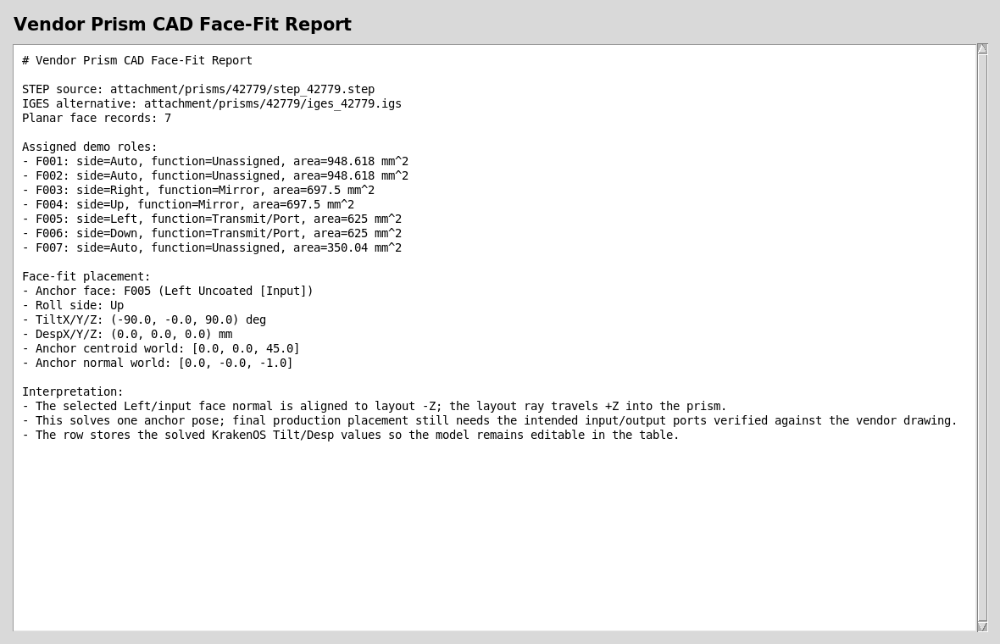

Case Study 12: Vendor Prism CAD Import And Face Placement
==========================================================

Goal
----

This case study shows the production-facing CAD workflow for an off-the-shelf
vendor prism:

* keep the vendor STEP, IGES, drawing, and curve documentation with the project;
* import the STEP body as a KrakenOS ``Solid_3d_stl`` optical row;
* inspect the generated mesh before trusting the trace;
* label candidate optical faces as input, output, fold, or mechanical faces;
* solve a first table pose from one selected CAD face;
* keep the final warning visible: face labels are authoring metadata and must
  be checked against the vendor drawing before production.

The screenshots in this tutorial are generated from the live Tk UI with:

.. code-block:: bash

   python -m KrakenOS.UI.capture_vendor_prism_case_study_screenshots

The validation script uses the same files:

.. code-block:: bash

   python -m KrakenOS.UI.validate_vendor_prism_42779

Bundled Vendor Files
--------------------

The tutorial uses a small Edmund 42779 prism package under:

.. code-block:: text

   attachment/prisms/42779/step_42779.step
   attachment/prisms/42779/iges_42779.igs
   attachment/prisms/42779/prnt_42779.pdf
   attachment/prisms/42779/CURV_42779.pdf
   attachment/prisms/42779/edrw_42779.eprt

The STEP file is the preferred import source. The IGES file is kept as a
fallback reference. The PDF files are not used by the ray trace; they are kept
so the user can verify which faces are intended optical ports, which surface is
coated or folded, and whether the imported scale matches the drawing.

Load The Vendor CAD Prism
-------------------------

1. Start the UI with ``python -m KrakenOS.UI.layout_editor``.
2. Choose ``File -> Import Optical CAD/STL Solid...``.
3. Select ``attachment/prisms/42779/step_42779.step``.
4. The CAD/STL optical-face assignment dialog opens automatically after the
   row is inserted.
5. Keep the row material as the intended optical glass, for example ``BK7`` if
   the drawing and stock number support that assumption.
6. Set ``Trace mode = Non-Sequential Preview``.
7. Click ``Update``.

The generated case-study screenshot builds the same table directly so the
documentation is reproducible:

   The row stores the cached mesh path, the original STEP source path, the IGES
   fallback path, the material, and the editable KrakenOS pose fields.

Set Source Divergence
---------------------

Set ``Object Mode`` to ``Finite`` in the left panel, then use
``Scene Source Manager...`` in the Source panel to edit source divergence. For
the default ideal workflow, keep ``Model`` as ``Pupil / field`` and edit
``Cone half-angle [deg]`` in the manager. This launches a deterministic
meridional cone from the object-field point. With ``Field = 0`` that point is
the object center.

For physical source-object split workflows, choose a physical source model such
as ``Random point cone``, ``Random circle source``, ``Random square source``, or
``Random line source`` in the manager. The same divergence control is a
half-angle, so a displayed value of ``5`` means a full cone angle of
``10 deg``.

For a laser-style Gaussian source, choose ``Source model -> Gaussian beam`` and
``GB input mode -> Diameter + divergence``. Enter the source-plane
``GB diameter [mm]`` and the manufacturer-style ``GB full div [mrad]``. That
Gaussian field uses full-angle divergence in milliradians, while the geometric
cone source uses half-angle degrees.

Inspect The Converted Mesh
--------------------------

Choose ``Actions -> Inspect Optical CAD/STL Solids`` before using any imported
body for optical decisions.

   For this prism the converted STEP mesh is closed, finite, outward wound, and
   trace-ready. The extents are roughly ``35.7 x 35.7 x 25 mm``, which is a
   useful sanity check against the drawing.

A trace-ready report does not prove that the optical intent is correct. It only
proves that the mesh is a usable closed solid for non-sequential intersection.
You still need to verify the material, coated/fold face, and input/output faces
against the vendor drawing.

Assign Optical Face Roles
-------------------------

The face-assignment dialog appears automatically after import. You can reopen
it later from ``Actions -> Assign CAD/STL Optical Faces``. The UI clusters
planar mesh triangles into candidate faces and gives them stable face IDs.

For this tutorial, the automated side labels are used as demo metadata:

.. code-block:: text

   Left  = Input,  function Transmit/Port
   Right = Mirror, function Mirror
   Up    = Mirror, function Mirror
   Down  = Output, function Transmit/Port
   Front/Back = Absorber/Mechanical

For each selected face, you may either use the quick buttons or set the
``2D side`` and ``Function`` fields directly. Pressing ``Save Roles`` applies
the currently selected face form before saving, so ``Apply Form to Selected`` is
only needed when you want to commit a form edit and continue editing other
faces before the final save.

   Face roles make the imported CAD usable in placement tools, inspection
   reports, and CAD-first ray tracing. They are not a substitute for checking
   the vendor drawing.

For Edmund 42779 specifically, the fold faces are vendor-coated reflective
faces, not TIR faces. Use ``Mirror`` when the drawing or product page says the
surface is aluminized or otherwise coated. Use ``TIR`` only when the geometry
and refractive index really satisfy total internal reflection.

Orient From The Input Face
--------------------------

The face-role dialog can solve one useful first pose directly when you press
``Save Roles``. Keep ``On Save: orient Left face as ray input`` enabled. In this
tutorial the ``Left`` face is used as the input/anchor face: its outward normal
is aligned to layout ``-Z``, which means the layout ray travels ``+Z`` into the
prism, matching the usual left-to-right YZ optical layout convention.

   The report records the selected face, solved ``TiltX/Y/Z`` values, solved
   ``DespX/Y/Z`` values, and the world-space normal after placement.

The solved values are normal KrakenOS table fields. After the first fit, the
user can continue editing the row manually, move the element as a grouped
component, or add sequential/non-sequential components before and after it.

Read The Fitted Layout
----------------------

After applying the face-fit pose, the 2D layout shows the prism as a traced
optical solid with its updated placement.

   This is the point where the design can continue like any other KrakenOS UI
   table row: edit material, thickness, pose, source settings, detector
   settings, and analysis mode.

For an optical CAD/STL solid with a labeled ``Transmit/Port`` output face, the
solid row ``Thickness`` becomes the downstream standoff from that output port to
the next row. In this penta-prism workflow the row after the prism is the
``Image`` detector plane, so increasing the prism-row ``Thickness`` moves the
detector farther along the outgoing output-port direction instead of along the
original axial ``+Z`` station. This is why a bottom-output prism places the
``Image`` plane below the prism after the face roles are saved.

Run The Validators
------------------

Use these checks after changing CAD import, face clustering, or face-placement
code:

.. code-block:: bash

   python -m KrakenOS.UI.validate_vendor_prism_42779
   python -m KrakenOS.UI.validate_optical_cad_solid_import
   python -m KrakenOS.UI.validate_optical_solid_face_fit
   python -m KrakenOS.UI.validate_optical_solid_path_fit

``validate_vendor_prism_42779`` proves that the bundled STEP file resolves to a
cached STL, the mesh is trace-ready, the scale is plausible, the face clusterer
finds usable optical candidates, and the face-fit solver can align the selected
input face to the incoming ``-Z`` normal convention.

What This Proves
----------------

This case study exercises the CAD-first side of the UI without overstating the
current physics:

* real vendor STEP import through the CAD conversion service;
* versioned vendor source assets beside the optical project;
* closed-solid diagnostics before ray-trace trust;
* planar face clustering on a converted vendor mesh;
* optical port/fold/mechanical face metadata;
* face-normal placement into KrakenOS ``Tilt`` and ``Desp`` table fields;
* separation between CAD authoring metadata and physical tracing assumptions.

Common Mistakes
---------------

``I imported the CAD file, so the UI should know the optical faces.``
  Mechanical CAD usually does not encode optical intent. The UI can cluster
  planar faces, but the user must verify which face is input, output, fold,
  coated, unused, or mechanical.

``The face labels look correct, so the trace must be correct.``
  Face labels are metadata, but selected optical functions now affect the
  imported STL interaction where implemented: ``Mirror`` forces a reflective
  STL face hit, and ``Transmit/Port`` identifies the output port used to place
  following rows. The trace still follows the mesh, row material, and row pose.
  Confirm the material and placement against the drawing.

``I changed Image thickness and the detector did not move.``
  For optical-solid output-port workflows, edit the CAD/STL solid row
  ``Thickness`` to change the distance from the output face to the following
  row. The final ``Image`` row thickness is normally ``0``.

``The STEP file is enough for production.``
  Keep the drawing and curve documents with the project. They are needed to
  verify dimensions, glass assumptions, coating notes, and vendor-specific
  surface intent.

``The cached STL path is the source of truth.``
  Treat the STEP or IGES file as the source of truth. The STL is generated
  cache output and can be recreated.
