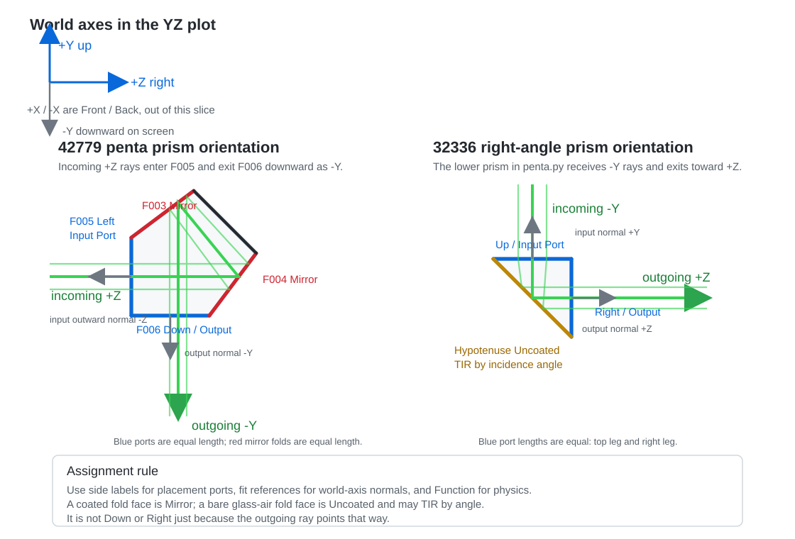

Case Study 12: Vendor Prism CAD Import And Face Placement
==========================================================

Goal
----

This case study shows the production-facing CAD workflow for an off-the-shelf
vendor prism:

* keep the vendor STEP, IGES, drawing, and curve documentation with the project;
* import the STEP body as a KrakenOS ``Solid_3d_stl`` optical row;
* inspect the generated mesh before trusting the trace;
* label candidate optical faces as input, output, fold, or mechanical faces;
* solve a first table pose from one selected CAD face;
* keep the final warning visible: face labels are authoring metadata and must
  be checked against the vendor drawing before production.

The screenshots in this tutorial are generated from the live Tk UI with:

.. code-block:: bash

   python -m KrakenOS.UI.capture_vendor_prism_case_study_screenshots

The validation script uses the same files:

.. code-block:: bash

   python -m KrakenOS.UI.validate_vendor_prism_42779

Bundled Vendor Files
--------------------

The tutorial uses a small Edmund 42779 prism package under:

.. code-block:: text

   attachment/prisms/Penta/step_42779.step
   attachment/prisms/Penta/iges_42779.igs
   attachment/prisms/Penta/prnt_42779.pdf
   attachment/prisms/Penta/CURV_42779.pdf
   attachment/prisms/Penta/edrw_42779.eprt

The STEP file is the preferred import source. The IGES file is kept as a
fallback reference. The PDF files are not used by the ray trace; they are kept
so the user can verify which faces are intended optical ports, which surface is
coated or folded, and whether the imported scale matches the drawing.

Load The Vendor CAD Prism
-------------------------

1. Start the UI with ``python -m KrakenOS.UI.layout_editor``.
2. Choose ``File -> Import Optical CAD/STL Solid...``.
3. Select ``attachment/prisms/Penta/step_42779.step``.
4. The CAD/STL optical-face assignment dialog opens automatically after the
   row is inserted.
5. Keep the row material as the intended optical glass, for example ``BK7`` if
   the drawing and stock number support that assumption.
6. Set ``Trace mode = Non-Sequential Preview``.
7. Click ``Update``.

The generated case-study screenshot builds the same table directly so the
documentation is reproducible:

.. figure:: ../_static/tutorials/vendor_prism_cad_placement/01_loaded_vendor_prism_cad_ui.png
   :alt: Vendor prism STEP imported as an optical solid row
   :width: 100%

   The row stores the cached mesh path, the original STEP source path, the IGES
   fallback path, the material, and the editable KrakenOS pose fields.

Set Source Divergence
---------------------

Set ``Object Mode`` to ``Finite`` in the left panel, then use
``Scene Source Manager...`` in the Source panel to edit source divergence. For
the default ideal workflow, keep ``Model`` as ``Pupil / field`` and edit
``Cone half-angle [deg]`` in the manager. In Open 3D this launches a
deterministic filled 3D angular-pupil cone from the object-field point. With
``Field = 0`` that point is the object center.

For physical source-object split workflows, choose a physical source model such
as ``Random point cone``, ``Random circle source``, ``Random square source``, or
``Random line source`` in the manager. The same divergence control is a
half-angle, so a displayed value of ``5`` means a full cone angle of
``10 deg``.

For a laser-style Gaussian source, choose ``Source model -> Gaussian beam`` and
``GB input mode -> Diameter + divergence``. Enter the source-plane
``GB diameter [mm]`` and the manufacturer-style ``GB full div [mrad]``. That
Gaussian field uses full-angle divergence in milliradians, while the geometric
cone source uses half-angle degrees.

Inspect The Converted Mesh
--------------------------

Choose ``Actions -> Inspect Optical CAD/STL Solids`` before using any imported
body for optical decisions.

.. figure:: ../_static/tutorials/vendor_prism_cad_placement/02_vendor_prism_mesh_diagnostics_report.png
   :alt: Vendor prism mesh diagnostics report
   :width: 100%

   For this prism the converted STEP mesh is closed, finite, outward wound, and
   trace-ready. The extents are roughly ``35.7 x 35.7 x 25 mm``, which is a
   useful sanity check against the drawing.

A trace-ready report does not prove that the optical intent is correct. It only
proves that the mesh is a usable closed solid for non-sequential intersection.
You still need to verify the material, coated/fold face, and input/output faces
against the vendor drawing.

Assign Optical Face Roles
-------------------------

The face-assignment dialog appears automatically after import. You can reopen
it later from ``Actions -> Assign CAD/STL Optical Faces``. The UI clusters
planar mesh triangles into candidate faces and gives them stable face IDs.

For this tutorial, the automated side labels are used as demo metadata:

.. code-block:: text

   Left  = Input,  function Transmit/Port
   Right = Mirror, function Mirror
   Up    = Mirror, function Mirror
   Down  = Output, function Transmit/Port
   Front/Back = Absorber/Mechanical

For each selected face, you may either use the quick buttons or set the
``2D side`` and ``Function`` fields directly. Pressing ``Save Roles`` applies
the currently selected face form before saving, so ``Apply Form to Selected`` is
only needed when you want to commit a form edit and continue editing other
faces before the final save.

.. figure:: ../_static/tutorials/vendor_prism_cad_placement/03_vendor_prism_face_assignment_dialog.png
   :alt: Vendor prism CAD optical face assignment dialog
   :width: 100%

   Face roles make the imported CAD usable in placement tools, inspection
   reports, and CAD-first ray tracing. They are not a substitute for checking
   the vendor drawing.

For Edmund 42779 specifically, the fold faces are vendor-coated reflective
faces, not uncoated faces. Use ``Full Reflecting`` when the drawing or product
page says the surface is aluminized or otherwise coated. Use ``Uncoated`` when
the face should follow normal glass/air Snell-Fresnel physics; total internal
reflection then happens automatically if the geometry and refractive index
really satisfy it.

Understand Side Labels, Axis Fits, And Optical Functions
--------------------------------------------------------

The face-assignment dialog intentionally separates three ideas that are easy to
mix together:

* ``2D side`` is an authoring and placement label. ``Left``, ``Right``,
  ``Up``, and ``Down`` refer to the face's role in the projected 2D layout
  after the CAD solid is placed. ``Front`` and ``Back`` refer to the thickness
  faces along the out-of-slice ``X`` direction.
* ``Fit reference`` is a physical 3D world-axis target for a selected face
  normal. ``-Z normal`` means "rotate this CAD face so its outward normal
  points toward world ``-Z``." ``-Y normal`` means the normal points downward in
  the YZ layout view.
* ``Function`` is the optical law. ``Mirror`` reflects. ``Transmit/Port`` lets
  the material boundary behave like a port and can anchor downstream rows.
  ``Uncoated`` means use the glass/air Snell-Fresnel physics, including total
  internal reflection when the incidence angle is above critical. ``Absorber``
  stops the ray.

In the YZ plot, ``+Z`` is to the right and ``+Y`` is upward. ``+X`` and ``-X``
are front/back, out of the screen. A face can therefore be ``side_2d = Left``
while using ``fit_reference = -Z normal``; those are not contradictory. The
first is the projected port name, and the second is the 3D normal direction
used by the pose solver.

   The examples match the ``attachment/penta.py`` YZ cascade snapshot. Blue
   segments are placement ports and red segments are coated penta-prism fold
   faces; both are drawn with equal length where they represent equal
   legs/folds. The amber right-angle-prism hypotenuse is ``Uncoated`` and
   reflects by total internal reflection when the incidence angle supports it.
   Gray arrows show world-axis normal fit references.

Examples From ``penta.py``
~~~~~~~~~~~~~~~~~~~~~~~~~~

The generated ``2D.png`` example has two different orientation cases:

* The upper ``42779`` penta prism receives the source fan from the left along
  ``+Z`` and sends the bundle downward along ``-Y``.
* The lower ``32336`` right-angle prism receives that downward ``-Y`` bundle
  and sends it back to the right along ``+Z``.

For the ``42779`` penta-prism orientation used by ``penta.py``, the practical
face mapping is:

.. list-table::
   :header-rows: 1
   :widths: 16 24 28 32

   * - Face
     - Authoring role
     - Fit reference
     - Expected behavior
   * - ``F005``
     - ``Left`` / ``Input Port`` / ``Transmit/Port``
     - ``-Z normal`` for the initial axial fit
     - Rays enter from the left side of the YZ drawing while travelling
       roughly along ``+Z``.
   * - ``F003``
     - ``Mirror``
     - usually ``Auto``
     - First internal fold. Do not label this face ``Down`` just because the
       final beam will leave downward.
   * - ``F004``
     - ``Mirror``
     - usually ``Auto``
     - Second internal fold. It is another reflective law surface, not the
       downstream placement port.
   * - ``F006``
     - ``Down`` / ``Output`` / ``Transmit/Port``
     - ``-Y normal`` when using it as a downward output port
     - Rays leave the prism downward. The next row is placed from this port
       when it is the selected output.
   * - ``F001`` and ``F002``
     - ``Front`` / ``Back`` or ``Auto``
     - ``+X`` or ``-X`` only if intentionally using a thickness face
     - These faces are out of the YZ slice and usually should not be the
       penta-prism optical path ports.
   * - ``F007``
     - ``Auto`` or ``Unassigned``
     - usually ``Auto``
     - Small non-path face; keep it unassigned unless the vendor drawing says
       otherwise.

For the ``32336`` right-angle prism in the lower half of ``2D.png``, assign by
the visible YZ face geometry instead of assuming the same face ids as the
penta prism. CAD face ids depend on the vendor body and tessellation, but the
roles are stable:

.. list-table::
   :header-rows: 1
   :widths: 22 26 24 28

   * - Visible face
     - Authoring role
     - Fit reference
     - Expected behavior
   * - Top horizontal leg
     - ``Up`` / ``Input Port`` / ``Transmit/Port``
     - ``+Y normal``
     - Receives the downward ``-Y`` bundle from the penta prism.
   * - Slanted hypotenuse
     - ``Uncoated``
     - usually ``Auto``
     - The bare glass-air face folds the ray toward ``+Z`` by total internal
       reflection for the shown angle. The kernel should decide TIR,
       reflection, or transmission from the incidence angle and media; do not
       relabel this face ``Mirror`` just to force the result.
   * - Right vertical leg
     - ``Right`` / ``Output`` / ``Transmit/Port``
     - ``+Z normal``
     - Rays leave to the right along ``+Z`` and downstream rows attach to this
       port.
   * - Front/back thickness faces
     - ``Front`` / ``Back`` or ``Auto``
     - ``+X`` or ``-X`` only if intentionally using a thickness face
     - These faces are out of the YZ slice and should not be selected as the
       prism path ports for the shown cascade.

The ambiguous slanted surfaces should normally be assigned by optical law, not
by where the beam goes after several interactions. In the penta prism, the
slanted folded faces are coated ``Mirror`` faces. In the right-angle prism
shown by ``penta.py``, the slanted hypotenuse is ``Uncoated``; TIR is a result
of the incidence angle and media state, not a face label the user should have
to fake. ``Down`` and ``Right`` belong to the port faces that the ray actually
exits through. Assigning a port side to a slanted fold face may still let the
ray reflect when its ``Function`` is reflective, but it gives placement/path
tools the wrong semantic hint.

The combinations below show the most common outcomes:

.. list-table::
   :header-rows: 1
   :widths: 30 34 36

   * - Face-role combination
     - What to expect
     - Typical mistake it avoids
   * - ``F005 = Left/Input/-Z``; ``F003`` and ``F004 = Mirror``;
       ``F006 = Down/Output/-Y``
     - The incoming ``+Z`` bundle enters from the left, reflects twice, and
       exits downward. This is the normal penta-prism cascade setup.
     - Treating the final beam direction as the label for every slanted face.
   * - ``32336 top leg = Up/Input/+Y``; hypotenuse = ``Uncoated``;
       right leg = ``Right/Output/+Z``
     - The incoming ``-Y`` bundle enters from above, TIR folds on the
       uncoated hypotenuse, and exits rightward along ``+Z``.
     - Reusing the penta-prism ``Left`` / ``Down`` labels for a prism that has
       been rotated into a different cascade orientation.
   * - Same input and mirror faces, but ``F006 = Right/Output``
     - The physical ray still follows Snell/reflection laws, but downstream
       row placement is biased toward a right-side port convention.
     - Accidentally placing the next prism to the right when the physical
       cascade should continue downward.
   * - ``F005 = Left/Input/+Z`` instead of ``-Z``
     - The input face is fit with the opposite normal. The CAD body can appear
       flipped relative to the incoming axial ray.
     - Confusing a ray direction ``+Z`` with the outward face normal, which is
       opposite for an entrance face.
   * - ``F003`` or ``F004 = Down`` while still ``Function = Mirror``
     - Reflection can still occur, but reports and placement helpers may name
       the mirror as the downstream output side.
     - Using side labels as physics instead of using ``Function = Mirror``.
   * - ``F001`` or ``F002 = Input/Output``
     - The path couples through the prism thickness direction, often out of
       the YZ slice.
     - Mistaking front/back CAD thickness faces for the 2D left/right optical
       faces.

Orient From The Input Face
--------------------------

The face-role dialog can solve one useful first pose directly when you press
``Save Roles``. Keep ``On Save: snap Input Port to traced ray`` enabled.
In this tutorial the entrance face is labeled ``Left`` and marked as
``Input Port``. If a traced ray/path already exists, Save Roles snaps that face
to the current Path view or the outgoing traced segment after the previous table
surface and aligns its outward normal against the incoming ray. If no traced ray
is available yet, it falls back to the standard axial convention: outward normal
``-Z`` and incoming layout ray ``+Z``.

.. figure:: ../_static/tutorials/vendor_prism_cad_placement/04_vendor_prism_face_fit_report.png
   :alt: Vendor prism face-fit placement report
   :width: 100%

   The report records the selected face, solved ``TiltX/Y/Z`` values, solved
   ``DespX/Y/Z`` values, and the world-space normal after placement.

The solved values are normal KrakenOS table fields. After the first fit, the
user can continue editing the row manually, move the element as a grouped
component, or add sequential/non-sequential components before and after it.

Off-Center Entrance Points
--------------------------

Some vendor prism sketches show the incoming ray hitting the entrance face away
from that face's geometric center. The CAD/STL face dialog now exposes
``Input snap U/V [mm]`` on each face. When the selected face acts as
``Input Port``, ``Save Roles`` aligns that offset anchor point to the traced
incoming ray instead of always using the face centroid.

``U`` is a deterministic in-plane axis that prefers the face-plane projection
of local ``+Z`` when available; ``V`` is the orthogonal in-plane axis. In the
common YZ layout view this means a bottom or top face usually uses ``U`` for
left/right movement along the sketch. For an off-center entrance, adjust
``Input snap U/V [mm]`` first; use ``Pick In 3D`` to click the exact entrance
point on the previewed face when the vendor drawing already gives that hit
location. Use row ``DespY/Z`` only for later whole-solid placement changes.

Read The Fitted Layout
----------------------

After applying the face-fit pose, the 2D layout shows the prism as a traced
optical solid with its updated placement.

.. figure:: ../_static/tutorials/vendor_prism_cad_placement/05_vendor_prism_fitted_layout_plot.png
   :alt: penta.py YZ cascade with 42779 penta prism and 32336 right-angle prism
   :width: 100%

   This snapshot is generated by ``attachment/penta.py``. The first imported
   prism is the ``42779`` penta prism; the second imported prism is the
   ``32336`` right-angle prism. This is the point where the design can
   continue like any other KrakenOS UI table row: edit material, thickness,
   pose, source settings, detector settings, and analysis mode.

For an optical CAD/STL solid with only an ``Input Port`` anchor, the UI now
uses the traced physical exit to place the next row. Add an explicit
``Output Port`` only when you want to override that physics-derived exit and
force a particular downstream face to become the placement reference. When an
explicit ``Transmit/Port`` output face is present, the solid row ``Thickness``
becomes the downstream standoff from that output port to the next row. In this
penta-prism workflow the row after the prism is the
``Image`` detector plane, so increasing the prism-row ``Thickness`` moves the
detector farther along the outgoing output-port direction instead of along the
original axial ``+Z`` station. This is why a bottom-output prism places the
``Image`` plane below the prism after the face roles are saved.

Chain Another Prism After A Folded Path
---------------------------------------

A second imported prism can be placed after a folded prism path without manual
global ``Tilt``/``Desp`` trial and error. The row order is still the optical
sequence:

.. code-block:: text

   Object -> first CAD prism -> lens/doublet rows -> second CAD prism -> Image

For the second CAD prism:

1. Import or convert the vendor STEP/IGES/STL body.
2. Set the optical material in the table ``Glass`` column. For example,
   ``Glass = BK7`` means the whole closed CAD solid is traced as BK7. Per-face
   ``material`` notes in the face-role dialog are currently documentation, not
   the authoritative ray-trace glass.
3. In ``Assign CAD/STL Optical Faces``, label the entrance face ``Left`` with
   ``Function = Transmit/Port``. The UI uses the ``Left`` side as the input
   anchor convention.
4. Label the outgoing face ``Transmit/Port`` with a non-left side such as
   ``Right``, ``Up``, or ``Down``. That face defines where downstream rows are
   anchored.
5. Label a coated fold face ``Full Reflecting`` when the drawing says it is
   aluminized or mirrored. Use ``Uncoated`` for a bare internal fold face; the
   actual trace then produces total internal reflection automatically when the
   glass index and incidence angle satisfy it.
6. Click ``Save Roles`` and then ``Update``.

When a CAD/STL row follows an existing output port, the UI now aligns its
``Left`` face to the active optical path instead of leaving it at raw global
table coordinates. The following row is then placed from that second prism's
selected output face. This is the intended "align to optical axis" workflow:
face labels define the local prism ports, the table order defines which path is
active, and ``Update`` solves the placement.

Roll Reference Faces
--------------------

An entrance face alone is not enough to orient an arbitrary prism. Aligning the
``Input Port`` face fixes the incoming ray direction, but the solid can still
roll around that ray. Use ``Fit ref normal`` on one nonparallel face to remove
that ambiguity.

For example, after assigning the ray entrance face as ``Input Port``, select a
second face whose outward normal should point upward in the layout and set:

.. code-block:: text

   Fit ref normal = +Y normal

To flip the same prism about the layout Y convention, change that reference to
``-Y normal`` or choose the opposite physical face and keep ``+Y normal``. The
same rule works for ``+Z normal``/``-Z normal`` or ``+X normal``/``-X normal``
when the reference face is not parallel to the entrance normal. If the selected
reference direction is parallel to the input normal, it cannot define roll; pick
a different nonparallel face.

This is stricter than using only ``2D side`` labels. The side labels still
document the YZ plot and path ports, while ``Fit ref normal`` tells ``Save
Roles`` how to orient the solid in 3D.

Single-Face Fold Mirrors
------------------------

For a right-angle mirror or mirrored prism used only as an external fold, do
not assign an ``Input Port``. Select the slanted reflective face and set:

.. code-block:: text

   2D side = Left
   Function = Mirror
   Port role = Interaction Surface

Then assign the desired outgoing leg face as ``Function = Transmit/Port`` and
``Port role = Output Port``. Use ``Down`` for a downward fold, ``Up`` for an
upward fold, or ``Right`` for a forward output. ``Save Roles`` places the
slanted mirror face on the incoming path and solves the CAD pose so the
reflected ray follows that output side. In this workflow ``Left`` means "the
incoming fold face for the active path"; it does not mean the face must appear
vertical in the 2D drawing.

For a physical prism where the ray enters glass, reflects internally, and exits
glass, use the normal prism workflow instead: entrance ``Transmit/Port`` as
``Input Port``, exit ``Transmit/Port`` as ``Output Port``, and internal coated
or uncoated fold faces as ``Interaction Surface``.

Run The Validators
------------------

Use these checks after changing CAD import, face clustering, or face-placement
code:

.. code-block:: bash

   python -m KrakenOS.UI.validate_vendor_prism_42779
   python -m KrakenOS.UI.validate_optical_solid_chained_ports
   python -m KrakenOS.UI.validate_optical_cad_solid_import
   python -m KrakenOS.UI.validate_optical_solid_face_fit
   python -m KrakenOS.UI.validate_optical_solid_path_fit

``validate_vendor_prism_42779`` proves that the bundled STEP file resolves to a
cached STL, the mesh is trace-ready, the scale is plausible, the face clusterer
finds usable optical candidates, and the face-fit solver can align the selected
input face to the incoming ``-Z`` normal convention.

``validate_optical_solid_chained_ports`` isolates the placement rule: ordinary
follower rows and a second CAD/STL optical solid both inherit the active output
port frame, and the final image plane is anchored to the second optical solid's
output port.

What This Proves
----------------

This case study exercises the CAD-first side of the UI without overstating the
current physics:

* real vendor STEP import through the CAD conversion service;
* versioned vendor source assets beside the optical project;
* closed-solid diagnostics before ray-trace trust;
* planar face clustering on a converted vendor mesh;
* optical port/fold/mechanical face metadata;
* face-normal placement into KrakenOS ``Tilt`` and ``Desp`` table fields;
* separation between CAD authoring metadata and physical tracing assumptions.

Common Mistakes
---------------

``I imported the CAD file, so the UI should know the optical faces.``
  Mechanical CAD usually does not encode optical intent. The UI can cluster
  planar faces, but the user must verify which face is input, output, fold,
  coated, unused, or mechanical.

``The face labels look correct, so the trace must be correct.``
  Face labels are metadata, but selected optical functions now affect the
  imported STL interaction where implemented: ``Mirror`` forces a reflective
  STL face hit, and ``Transmit/Port`` identifies the output port used to place
  following rows. The trace still follows the mesh, row material, and row pose.
  Confirm the material and placement against the drawing.

``I set material inside the face-role dialog, but the prism index did not change.``
  Set the prism glass in the main editable table ``Glass`` column on the CAD/STL
  optical-solid row. That row material is what the KrakenOS non-sequential trace
  uses for the closed solid.

``I changed Image thickness and the detector did not move.``
  For optical-solid output-port workflows, edit the CAD/STL solid row
  ``Thickness`` to change the distance from the output face to the following
  row. The final ``Image`` row thickness is normally ``0``.

``The STEP file is enough for production.``
  Keep the drawing and curve documents with the project. They are needed to
  verify dimensions, glass assumptions, coating notes, and vendor-specific
  surface intent.

``The cached STL path is the source of truth.``
  Treat the STEP or IGES file as the source of truth. The STL is generated
  cache output and can be recreated.
