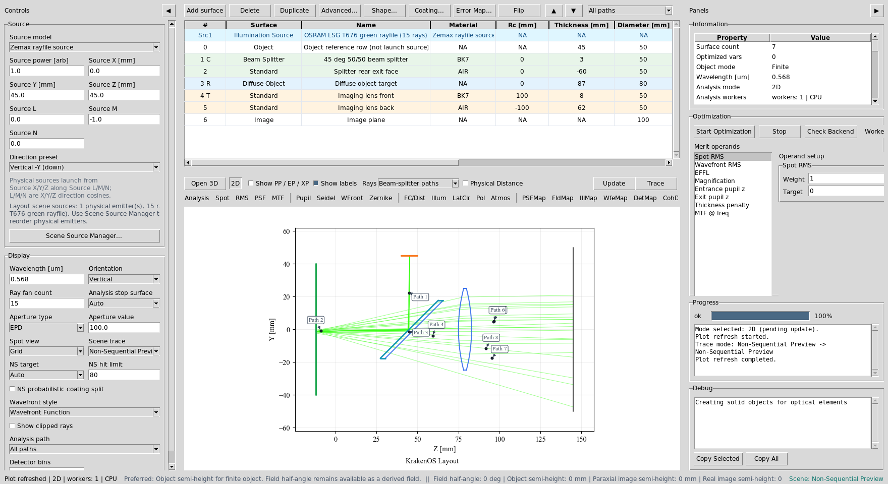
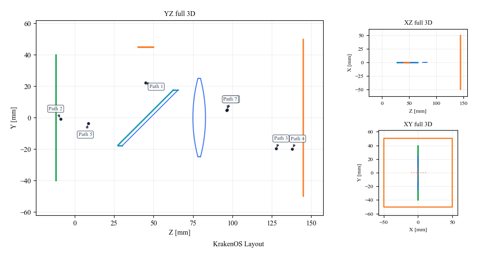
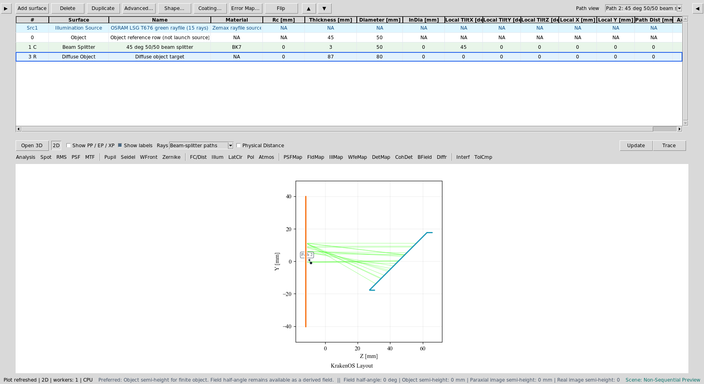
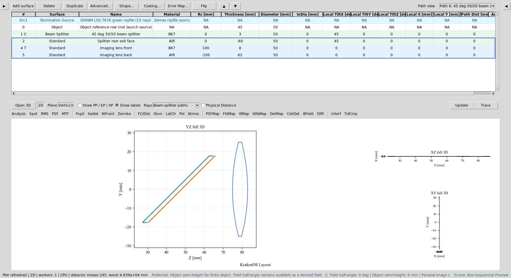
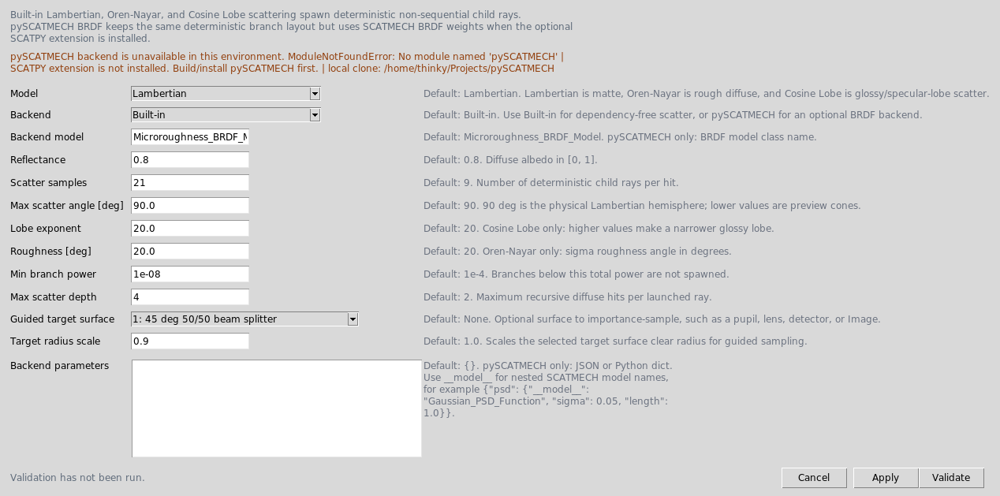
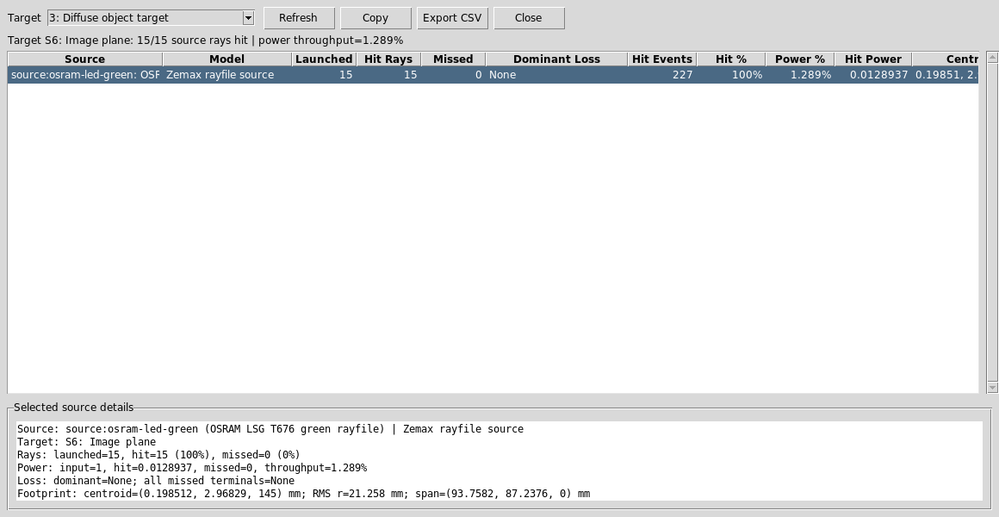
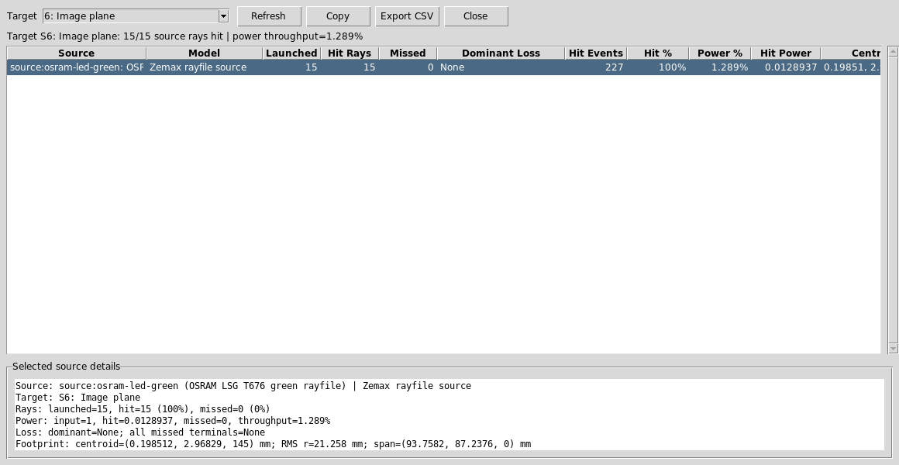
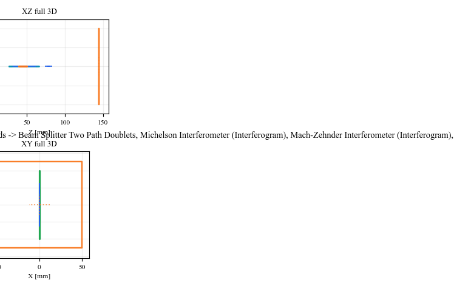
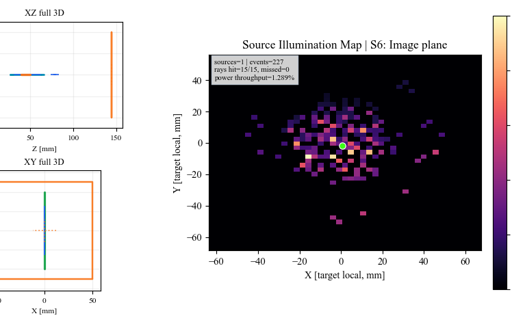

Case Study 9: Zemax LED Source To Diffuse Object Imaging
========================================================

Goal
----

This case study demonstrates a more realistic source/object split than the
specular proxy case:

* load a vendor Zemax ``.DAT`` LED source;
* route the LED through a 45 degree beam splitter;
* illuminate a true ``Diffuse Object`` surface;
* use guided Lambertian scatter to return light through the splitter;
* pass the return path through a simple BK7 imaging lens;
* inspect source throughput and camera-plane irradiance.

The screenshots in this tutorial are generated from the live Tk UI with:

.. code-block:: bash

   python -m KrakenOS.UI.capture_zemax_led_diffuse_case_study_screenshots

Load The Layout
---------------

1. Start the UI with ``python -m KrakenOS.UI.layout_editor``.
2. Choose
   ``Layouts -> Beam Splitters / Folds -> Zemax LED Beam-Splitter Imaging``.
3. Keep ``Trace mode = Non-Sequential Preview``.
4. Keep ``NS probabilistic coating split`` off.

The first table row is an ``Illumination Source`` scene row backed by the OSRAM
green Zemax rayfile:

.. code-block:: text

   attachment/LED/rayfile_LSG_T676_20200827_Zemax/rayfile_LSG_T676_green_100k_20200827_Zemax.DAT

The ``Object`` row is reference geometry only. The useful optical chain is:
LED source -> beam splitter -> diffuse object -> beam splitter return ->
BK7 imaging lens -> Image plane.

   The layout combines a vendor rayfile source, beam splitter, diffuse object,
   imaging lens, and detector plane.

Read The Scatter Paths
----------------------

Click ``Update``. The 2D plot uses physical path labels plus scatter branch
rays. The diffuse object is the green vertical surface on the left. The blue
curves are the imaging lens surfaces on the return path.

   The return rays are not mirror reflections from an ``Object Target`` proxy.
   They are child branches spawned by the ``Diffuse Object`` row.

Use Path View
-------------

Open the table toolbar ``Path view`` dropdown and select:

.. code-block:: text

   Path 2: 45 deg 50/50 beam splitter to 45 deg 50/50 beam splitter via Diffuse object target

This isolates the source-to-object and object-return leg.

   The ``Diffuse Object`` row is the physical scattering target.

Now select:

.. code-block:: text

   Path entry containing: 45 deg 50/50 beam splitter to Imaging lens back via Splitter rear exit face, Imaging lens front

This isolates one useful image path through the splitter exit face and lens.
The exact path number can change as deterministic diffuse child branches are
inserted before the imaging leg, so select the discovered path whose label
continues through ``Imaging lens front`` and ``Imaging lens back``.

   Path view remains useful even when the branch-code list is long.

Inspect Diffuse / BRDF Settings
-------------------------------

Right-click the ``Diffuse Object`` row and choose
``Coating / Polarization -> Diffuse / BRDF Settings...``.

   This preset uses the dependency-free built-in Lambertian model. ``Guided
   target surface`` is set to the splitter return aperture so the deterministic
   diffuse child rays can be traced through the useful camera branch.

Audit Source Illumination
-------------------------

Choose ``Actions -> Source Illumination Report``. Set ``Target`` to:

.. code-block:: text

   3: Diffuse object target

   The report shows that the vendor LED source reaches the diffuse object and
   reports source throughput and footprint size at the target.

Now change ``Target`` to:

.. code-block:: text

   6: Image plane

   The Image-plane report verifies that source-driven diffuse return rays reach
   the detector after splitter and lens losses.

Run Image-Plane Analyses
------------------------

Set:

.. code-block:: text

   Analysis path = All paths
   Analysis surface = 6: Image plane
   Detector bins = 64

Click ``DetMap`` and ``Update``.

   ``DetMap`` shows the Image-plane power distribution from the useful
   source-to-diffuse-object return rays.

Click ``Illum`` and ``Update``.

   ``Illum`` uses the same source-hit records to show image-plane illumination
   and centroid diagnostics.

Run The Python Example
----------------------

The same layout has a scriptable example:

.. code-block:: bash

   python KrakenOS/Examples/Examp_Zemax_LED_Beam_Splitter_Imaging.py

The script prints the rayfile source path and a per-ray trace summary,
including whether each sampled LED ray hits the diffuse object and reaches the
Image plane.

What This Proves
----------------

This case study combines several KrakenOS UI capabilities in one workflow:

* vendor Zemax rayfile source import;
* source/object separation;
* deterministic beam-splitter branch spawning;
* true ``Diffuse Object`` scattering instead of a specular proxy;
* guided Lambertian target sampling;
* path filtering for a branch-heavy non-sequential scene;
* detector power and source-illumination analysis at the Image plane.

Common Mistakes
---------------

``I expected one clean return ray from the object.``
  A diffuse surface creates many child rays. This is expected and is the point
  of replacing the specular proxy with ``Diffuse Object``.

``The Analysis path dropdown contains many Rscatter entries.``
  Those are deterministic scatter branch codes. For the camera result in this
  tutorial, keep ``Analysis path = All paths`` and choose the Image plane as
  the analysis surface.

``The Source panel ray count did not change the explicit rayfile source row.``
  This layout declares an explicit scene source in ``SETTINGS["scene_sources"]``.
  Edit the source row or Scene Source Manager when changing that source.

``I changed Guided target surface to None and fewer rays reached the camera.``
  Unguided diffuse sampling sprays rays over the scatter cone. Guided target
  sampling keeps the UI preview deterministic while still weighting rays with
  the selected scatter model.
